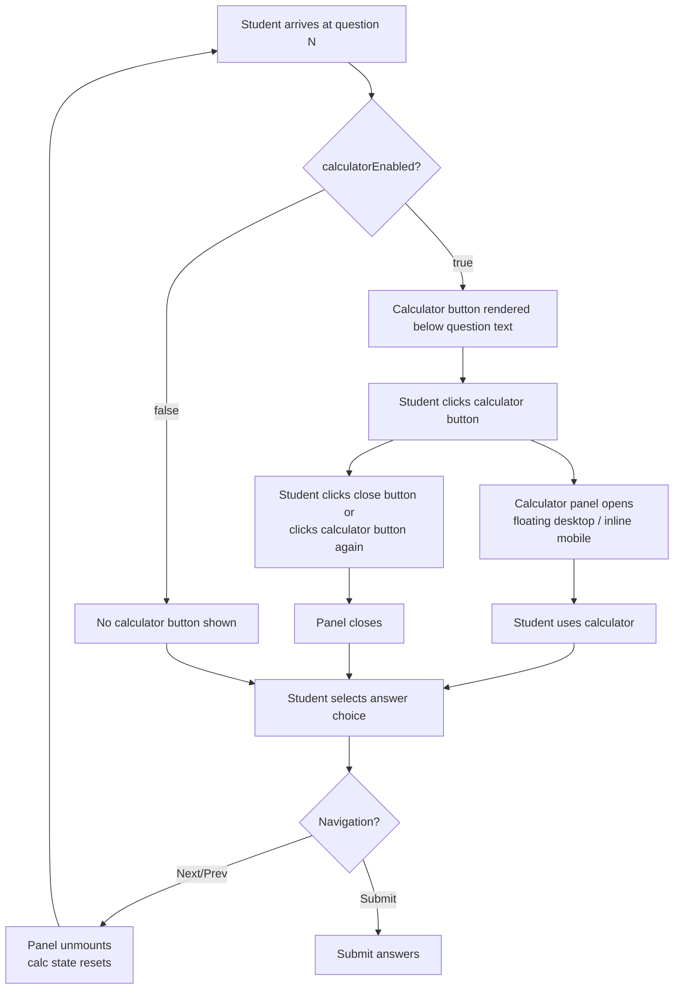
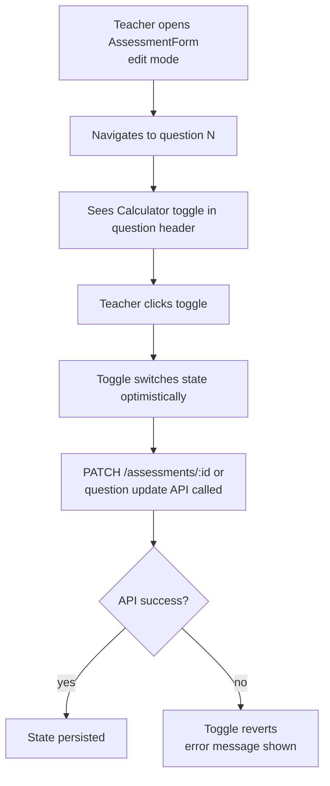
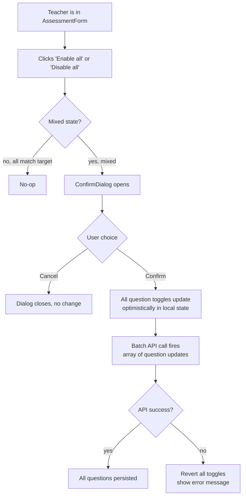

# cm-0001: Per-Question Calculator Toggle — Wireframe

## 1. Overview

This feature adds an optional floating calculator to the student assessment-taking experience. Teachers author assessments using `AssessmentForm` + `QuestionEditor` inside the existing lesson, quiz, and exam flows. The new toggle appears on each `QuestionEditor` card and in a bulk-apply toolbar above the question list.

Students take assessments using `AssessmentTaker`. When the active question has `calculatorEnabled: true`, a calculator button renders below the question text. Clicking it opens a floating panel anchored to the bottom-right of the viewport, above all page content. On narrow viewports (< 640 px / Tailwind `sm` breakpoint) the panel stacks inline below the question text instead.

**Affected routes:**
- `/courses/:courseId/units/:unitId/lessons/:lessonId` — `LessonDetailPage`, which hosts `AssessmentTaker` via `QuizSection` / `TestSection` / `ExamSection`
- Same route — `AssessmentForm` + `QuestionEditor` (teacher role, edit mode)

**Auth gates:** Calculator toggle UI is visible only to `teacher` and `admin` roles. Calculator button and panel are visible only to `student` (and teacher/admin previewing). `calculatorEnabled` is persisted per question.

---

## 2. Desktop Layout

### 2a. Student View — AssessmentTaker with floating calculator panel

The `AssessmentTaker` component renders inside a lesson-scoped card or panel. The floating calculator panel is rendered in a React portal so it escapes any `overflow: hidden` ancestor.

```
┌─────────────────────────────────────────────────────────────────┐
│  LESSON DETAIL PAGE  (bg-background)                            │
│                                                                 │
│  ┌──────────────────────────────────────────────────────────┐   │
│  │  Assessment Card  (bg-surface-raised, rounded-2xl,       │   │
│  │                    border-border, shadow-warm-md)        │   │
│  │                                                          │   │
│  │  Question 2 of 5                         [text-xs        │   │
│  │                                           muted-fg]      │   │
│  │  ─────────────────────────────────────────────────────   │   │
│  │                                                          │   │
│  │  2. A train travels 120 km in 1.5 hours. What is its     │   │
│  │     average speed in km/h?          [font-medium]        │   │
│  │                                                          │   │
│  │  ┌──────────────────────────────────────────────────┐   │   │
│  │  │  [🧮] Calculator   (ghost Button, size sm,       │   │   │
│  │  │       icon + label, border-border rounded-xl)    │   │   │
│  │  └──────────────────────────────────────────────────┘   │   │
│  │     ↑ Renders only when calculatorEnabled === true       │   │
│  │       Positioned below question text, above options      │   │
│  │                                                          │   │
│  │  ○ 60 km/h        [label, border-border, bg-surface]    │   │
│  │  ● 80 km/h        [selected: border-primary bg-primary/10]  │
│  │  ○ 90 km/h                                              │   │
│  │  ○ 100 km/h                                             │   │
│  │                                                          │   │
│  │  [← Previous]               [Cancel]  [Next →]          │   │
│  └──────────────────────────────────────────────────────────┘   │
│                                                                 │
│                                                                 │
│         ┌───────────────────────────────────┐  ← Portal        │
│         │  CALCULATOR PANEL                 │    fixed,        │
│         │  (fixed, bottom-4 right-4,        │    z-50          │
│         │   bg-surface-raised,              │                  │
│         │   rounded-2xl, border-border,     │                  │
│         │   shadow-warm-lg, w-72)           │                  │
│         │                                   │                  │
│         │  ┌─────────────────────────────┐  │                  │
│         │  │  DISPLAY                    │  │                  │
│         │  │  [          80 km/h       ] │  │                  │
│         │  │  bg-surface, rounded-xl,    │  │                  │
│         │  │  text-right, text-xl, px-3  │  │                  │
│         │  │  Two lines: expression (sm, │  │                  │
│         │  │  muted-fg) + result (xl,    │  │                  │
│         │  │  foreground)                │  │                  │
│         │  └─────────────────────────────┘  │                  │
│         │                                   │                  │
│         │  [C]  [⌫]  [√x]  [xʸ]            │                  │
│         │  [7]  [8]  [9]   [÷]             │                  │
│         │  [4]  [5]  [6]   [×]             │                  │
│         │  [1]  [2]  [3]   [−]             │                  │
│         │  [0]  [.]  [=]   [+]             │                  │
│         │                                   │                  │
│         │  ── drag handle (top center) ──   │                  │
│         │  [✕ Close] (ghost, top-right)     │                  │
│         └───────────────────────────────────┘                  │
└─────────────────────────────────────────────────────────────────┘
```

**Panel layout detail — Calculator Panel (w-72 = 288px):**

```
┌──────────────────────────────────────┐
│  ≡  (drag handle, text-muted-fg)  [✕]│  ← header row: flex justify-between
│                                      │    items-center px-3 pt-3 pb-1
├──────────────────────────────────────┤
│                       120 ÷ 1.5      │  ← expression line: text-sm
│                              80      │    text-muted-foreground, text-right
│                                      │  ← result line: text-2xl font-semibold
│                                      │    text-foreground, text-right
│                                      │    bg-surface rounded-xl px-3 py-2 mx-3
├──────────────────────────────────────┤
│  [C]   [⌫]   [√x]   [xʸ]            │  ← utility row
│  [7]   [8]   [9]    [÷ ]            │
│  [4]   [5]   [6]    [× ]            │
│  [1]   [2]   [3]    [− ]            │
│  [0]   [.]   [=]    [+ ]            │  ← grid-cols-4, gap-1.5, px-3 pb-3
└──────────────────────────────────────┘
```

**Calculator button grid layout (4 columns):**

| Col 1 | Col 2 | Col 3 | Col 4 |
|-------|-------|-------|-------|
| C     | ⌫     | √x    | xʸ    |
| 7     | 8     | 9     | ÷     |
| 4     | 5     | 6     | ×     |
| 1     | 2     | 3     | −     |
| 0     | .     | =     | +     |

The `=` and `+` buttons in the last row span the grid normally (1 cell each). No spanning needed.

**Positioning annotation:**
- Panel: `fixed bottom-4 right-4 z-50 w-72`
- Panel is draggable via pointer events on the drag handle; dragging updates `transform: translate(dx, dy)` via inline style
- When open, the calculator button changes label to "Close calculator" (or icon only with aria-label)

---

### 2b. Teacher View — QuestionEditor with calculator toggle

Each `QuestionEditor` card gains a "Calculator" toggle in its header row.

```
┌──────────────────────────────────────────────────────────────┐
│  QUESTION EDITOR CARD  (bg-surface, rounded-lg, border-border│
│                          p-4)                                │
│                                                              │
│  ┌─ header row ────────────────────────────────────────────┐ │
│  │  QUESTION 1                        [Calculator ○──●]   │ │
│  │  [text-xs muted-fg uppercase]      [Remove]            │ │
│  └────────────────────────────────────────────────────────┘ │
│                                                              │
│  [Textarea: Question text]                                   │
│                                                              │
│  Options                                                     │
│  ○ [Option 1 text input]  [✕]                               │
│  ○ [Option 2 text input]  [✕]                               │
│  ○ [Option 3 text input]  [✕]                               │
│     ↑ radio = mark correct                                   │
│  [+ Add option]                                              │
└──────────────────────────────────────────────────────────────┘
```

**Calculator toggle detail:**

The toggle is a `<button role="switch">` styled as a pill toggle, placed in the question card header between the question label and the Remove button.

```
  QUESTION 2                 [🧮 Calculator  ●──○]   [Remove]
                              ↑                ↑
                              icon+label       switch pill
                              text-xs          checked state:
                              muted-fg         bg-primary
                                               unchecked:
                                               bg-border
```

Toggle pill anatomy:
```
  [🧮 Calculator]  [====●]      ← enabled (bg-primary, knob right)
  [🧮 Calculator]  [●====]      ← disabled (bg-border, knob left)

  Pill: w-9 h-5, rounded-full
  Knob: w-4 h-4, rounded-full, bg-surface-raised
        translate-x-0 (off) or translate-x-4 (on)
  Transition: transition-all duration-150
```

---

### 2c. Teacher View — AssessmentForm with bulk-apply toolbar

The `AssessmentForm` gains a toolbar row between the "Question X of N" label and the `QuestionEditor`.

```
┌──────────────────────────────────────────────────────────────┐
│  ASSESSMENT FORM                                             │
│                                                              │
│  Question 2  of 5                                            │
│                                                              │
│  ┌─ BULK TOOLBAR ────────────────────────────────────────┐  │
│  │  bg-surface, rounded-xl, border border-border,        │  │
│  │  px-3 py-2, flex items-center justify-between         │  │
│  │                                                        │  │
│  │  [🧮] Calculator:  [Enable all]  [Disable all]         │  │
│  │       text-xs      ghost Button  ghost Button          │  │
│  │       muted-fg     size sm       size sm               │  │
│  └────────────────────────────────────────────────────────┘  │
│                                                              │
│  ┌─ QUESTION EDITOR CARD ─────────────────────────────────┐  │
│  │  ... (see 2b above)                                    │  │
│  └────────────────────────────────────────────────────────┘  │
│                                                              │
│  [← Prev]          [+ Add Question]          [Save] [Cancel]│
└──────────────────────────────────────────────────────────────┘
```

**Bulk-apply confirmation dialog (mixed-state):**

When the teacher clicks "Enable all" or "Disable all" and the current questions are in a mixed state (some on, some off), a `ConfirmDialog` appears. The existing `ConfirmDialog` shared component is reused.

```
┌─────────────────────────────────────────┐
│  CONFIRM DIALOG  (Modal, size md)       │
│                                         │
│  Enable calculator for all questions?   │  ← title
│                                         │
│  Some questions currently have the      │
│  calculator disabled. This will enable  │
│  it for all 5 questions.                │  ← body text, text-sm muted-fg
│                                         │
│  ┌─────────────────────────────────┐    │
│  │  [Cancel]     [Enable for all]  │    │
│  │   secondary    primary          │    │
│  └─────────────────────────────────┘    │
└─────────────────────────────────────────┘
```

Confirm dialog variant for "Disable all":
- Title: "Disable calculator for all questions?"
- Body: "Some questions currently have the calculator enabled. This will disable it for all N questions."
- Confirm button: "Disable for all" (danger variant)

No confirmation dialog is shown if all questions are already in the target state (all already enabled when "Enable all" is clicked, or all already disabled when "Disable all" is clicked). The action is a no-op in that case with no visual feedback needed.

---

## 3. Mobile Layout

**Breakpoint:** below `sm` (640px). The floating panel is replaced by an inline panel.

### 3a. Student View — Inline calculator (mobile)

```
┌────────────────────────────────────────┐
│  Assessment Card  (mx-4, rounded-2xl)  │
│                                        │
│  Question 2 of 5         [text-xs]     │
│  ────────────────────────────────────  │
│                                        │
│  2. A train travels 120 km in 1.5      │
│     hours. What is its average         │
│     speed in km/h?                     │
│                                        │
│  ┌────────────────────────────────┐    │
│  │ [🧮 Calculator ▼]  (open btn) │    │
│  └────────────────────────────────┘    │
│                                        │
│  ┌────────────────────────────────┐    │ ← inline panel,
│  │  CALCULATOR (inline, w-full)   │    │   stacked below
│  │                                │    │   question text,
│  │  [  120 ÷ 1.5          ]      │    │   above answer
│  │  [               80    ]      │    │   choices
│  │                                │    │
│  │  [C]  [⌫]  [√x]  [xʸ]        │    │
│  │  [7]  [8]  [9]   [÷ ]        │    │
│  │  [4]  [5]  [6]   [× ]        │    │
│  │  [1]  [2]  [3]   [− ]        │    │
│  │  [0]  [.]  [=]   [+ ]        │    │
│  └────────────────────────────────┘    │
│                                        │
│  ○ 60 km/h                             │
│  ● 80 km/h                             │
│  ○ 90 km/h                             │
│  ○ 100 km/h                            │
│                                        │
│  [← Prev]          [Cancel] [Next →]   │
└────────────────────────────────────────┘
```

**Mobile calculator button:**
- Full-width (`w-full`) secondary Button, size sm
- Label: "Calculator" with chevron icon (▼ open, ▲ when expanded)
- Minimum touch target: 44px height (use `min-h-[44px]`)

**Inline panel:**
- `w-full`, `rounded-xl`, `border border-border`, `bg-surface-raised`, `mt-3 mb-4`
- No drag handle (not applicable inline)
- No close button — collapse by tapping the calculator button again (chevron toggles)
- Calculator button label changes to "Calculator ▲" when panel is open

### 3b. Teacher View — Mobile QuestionEditor toggle

The toggle pill moves to a second row below the "Question N" / "Remove" header on very narrow screens:

```
┌─────────────────────────────────────┐
│  QUESTION 1                [Remove] │
│  [🧮 Calculator  ●──○]              │  ← second row, full-width area
│                                     │
│  [Textarea: Question text]          │
│  ...                                │
└─────────────────────────────────────┘
```

**Bulk toolbar on mobile:**
- Stacks vertically: label row, then button row
```
  [🧮] Calculator
  [Enable all]  [Disable all]     ← flex gap-2
```

---

## 4. Interactive States

### 4a. Calculator button (opens/closes panel)

| State | Visual | Notes |
|---|---|---|
| Default (panel closed) | ghost Button, `border border-border`, icon + "Calculator" label | Only visible when `calculatorEnabled === true` for active question |
| Hover | `bg-surface` (ghost hover), cursor pointer | Standard ghost Button hover |
| Focus | `focus-visible:ring-2 focus-visible:ring-primary focus-visible:ring-offset-2` | Inherited from Button component |
| Active/Pressed | `brightness-95` | Standard browser active |
| Panel open | Label changes to "Close calculator"; button receives `aria-expanded="true"` | Icon may flip or change to X |
| Disabled | Not applicable — button only renders when feature is enabled | n/a |

### 4b. Calculator digit and operator buttons (inside panel)

| State | Visual | Notes |
|---|---|---|
| Default | `bg-surface rounded-xl text-foreground text-sm font-medium` | All buttons same base |
| Hover | `hover:bg-surface-raised` | Subtle lift |
| Focus | `focus-visible:ring-2 focus-visible:ring-primary` | Keyboard navigable |
| Active/Pressed | `active:scale-95 active:brightness-90` | Tactile press feedback |
| Operator keys (÷ × − +) | `text-primary` or `text-accent` (consistent, one color chosen at impl) | Visually distinct from digits |
| Equals (=) | `bg-primary text-primary-foreground` | Prominent CTA |
| Clear (C) | `text-destructive` or `text-warning` | Warning tone |
| Backspace (⌫) | `text-muted-foreground` | Secondary action |
| Disabled (e.g., operator after operator) | `opacity-40 cursor-not-allowed` | Prevent invalid sequences |

### 4c. Calculator display

| State | Visual | Notes |
|---|---|---|
| Empty / initial | Shows "0" in result line | Expression line empty |
| Entering number | Result line updates live | Expression line shows accumulated expression |
| After operator | Expression line: "120 ÷", result line: "120" | Awaiting second operand |
| Result displayed | Expression line: "120 ÷ 1.5 =", result line: "80" | After equals |
| Error (e.g., divide by zero) | Result line: "Error", `text-destructive` | Expression cleared |
| Overflow (result > display width) | Shrink font or use scientific notation display | text-lg fallback |

### 4d. Calculator panel (floating)

| State | Visual | Notes |
|---|---|---|
| Closed | Not rendered (unmounted or `hidden`) | No animation required; simple mount/unmount |
| Opening | Fade-in + slide-up: `animate-in fade-in slide-in-from-bottom-2 duration-150` | Respects `prefers-reduced-motion` |
| Open / idle | `fixed bottom-4 right-4 z-50 shadow-warm-lg` | Default resting position |
| Dragging | `cursor-grabbing`, panel follows pointer via `transform: translate()` | Desktop only |
| Closing | Unmount on question navigation, or on close button click | No outgoing animation required |
| Question navigation | Panel unmounts, calculator state resets — new question mounts fresh instance | Handled by React key prop on calculator |

### 4e. Teacher toggle (per-question)

| State | Visual | Notes |
|---|---|---|
| Off (default) | Pill: `bg-border`, knob left, `translate-x-0` | `aria-checked="false"` |
| Off / hover | `bg-border/80` | Subtle |
| On | Pill: `bg-primary`, knob right, `translate-x-4` | `aria-checked="true"` |
| On / hover | `bg-primary/90` | Subtle |
| Focus | `focus-visible:ring-2 focus-visible:ring-primary focus-visible:ring-offset-2` | |
| Saving (optimistic) | Toggle moves immediately; error reverts | Optimistic update |
| Error on save | Revert toggle + inline error toast or inline `text-destructive` message | |

### 4f. Bulk-apply buttons

| State | Visual | Notes |
|---|---|---|
| Default | ghost Button, size sm | |
| All already in target state | Button appears but action is no-op (no click handler feedback needed) | Optional: `opacity-50` if all already match |
| Mixed state — click | Opens `ConfirmDialog` | |
| Confirm dialog — Cancel | Dialog closes, no changes | |
| Confirm dialog — Confirm | Dialog closes, all toggles update optimistically | |

---

## 5. User Flows

### 5a. Student opens calculator on a question



### 5b. Teacher enables calculator toggle per question



### 5c. Teacher bulk-applies calculator



### 5d. Auth-gated access

- `teacher` and `admin` roles see the per-question toggle in `QuestionEditor` and the bulk toolbar in `AssessmentForm`.
- `student` role sees only the calculator button in `AssessmentTaker` (when `calculatorEnabled === true` for the active question).
- The calculator panel itself has no auth requirement — it is purely client-side computation.
- No new `RequireRole` wrapper is needed; existing component-level `user?.role` checks in the assessment editor pattern are sufficient.

---

## 6. Component Inventory

| Component | Path | Status | Notes |
|---|---|---|---|
| `CalculatorPanel` | `client/src/features/assessments/CalculatorPanel.tsx` | **New** | Floating panel for desktop, inline on mobile. Accepts `mode: 'floating' \| 'inline'`. Rendered via React portal (`createPortal`) for floating mode. Contains `CalculatorDisplay` and `CalculatorKeypad` as sub-components or internal regions. |
| `CalculatorDisplay` | Internal to `CalculatorPanel` | **New** | Two-line display: expression (sm, muted-fg) + result (2xl, foreground). |
| `CalculatorKeypad` | Internal to `CalculatorPanel` | **New** | 4-column grid of `CalculatorKey` buttons. |
| `CalculatorKey` | Internal to `CalculatorPanel` | **New** | Single styled button. Accepts `variant: 'digit' \| 'operator' \| 'equals' \| 'utility'`. |
| `CalculatorButton` | In `AssessmentTaker.tsx` (inline addition) | **New (inline)** | The toggle button that opens/closes the panel. Only renders when `question.calculatorEnabled`. |
| `useCalculator` | `client/src/hooks/useCalculator.ts` | **New** | Custom hook encapsulating calculator state machine (expression, result, operations). Returns `{ expression, result, handleKey, reset }`. |
| `QuestionEditor` | `client/src/features/assessments/QuestionEditor.tsx` | **Modify** | Add `calculatorEnabled` to `QuestionDraft`, add toggle to card header. |
| `AssessmentForm` | `client/src/features/assessments/AssessmentForm.tsx` | **Modify** | Add bulk-apply toolbar above `QuestionEditor`. |
| `AssessmentTaker` | `client/src/features/assessments/AssessmentTaker.tsx` | **Modify** | Render `CalculatorButton` + `CalculatorPanel` when `question.calculatorEnabled`. Reset panel on question index change via `key` prop. |
| `ConfirmDialog` | `client/src/components/ConfirmDialog.tsx` | **Exists — reuse** | Used for bulk-apply mixed-state confirmation. |
| `Button` | `client/src/components/Button.tsx` | **Exists — reuse** | Used for calculator open button, bulk toolbar buttons, close button. |
| `Modal` | `client/src/components/Modal.tsx` | **Exists — reuse** | Not used directly; `ConfirmDialog` handles the confirmation. |
| `Tooltip` | `client/src/components/Tooltip.tsx` | **Exists — reuse** | Tooltip on the calculator toggle icon in `QuestionEditor` header for teachers. |

**Library decision (per spec guidance):**

Do not add a third-party calculator UI library. The spec's operation set (+ − × ÷ xʸ √x, C, ⌫, decimal, equals) is small and well-defined. A custom `useCalculator` hook backed by `Decimal.js` for precision arithmetic is the preferred approach. `Decimal.js` is a dependency-only addition (no UI), has zero accessibility surface area to worry about, and handles floating-point edge cases (e.g., 0.1 + 0.2). `math.js` is larger and brings far more than needed. No react-specific calculator library is needed.

**`Decimal.js` justification:** Prevents common JS floating-point errors (e.g., 0.1 + 0.2 = 0.30000000000004) that would be immediately visible to students doing arithmetic. This is a focused, widely-used library with no transitive dependencies.

---

## 7. Accessibility Notes

### Calculator button (opens/closes panel)

- `<button>` element using existing `Button` component
- `aria-label="Open calculator"` when closed; `aria-label="Close calculator"` when open
- `aria-expanded={isOpen}` reflects panel state
- `aria-controls="calculator-panel"` pointing to the panel's `id`
- Tab stop in the natural DOM order (below question text, before answer choices on desktop; after answer choices consideration — keep it above choices per layout to maintain logical reading order)

### Calculator panel

- Panel container: `role="dialog"` or `role="region"` with `aria-label="Calculator"`
- `id="calculator-panel"` to match `aria-controls`
- Focus management: when panel opens, focus moves to the calculator display or the first focusable key (digit `7` or `C`)
- When panel closes, focus returns to the calculator toggle button
- Keyboard trap is NOT required (panel is supplementary, not a blocking modal)
- Drag handle: `aria-hidden="true"` (decorative for mouse users); dragging is keyboard-inaccessible but the fixed position default is fully functional without dragging
- Close button: `aria-label="Close calculator"`, `Button variant="ghost" size="sm"`

### Calculator keypad buttons

- Each button: `<button type="button">` with explicit `aria-label` for symbols:
  - `⌫` → `aria-label="Backspace"`
  - `√x` → `aria-label="Square root"`
  - `xʸ` → `aria-label="Exponent"`
  - `÷` → `aria-label="Divide"`
  - `×` → `aria-label="Multiply"`
  - `−` → `aria-label="Subtract"`
  - `+` → `aria-label="Add"`
  - `=` → `aria-label="Equals"`
  - `.` → `aria-label="Decimal point"`
  - `C` → `aria-label="Clear"`
- Keyboard navigation: `Tab` cycles through all buttons; no arrow-key grid navigation required (tab is sufficient for a small 20-button grid)
- `focus-visible:ring-2 focus-visible:ring-primary` on every key

### Calculator display

- `aria-live="polite"` on the result line so screen readers announce result changes after each operation
- `aria-label="Calculator display"` on the display region
- Do not use `aria-live="assertive"` — digit-by-digit announcements would be disruptive

### Teacher toggle (per-question)

- `<button role="switch" aria-checked={calculatorEnabled} aria-label="Allow calculator for this question">`
- Label text "Calculator" is visible alongside the toggle — no aria-label override needed if label text is properly associated
- Wrapping `<label>` element is preferred: `<label>Calculator <button role="switch" ...></label>`

### Bulk toolbar buttons

- "Enable all": `aria-label="Enable calculator for all questions"`
- "Disable all": `aria-label="Disable calculator for all questions"`
- Both are standard `<button>` elements

### ConfirmDialog (reused)

- Existing `Modal` component handles focus trap and Escape dismissal
- Confirm button receives initial focus when dialog opens
- `aria-describedby` on the dialog points to the body text element

### Keyboard navigation order (student view, desktop)

```
Tab order:
1. ... (lesson nav elements above)
2. Calculator button (if calculatorEnabled)
3. Answer choice radio buttons
4. Previous / Next / Submit navigation buttons
5. [If panel open]: Close button → calculator keys (C, ⌫, √x, xʸ, 7–9, ÷, 4–6, ×, 1–3, −, 0, ., =, +)
```

The calculator panel's tab order is appended to the natural document flow via the portal, but focus management (on open: move to panel; on close: return to trigger) ensures keyboard users are not stranded.

### Color contrast requirements

- All text on `bg-surface-raised` and `bg-surface` must meet WCAG AA (4.5:1 for normal text)
- `text-foreground` (`#1e1e24`) on `bg-surface-raised` (`#ffffff`) in light mode: contrast ~15:1 — passes
- `text-muted-foreground` (`#6e6860`) on `bg-surface-raised` (`#ffffff`): ~4.6:1 — passes AA
- `text-primary-foreground` (`#ffffff`) on `bg-primary` (`#138808`, equals button): ~5.1:1 — passes AA
- `text-destructive` (`#dc2626`) on `bg-surface-raised` (clear button): ~5.9:1 — passes AA
- Dark mode equivalents verified against dark surface values from `index.css`
- Do not use color alone to convey operator vs digit distinction — also use font weight or size difference

---

## 8. Required Token Additions

No new tokens required.

All needed design values are covered by the existing token set:
- Panel background: `bg-surface-raised`
- Panel border: `border-border`
- Panel shadow: `shadow-warm-lg`
- Toggle on: `bg-primary`
- Toggle off: `bg-border`
- Equals button: `bg-primary text-primary-foreground`
- Error state: `text-destructive`
- Display background: `bg-surface`
- Animation: standard Tailwind `transition-all duration-150`

The floating panel's `z-50` matches the existing `Modal` component's `z-50`, which is acceptable since the calculator panel does not need to appear above modals — if a modal is open, the calculator should not be open simultaneously (question navigation closes the calculator, and submitting an assessment navigates away).
