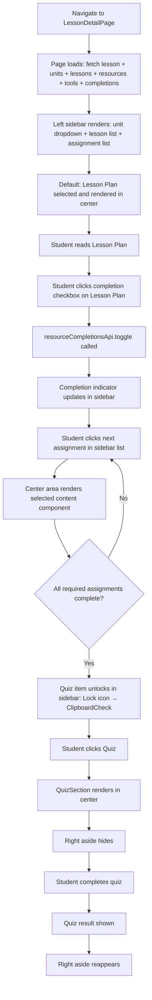
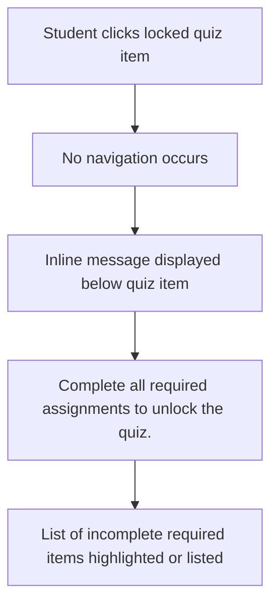
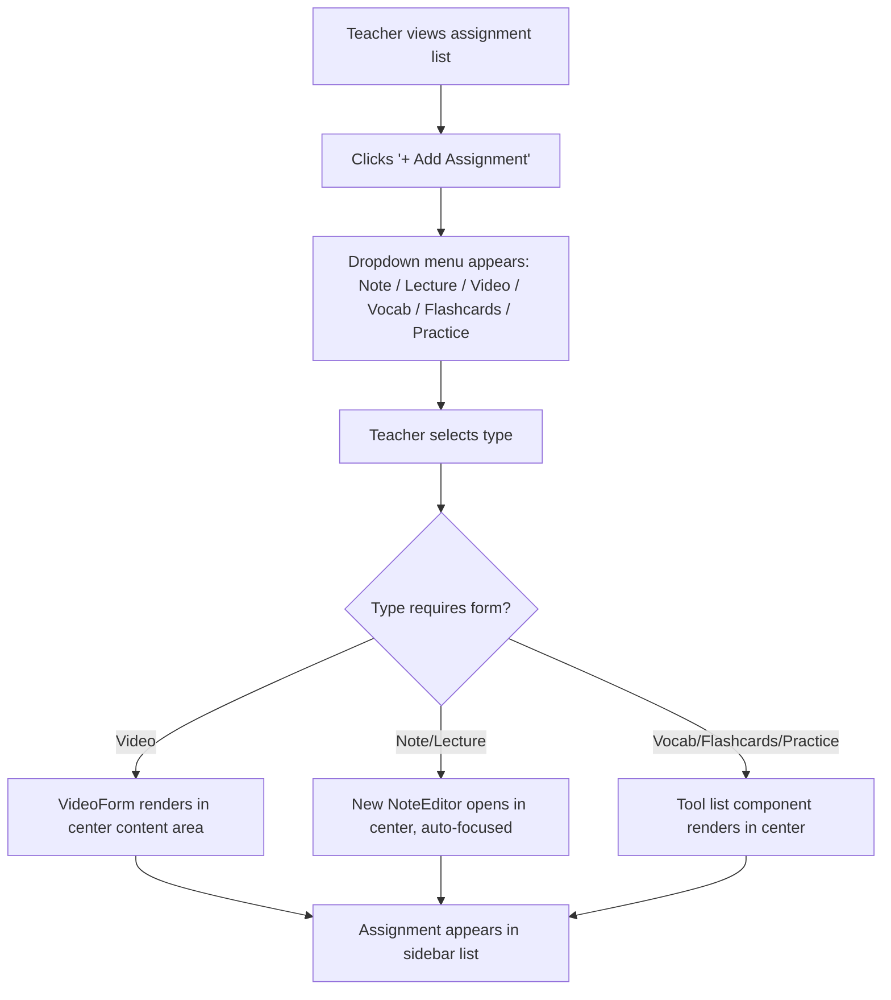
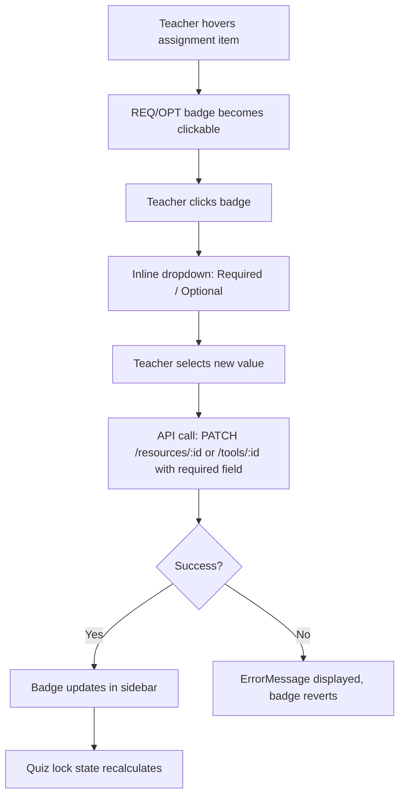
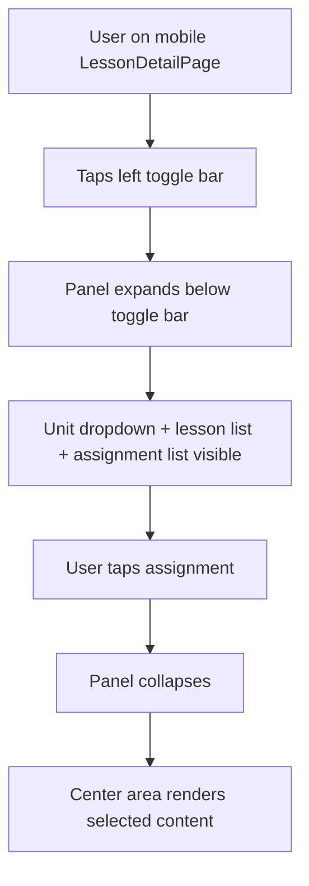

# Wireframe: Redesign Lesson Detail Page Layout

## 1. Overview

This feature replaces the horizontal tab bar (`LearningResourceNav`) and separate `PracticeResourceSidebar` with a lesson-flow layout:

- **Left sidebar** — simplified to unit dropdown + lesson list only. No assignment list.
- **Assignment stepper** — a sticky horizontal progress bar below the lesson header. Each step represents one assignment (lesson plan, notes, videos, vocab, flashcards, practice, quiz). Completion dots show progress. Clicking a step jumps to that section. Locked quiz shown with a lock icon.
- **Lesson scroll** — the main content area is a single scrollable page with all assignment sections stacked in order. Students work top-to-bottom or jump via the stepper. The stepper tracks which section is in view via scroll position.
- **Student Tools bar** — a narrow vertical icon bar on the right edge (desktop) / horizontal row below the stepper (mobile). One button per student tool available in the lesson (📝 Notes, 🃏 Flashcards, 📋 Practice, 📖 Vocab). Opens the **Student Materials modal** with that tool.
- **Student Materials modal** — draggable floating panel (desktop) / bottom sheet (mobile). Students can keep a tool (e.g. notes) open alongside any assignment section.

**Affected route:** `/courses/:courseId/units/:unitId/lessons/:lessonId` → `LessonDetailPage`

**Auth:** All views visible to authenticated users. Teacher controls (add/delete/reorder, required/optional toggle) rendered inline in each assignment section header when `canEdit`.

---

## 2. Desktop Layout

Two-column layout: simplified left sidebar + scrollable lesson content area with sticky stepper + right tools bar.

```
┌────────────────────────────────────────────────────────────────────────────┐
│  App Shell  bg-background  h-screen overflow-hidden                        │
├──────────────────────┬───────────────────────────────────────┬─────────────┤
│  LEFT SIDEBAR        │  CENTER                               │  TOOLS BAR  │
│  w-56  shrink-0      │  flex-1 flex flex-col min-w-0         │  w-10       │
│  border-r border-    │                                       │  shrink-0   │
│  border bg-surface   │  ┌─────────────────────────────────┐  │  border-l   │
│  flex flex-col       │  │ LESSON HEADER  (static)         │  │  border-    │
│  overflow-y-auto     │  │ px-4 py-3 border-b border-border│  │  border     │
│                      │  │  h1: lesson title               │  │  bg-surface │
│  ┌──────────────────┐│  │  p:  description                │  │  flex flex- │
│  │ UNIT DROPDOWN    ││  │  [Settings icon] (teacher)      │  │  col        │
│  │ [Unit 2: ... ▼]  ││  └─────────────────────────────────┘  │  items-     │
│  └──────────────────┘│                                       │  center     │
│  border-b mb-1       │  ┌─────────────────────────────────┐  │  py-3 gap-2 │
│                      │  │ ASSIGNMENT STEPPER  (sticky)    │  │             │
│  LESSON LIST         │  │ top-0 z-10 bg-surface           │  │  [📝]       │
│  ─────────────       │  │ border-b border-border px-4 py-3│  │  Notes      │
│  1. Intro Newton     │  │                                 │  │             │
│  ► 2. Forces ◄       │  │  ☑──☑──○──○──○──○──🔒          │  │  [🃏]       │
│  3. Energy           │  │  Pln Nte Vid Voc Crd Prc Quiz   │  │  Cards      │
│  4. Momentum         │  │                                 │  │             │
│  + Add (teacher)     │  │  Step 3 of 7                    │  │  [📋]       │
│                      │  └─────────────────────────────────┘  │  Practice   │
│                      │                                       │             │
│                      │  ┌─────────────────────────────────┐  │  [📖]       │
│                      │  │ LESSON SCROLL  overflow-y-auto  │  │  Vocab      │
│                      │  │ flex-1 px-4 py-6 space-y-8      │  │             │
│                      │  │                                 │  │             │
│                      │  │  ┌───────────────────────────┐  │  │             │
│                      │  │  │ ASSIGNMENT SECTION        │  │  │             │
│                      │  │  │ (each assignment stacked) │  │  │             │
│                      │  │  │                           │  │  │             │
│                      │  │  │ [icon] Lesson Plan  [REQ] │  │  │             │
│                      │  │  │ (teacher: [OPT▼][↑↓][✕]) │  │  │             │
│                      │  │  │ ─────────────────────     │  │  │             │
│                      │  │  │ [LessonPlanView content]  │  │  │             │
│                      │  │  │                           │  │  │             │
│                      │  │  │ [☑ Mark complete] [Next→] │  │  │             │
│                      │  │  └───────────────────────────┘  │  │             │
│                      │  │                                 │  │             │
│                      │  │  ── divider ──                  │  │             │
│                      │  │                                 │  │             │
│                      │  │  ┌───────────────────────────┐  │  │             │
│                      │  │  │ ASSIGNMENT SECTION        │  │  │             │
│                      │  │  │ [icon] Note 1       [REQ] │  │  │             │
│                      │  │  │ [NoteEditor content]      │  │  │             │
│                      │  │  │ [☑ Mark complete] [Next→] │  │  │             │
│                      │  │  └───────────────────────────┘  │  │             │
│                      │  │                                 │  │             │
│                      │  │  ... (all assignments) ...      │  │             │
│                      │  │                                 │  │             │
│                      │  │  ┌───────────────────────────┐  │  │             │
│                      │  │  │ QUIZ SECTION (last)       │  │  │             │
│                      │  │  │ [🔒 locked] or [QuizSection│  │  │             │
│                      │  │  │  when unlocked]           │  │  │             │
│                      │  │  └───────────────────────────┘  │  │             │
│                      │  └─────────────────────────────────┘  │             │
└──────────────────────┴───────────────────────────────────────┴─────────────┘

     ┌────────────────────────────────────┐  (floating modal — position: fixed)
     │ drag handle ══ 📝 Notes      [✕] │
     ├────────────────────────────────────┤
     │ [📝] [🃏] [📋] [📖]  tool switcher│
     ├────────────────────────────────────┤
     │ [active tool content]             │
     └────────────────────────────────────┘  (hidden during quiz)
```

### Sidebar Annotations

**Unit Dropdown**

```
┌──────────────────────────────────────────┐
│  Course Masters 101   (course title link) │
│  > Unit 2: Forces & Motion          [▼]  │
│    ─────────────────────────────────────  │
│    Unit 1: Introduction                   │
│  ► Unit 2: Forces & Motion (current)     │
│    Unit 3: Energy                         │
└──────────────────────────────────────────┘
```

- Trigger: `flex items-center justify-between px-3 py-2 rounded-lg bg-surface-raised hover:bg-surface-raised/80 text-sm font-medium`
- Panel: `absolute z-50 bg-surface border border-border rounded-lg shadow-warm-md py-1 w-full`
- Active unit: `bg-primary-subtle text-primary font-medium`
- Other unit: `text-muted-foreground hover:text-foreground hover:bg-surface-raised`

**Lesson List** (unchanged from existing `UnitLessonSidebar`)

- Current: `px-3 py-1.5 rounded-lg text-sm bg-primary-subtle text-primary font-medium`
- Other: `px-3 py-1.5 rounded-lg text-sm text-muted-foreground hover:text-foreground hover:bg-surface-raised`

**Sidebar Collapse Toggle**

- Collapsed: `w-14`, icon-only; Expanded: `w-56` with labels

### Assignment Stepper Annotations

```
  ☑ ──────── ☑ ──────── ○ ──────── ○ ──────── 🔒
[Plan]     [Note 1]  [Video 1]  [Vocab]    [Quiz]
```

- Container: `sticky top-0 z-10 bg-surface border-b border-border px-4 py-3 overflow-x-auto`
- Step node: `w-6 h-6 rounded-full flex items-center justify-center text-xs`
    - Complete: `bg-primary text-white`
    - Current (in view): `bg-primary-subtle text-primary border-2 border-primary`
    - Incomplete: `bg-surface-raised text-muted-foreground border border-border`
    - Locked quiz: `bg-surface-raised text-muted-foreground/50 border border-border` + `Lock` icon
- Connector line: `flex-1 h-px bg-border mx-1` (dimmed for incomplete sections ahead)
- Step label: `text-xs text-muted-foreground mt-1 whitespace-nowrap` (truncated on small screens)
- Clicking a step: smooth-scrolls to that assignment section's anchor
- "Step N of M" counter: `text-xs text-muted-foreground ml-auto` — updates as user scrolls

### Assignment Section Annotations

Each assignment section is an anchor-linked card:

```
┌──────────────────────────────────────────────────────┐
│  [Icon]  Note 1                      [REQ badge]     │
│          text-base font-semibold                     │  ← section header
│                               (teacher: [OPT▼][↑][↓][✕]) │
├──────────────────────────────────────────────────────┤
│  [content component — NoteEditor, VideoCard, etc.]   │  ← content
│                                                      │
├──────────────────────────────────────────────────────┤
│  [☑ Mark complete]  ──────────────────  [Next →]    │  ← footer
└──────────────────────────────────────────────────────┘
```

- Section wrapper: `id="assignment-{key}"` for scroll anchoring; `scroll-mt-24` to clear sticky stepper
- Header: `flex items-center gap-2 px-4 py-3 border-b border-border`
- REQ badge: `text-xs px-1.5 py-0.5 rounded bg-accent/10 text-accent font-medium`
- OPT badge: `text-xs px-1.5 py-0.5 rounded bg-surface-raised text-muted-foreground font-medium`
- Teacher controls (visible always for teachers, not hover-only): `[OPT▼]` dropdown, `[↑][↓]` reorder, `[✕]` delete — `ml-auto flex items-center gap-1`
- Content area: `px-4 py-4`
- Footer: `flex items-center justify-between px-4 py-3 border-t border-border`
- Mark complete button: `flex items-center gap-1.5 text-sm` — shows filled checkbox + "Marked complete" when done
- Next button: `text-sm text-primary hover:underline` — scrolls to next section; hidden on last section

**Quiz section (locked state):**

```
┌──────────────────────────────────────────────────────┐
│  🔒  Quiz                                            │
├──────────────────────────────────────────────────────┤
│  Complete all required assignments to unlock.        │
│  Remaining: Video 1, Flashcards                      │
└──────────────────────────────────────────────────────┘
```

**Teacher: Add Assignment**

- `[+ Add Assignment]` button appears after the last assignment section (before the quiz)
- Dropdown: Note / Lecture / Video / Vocab / Flashcards / Practice

---

## 3. Mobile Layout

On screens below `lg` breakpoint, the left sidebar collapses to a toggle bar. The stepper and tools bar adapt to the narrow viewport.

```
┌──────────────────────────────────────────────────┐
│  App Shell                                       │
├──────────────────────────────────────────────────┤
│  [≡ Unit 2: Forces / Lesson 2         ▼]         │  ← sidebar toggle
│  (expands: unit dropdown + lesson list)          │
├──────────────────────────────────────────────────┤
│  LESSON HEADER  px-4 py-3 border-b               │
│  Forces & Motion                                 │
├──────────────────────────────────────────────────┤
│  ASSIGNMENT STEPPER  (sticky, scrolls horizontal)│
│  overflow-x-auto px-4 py-2 border-b              │
│  ☑──☑──○──○──○──○──🔒  (Step 3 of 7)            │
├──────────────────────────────────────────────────┤
│  STUDENT TOOLS BAR (horizontal row)              │
│  flex flex-row gap-2 px-4 py-2 border-b          │
│  [📝 Notes]  [🃏]  [📋]  [📖]  (tools present)  │
│  Hidden during quiz                              │
├──────────────────────────────────────────────────┤
│  LESSON SCROLL  overflow-y-auto flex-1 px-4 py-4 │
│                                                  │
│  ┌──────────────────────────────────────────┐    │
│  │ Lesson Plan  [REQ]                       │    │
│  │ [content]                                │    │
│  │ [☑ Mark complete]           [Next →]    │    │
│  └──────────────────────────────────────────┘    │
│  ── divider ──                                   │
│  ┌──────────────────────────────────────────┐    │
│  │ Note 1  [REQ]                            │    │
│  │ [content]                                │    │
│  │ [☑ Mark complete]           [Next →]    │    │
│  └──────────────────────────────────────────┘    │
│  ...                                             │
├──────────────────────────────────────────────────┤
│  STUDENT MATERIALS BOTTOM SHEET (when open)      │
│  position: fixed bottom-0 inset-x-0             │
│  bg-surface border-t rounded-t-xl max-h-[60vh]  │
│  ── drag handle ──                               │
│  [📝][🃏][📋][📖]  tool switcher          [✕]   │
│  [active tool content]                           │
│  Hidden during quiz                              │
└──────────────────────────────────────────────────┘
```

### Mobile Specifics

**Left sidebar toggle**

- Trigger: unit + lesson name; expands to show unit dropdown + lesson list only (no assignment list)
- Pattern mirrors existing `UnitLessonSidebar` `lg:hidden` collapse

**Assignment stepper (mobile)**

- Horizontally scrollable; step labels hidden, only nodes and connector lines shown
- "Step N of M" counter shown to the right as the only text label

**Student Tools bar (mobile)**

- Horizontal row below the stepper; icon+short label per tool
- Hidden when quiz is active

**Student Materials bottom sheet**

- Opens on tool bar button tap; slides up from bottom; `max-h-[60vh]`
- Tool switcher at top; dismissible via `✕` or backdrop tap

---

## 4. Interactive States

### Unit Dropdown

| State                   | Visual                                                                                 |
| ----------------------- | -------------------------------------------------------------------------------------- |
| Default (closed)        | `bg-surface-raised rounded-lg text-sm font-medium text-foreground`, `ChevronDown` icon |
| Hover                   | `hover:bg-surface-raised/80`                                                           |
| Open                    | `ChevronDown` rotates `180deg`, dropdown panel visible, `shadow-warm-md`               |
| Current unit option     | `bg-primary-subtle text-primary font-medium`                                           |
| Other unit option hover | `hover:bg-surface-raised text-foreground`                                              |
| Loading units           | `LoadingSpinner` inside dropdown trigger area, `disabled`                              |

### Assignment Stepper

| State                                 | Visual                                                                |
| ------------------------------------- | --------------------------------------------------------------------- |
| Step complete                         | `bg-primary text-white` filled circle + checkmark icon                |
| Step in view (current)                | `bg-primary-subtle text-primary border-2 border-primary` circle       |
| Step not yet reached                  | `bg-surface-raised text-muted-foreground border border-border` circle |
| Locked quiz step                      | Dimmed circle, `Lock` icon, `cursor-not-allowed`                      |
| Clicking a complete/incomplete step   | Smooth-scrolls to that section                                        |
| Clicking locked quiz step             | No scroll; locked quiz section already visible at bottom of page      |
| Connector line (before complete step) | `bg-primary h-px`                                                     |
| Connector line (between future steps) | `bg-border h-px`                                                      |

### Assignment Section

| State                                     | Visual                                                                                     |
| ----------------------------------------- | ------------------------------------------------------------------------------------------ |
| Default (incomplete)                      | Normal section header, empty checkbox footer                                               |
| In view (tracked by IntersectionObserver) | Corresponding stepper step updates to "current" state                                      |
| Complete                                  | "Mark complete" button shows filled check + "Marked complete" text in `text-primary`       |
| Teacher controls visible                  | `[OPT▼]` badge, `[↑][↓]` arrows, `[✕]` delete button always visible in header for teachers |
| Required badge                            | `bg-accent/10 text-accent text-xs rounded px-1.5 py-0.5`                                   |
| Optional badge                            | `bg-surface-raised text-muted-foreground text-xs rounded px-1.5 py-0.5`                    |
| Deleting                                  | Optimistic removal with smooth collapse animation; `ErrorMessage` on failure               |
| Reordering                                | Optimistic reorder; page scroll jumps to moved section                                     |

### Required/Optional Toggle (teacher only)

| State         | Visual                                                                          |
| ------------- | ------------------------------------------------------------------------------- |
| Default       | Badge shows current state (REQ/OPT) clickable for teachers                      |
| Open dropdown | Inline dropdown: "Required" / "Optional", `shadow-warm-sm border border-border` |
| Saving        | Opacity transition on badge while saving                                        |
| Saved         | Badge updates to new state                                                      |
| Error         | `ErrorMessage` inline, badge reverts                                            |

### Student Tools Bar

| State                                   | Visual                                                                                               |
| --------------------------------------- | ---------------------------------------------------------------------------------------------------- |
| Default                                 | Vertical strip (`w-10`) on right edge; each button shows icon + small label; `text-muted-foreground` |
| Button hover                            | `hover:bg-surface-raised hover:text-foreground`                                                      |
| Button active (modal open on this tool) | `bg-primary-subtle text-primary rounded-lg`                                                          |
| Tool not present in lesson              | Button not rendered                                                                                  |
| Quiz active                             | Entire bar hidden                                                                                    |
| Mobile                                  | Horizontal row below lesson header; same active/hidden behavior                                      |

### Student Materials Modal

| State                                | Visual                                                                                                                                                             |
| ------------------------------------ | ------------------------------------------------------------------------------------------------------------------------------------------------------------------ |
| Closed (default)                     | Not rendered                                                                                                                                                       |
| Open — desktop                       | Floating panel `position: fixed`, `w-80`, `shadow-warm-lg`, `rounded-xl`, `border border-border`, `bg-surface`; default position bottom-right (`bottom-6 right-6`) |
| Open — mobile                        | Bottom sheet slides up; `position: fixed bottom-0 left-0 right-0`, `rounded-t-xl`, max height `60vh`                                                               |
| Dragging (desktop)                   | Cursor `grabbing`; panel follows pointer; `user-select: none` on page; shadow increases slightly                                                                   |
| Tool switcher — active tool          | Icon button `bg-primary-subtle text-primary rounded-md`                                                                                                            |
| Tool switcher — other tools          | `text-muted-foreground hover:text-foreground hover:bg-surface-raised rounded-md`                                                                                   |
| Notes active — unsaved               | "Saving…" in `text-xs text-muted-foreground`                                                                                                                       |
| Notes active — saved                 | "Saved" in `text-xs text-primary`                                                                                                                                  |
| Notes active — empty                 | Placeholder: "Write your personal notes…"                                                                                                                          |
| Notes active — has content           | "Clear" button visible                                                                                                                                             |
| Flashcards / Practice / Vocab active | Renders the corresponding read-only tool component (`FlashCardList`, `PracticeProblemList`, `VocabList`)                                                           |
| Quiz active                          | Modal hidden entirely; tools bar hidden; notes auto-saved before hiding                                                                                            |
| Close button                         | `✕` `p-1 rounded hover:bg-surface-raised`; modal closes, notes saved                                                                                               |

**Student Tools Bar**

- Location: narrow column (`w-10`) pinned to the right edge of the layout, between the center content area and the viewport edge; `border-l border-border bg-surface`
- Each button is an icon with a small label below: `flex flex-col items-center gap-0.5 p-2 rounded-lg text-muted-foreground hover:text-foreground hover:bg-surface-raised`
- Active (modal open showing this tool): `bg-primary-subtle text-primary`
- Only buttons for tools that exist in the current lesson are shown (e.g. if no flashcards, no 🃏 button). Notes button always shown (student note is lesson-scoped and always available).
- Hidden entirely during quiz-taking (`isQuizActive`)
- Tools: 📝 Notes (`NotebookPen`), 🃏 Flashcards (`Layers`), 📋 Practice (`ClipboardList`), 📖 Vocab (`BookOpen`)
- On mobile: stacks as a horizontal bar below the lesson header instead of a vertical column

**Student Materials Modal — tool switcher**

- Inside the modal, below the drag handle, a compact row of icon buttons allows switching between tools without closing and reopening: `[📝] [🃏] [📋] [📖]`
- Active tool button: `bg-primary-subtle text-primary rounded-md`; others: `text-muted-foreground hover:text-foreground`
- Only tools present in the lesson appear

**Drag handle (desktop)**

- Full-width bar at top of modal: `cursor: grab`, `bg-surface-raised rounded-t-xl px-3 py-2`
- Contains active tool title (e.g. "📝 Notes") and `✕` close button
- Dragging is implemented via `onMouseDown` on the handle — not the whole modal

### Sidebar Collapse Toggle

| State               | Visual                                                     |
| ------------------- | ---------------------------------------------------------- |
| Expanded            | `ChevronLeft` icon; sidebar at full width (`w-56` desktop) |
| Collapsed           | `ChevronRight` icon; sidebar at `w-14` showing only icons  |
| Toggle button hover | `hover:bg-surface-raised`                                  |

---

## 5. User Flows

### Happy Path: Student Completes Assignments



### Edge Case: Locked Quiz Clicked



### Teacher: Add Assignment



### Teacher: Toggle Required/Optional



### Mobile: Open Sidebar



### Auth-Gated Transitions

- All views require `authenticate` middleware (user must be logged in — enforced by `RequireAuth` wrapper on the route)
- Teacher controls (add/delete/reorder, required/optional toggle) are rendered only when `user?.role === 'teacher' || user?.role === 'admin'`
- The required/optional PATCH endpoint must be protected by `authorize(['teacher', 'admin'])` middleware on the server

---

## 6. Component Inventory

| Component                    | Status    | Location / Notes                                                                                                                                                                                                                                                                                                        |
| ---------------------------- | --------- | ----------------------------------------------------------------------------------------------------------------------------------------------------------------------------------------------------------------------------------------------------------------------------------------------------------------------- |
| `LessonDetailPage`           | Modify    | `client/src/features/lessons/LessonDetailPage.tsx` — restructure layout, add units fetch, wire new sidebar and right aside                                                                                                                                                                                              |
| `UnitLessonSidebar`          | Modify    | `client/src/features/lessons/UnitLessonSidebar.tsx` — add `UnitDropdown`; remove assignment list section; sidebar now shows only unit dropdown + lesson list                                                                                                                                                            |
| `StudentNotePanel`           | Modify    | `client/src/features/student-notes/StudentNotePanel.tsx` — remove floating FAB; expose as plain editor used inside `StudentMaterialsModal`                                                                                                                                                                              |
| `LearningResourceNav`        | Remove    | `client/src/features/lessons/LearningResourceNav.tsx` — replaced by `AssignmentStepper` + lesson scroll                                                                                                                                                                                                                 |
| `PracticeResourceSidebar`    | Remove    | `client/src/features/lessons/PracticeResourceSidebar.tsx` — tools are now student-facing only via `StudentMaterialsModal`                                                                                                                                                                                               |
| `PracticeResourceMobileBar`  | Remove    | Exported from `PracticeResourceSidebar.tsx`                                                                                                                                                                                                                                                                             |
| **`UnitDropdown`**           | **New**   | `client/src/features/lessons/UnitDropdown.tsx` — unit selector, navigates to first lesson of selected unit                                                                                                                                                                                                              |
| **`AssignmentStepper`**      | **New**   | `client/src/features/lessons/AssignmentStepper.tsx` — sticky horizontal progress bar; one node per assignment; tracks active section via IntersectionObserver callback prop; clicking a node smooth-scrolls to that section                                                                                             |
| **`AssignmentSection`**      | **New**   | `client/src/features/lessons/AssignmentSection.tsx` — wrapper for each assignment in the scroll: header (icon, title, REQ/OPT badge, teacher controls), content slot, footer (mark complete + next button)                                                                                                              |
| **`StudentToolsBar`**        | **New**   | `client/src/features/student-notes/StudentToolsBar.tsx` — vertical icon bar (desktop) / horizontal row (mobile) with one button per tool present in the lesson. Each button opens `StudentMaterialsModal` with that tool loaded. Hidden during quiz.                                                                    |
| **`StudentMaterialsModal`**  | **New**   | `client/src/features/student-notes/StudentMaterialsModal.tsx` — draggable floating modal (desktop) / bottom sheet (mobile). Contains a tool switcher row + active tool content (`StudentNotePanel`, `FlashCardList`, `PracticeProblemList`, or `VocabList`). Manages open/closed state, active tool, and drag position. |
| `LessonPlanView`             | Unchanged | `client/src/features/lessons/LessonPlanView.tsx`                                                                                                                                                                                                                                                                        |
| `NoteEditor`                 | Unchanged | `client/src/features/notes/NoteEditor.tsx`                                                                                                                                                                                                                                                                              |
| `VideoCard`                  | Unchanged | `client/src/features/videos/VideoCard.tsx`                                                                                                                                                                                                                                                                              |
| `VideoForm`                  | Unchanged | `client/src/features/videos/VideoForm.tsx`                                                                                                                                                                                                                                                                              |
| `VocabList`                  | Unchanged | `client/src/features/vocab/VocabList.tsx`                                                                                                                                                                                                                                                                               |
| `FlashCardList`              | Unchanged | `client/src/features/flashcards/FlashCardList.tsx`                                                                                                                                                                                                                                                                      |
| `PracticeProblemList`        | Unchanged | `client/src/features/practice-problems/PracticeProblemList.tsx`                                                                                                                                                                                                                                                         |
| `QuizSection`                | Unchanged | `client/src/features/quizzes/QuizSection.tsx`                                                                                                                                                                                                                                                                           |
| `TestSection`                | Unchanged | `client/src/features/tests/TestSection.tsx`                                                                                                                                                                                                                                                                             |
| `ResourceCompletionCheckbox` | Unchanged | `client/src/components/ResourceCompletionCheckbox.tsx` — used inside assignment list items                                                                                                                                                                                                                              |
| `Modal`                      | Unchanged | `client/src/components/Modal.tsx`                                                                                                                                                                                                                                                                                       |
| `LoadingSpinner`             | Unchanged | `client/src/components/LoadingSpinner.tsx`                                                                                                                                                                                                                                                                              |
| `ErrorMessage`               | Unchanged | `client/src/components/ErrorMessage.tsx`                                                                                                                                                                                                                                                                                |

---

## 7. Accessibility Notes

### Left Sidebar

| Element                     | ARIA / Keyboard Requirements                                                                                                                                            |
| --------------------------- | ----------------------------------------------------------------------------------------------------------------------------------------------------------------------- |
| Sidebar nav container       | `<nav aria-label="Lesson navigation">` wrapping the full left sidebar                                                                                                   |
| Unit dropdown trigger       | `<button aria-haspopup="listbox" aria-expanded={isOpen}>` with `aria-label="Select unit"`                                                                               |
| Unit dropdown list          | `role="listbox"`, each option `role="option"`, `aria-selected` on current unit                                                                                          |
| Unit dropdown keyboard      | `Enter`/`Space` opens; `ArrowDown`/`ArrowUp` navigate options; `Escape` closes; `Tab` moves past                                                                        |
| Lesson list                 | `<ul>` with `<li>` items; current lesson item `aria-current="page"`                                                                                                     |
| Assignment list container   | `<ol aria-label="Assignments for [lesson title]">` (ordered list communicates sequence)                                                                                 |
| Assignment item             | `<li>` containing a `<button>` for selection                                                                                                                            |
| Completion checkbox         | `<input type="checkbox" aria-label="Mark [assignment title] complete">`, `checked` reflects state                                                                       |
| Required/optional badge     | For teachers: `<button aria-label="[assignment title] is required. Click to change.">` or `aria-label="[assignment title] is optional. Click to change."`               |
| Locked quiz button          | `<button disabled aria-label="Quiz locked. Complete all required assignments first." aria-describedby="quiz-lock-hint">` with a visually hidden or visible hint element |
| Reorder up/down buttons     | `aria-label="Move [title] up"` / `aria-label="Move [title] down"`, `disabled` when at boundary                                                                          |
| Delete button               | `aria-label="Delete [title]"`                                                                                                                                           |
| Add assignment button       | `aria-label="Add assignment"`                                                                                                                                           |
| Sidebar collapse toggle     | `aria-expanded={isExpanded}` `aria-label="Collapse lesson navigation"` / `aria-label="Expand lesson navigation"`                                                        |
| Focus management            | When an assignment is deleted, focus moves to the previous item in the list or the "Add Assignment" button                                                              |
| Keyboard navigation in list | `Tab` moves between interactive elements; `Enter`/`Space` activates buttons                                                                                             |

### Center Content Area

| Element                   | ARIA / Keyboard Requirements                                                                                             |
| ------------------------- | ------------------------------------------------------------------------------------------------------------------------ |
| Main landmark             | `<main>` element wrapping the content area                                                                               |
| Lesson header             | `<header>` containing `<h1>` with lesson title                                                                           |
| Settings button (teacher) | `aria-label="Lesson settings"` (already present in current code)                                                         |
| Content components        | Each content component (`LessonPlanView`, `NoteEditor`, etc.) maintains its existing accessibility — no changes required |

### Student Materials Modal

| Element                     | ARIA / Keyboard Requirements                                                                                  |
| --------------------------- | ------------------------------------------------------------------------------------------------------------- |
| Open button (lesson header) | `<button aria-label="Open Student Materials" aria-expanded={isOpen} aria-controls="student-materials-modal">` |
| Modal container             | `role="dialog" aria-modal="true" aria-label="Student Materials" id="student-materials-modal"`                 |
| Modal heading               | `<h2>Student Materials</h2>` (visible, inside modal)                                                          |
| Close button                | `<button aria-label="Close Student Materials">` — focus returns to the open button on close                   |
| Note textarea               | `<textarea aria-label="Personal notes for this lesson" aria-describedby="note-save-status">`                  |
| Save status                 | `<span id="note-save-status" aria-live="polite">Saved</span>`                                                 |
| Clear button                | `aria-label="Clear personal notes"`                                                                           |
| Hidden state (quiz)         | Unmount or `inert` the modal and the open button; do not leave a `aria-hidden` dialog in the DOM              |
| Focus trap                  | While modal is open, `Tab`/`Shift+Tab` cycles within the modal; `Escape` closes it                            |
| Drag handle                 | `aria-hidden="true"` (drag is a mouse-only enhancement; keyboard users use `Escape` to close)                 |

### Mobile Toggle Bars

| Element               | ARIA / Keyboard Requirements                                                               |
| --------------------- | ------------------------------------------------------------------------------------------ |
| Left toggle           | `<button aria-expanded={isOpen} aria-controls="lesson-nav-panel">` with visible label      |
| Left nav panel        | `id="lesson-nav-panel"`, `aria-hidden={!isOpen}`                                           |
| Bottom sheet          | Same `role="dialog" aria-modal="true"` as desktop modal; close with `✕` button or `Escape` |
| Bottom sheet backdrop | `<div aria-hidden="true">` (tapping closes, but not keyboard-interactive)                  |

### Color Contrast

- All text on `bg-surface`: `text-foreground` and `text-muted-foreground` must meet WCAG AA (4.5:1 for normal text, 3:1 for large text) — use project semantic tokens which are designed for this
- Required badge (`bg-accent/10 text-accent`): verify accent color meets contrast on surface — if not, use solid `bg-accent text-white` fallback
- Locked quiz (`text-muted-foreground/50`): this is informational-only (the item is disabled); pairing with the `Lock` icon ensures meaning is not conveyed by color alone

### Screen Reader Text for Icon-Only Elements

- Sidebar collapse button (collapsed state, icon-only): visually hidden label via `sr-only` span: `<span className="sr-only">Expand lesson navigation</span>`
- Assignment item icons (decorative in context of labeled button): `aria-hidden="true"` on the icon element itself

---

## 8. Required Token Additions

No new tokens required.

All layout, color, spacing, and typography decisions in this wireframe use existing semantic tokens:

- `bg-background`, `bg-surface`, `bg-surface-raised`, `bg-primary`, `bg-accent`, `bg-destructive`
- `text-foreground`, `text-muted-foreground`, `text-primary`, `text-accent`, `text-destructive`
- `border-border`
- `shadow-warm-sm`, `shadow-warm-md`, `shadow-warm-lg`
- `bg-primary-subtle` (used in existing `UnitLessonSidebar` active state — assumed defined)

The `REQ` / `OPT` badges use `bg-accent/10 text-accent` and `bg-surface-raised text-muted-foreground`, both composable from existing tokens. No custom CSS variables need to be added.
