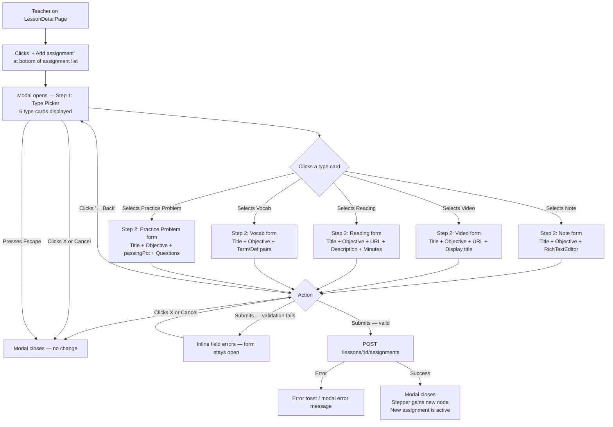
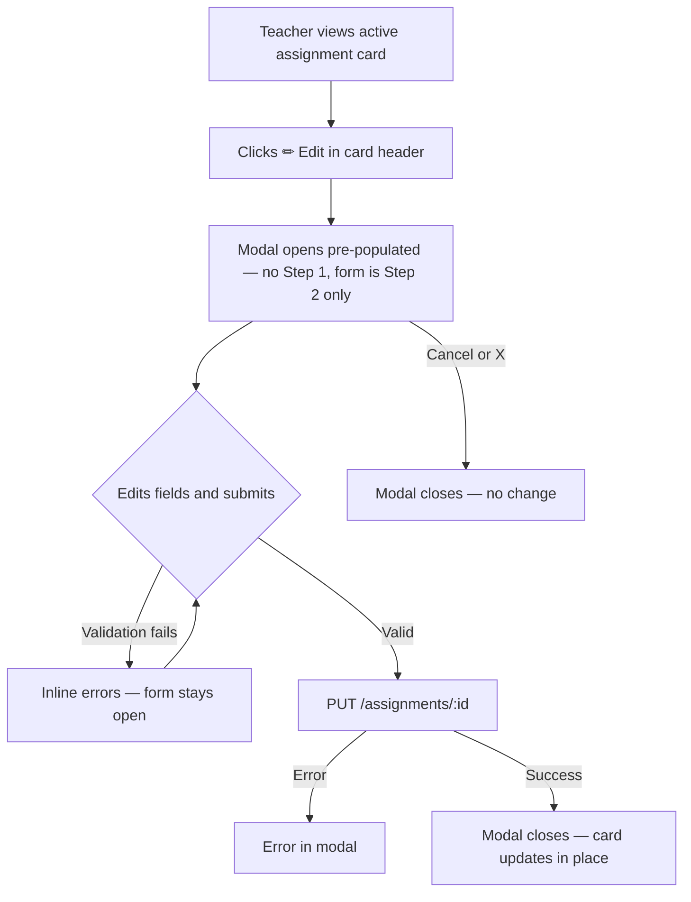
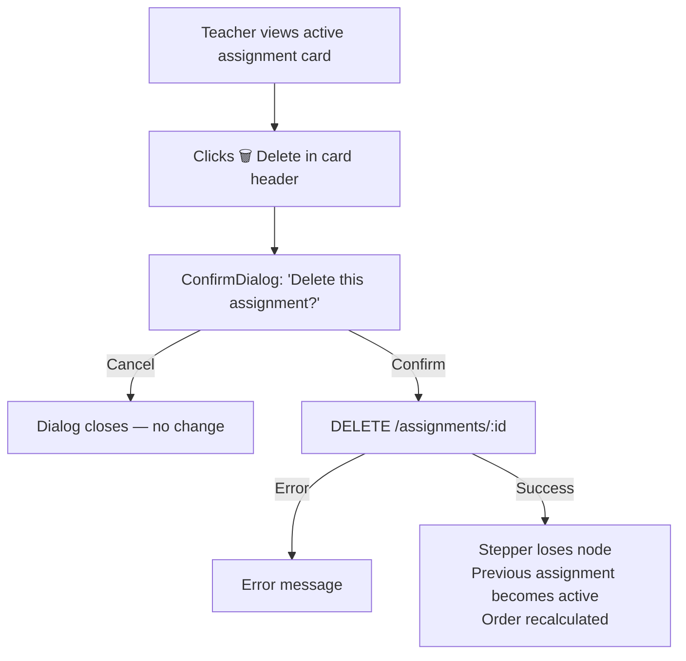
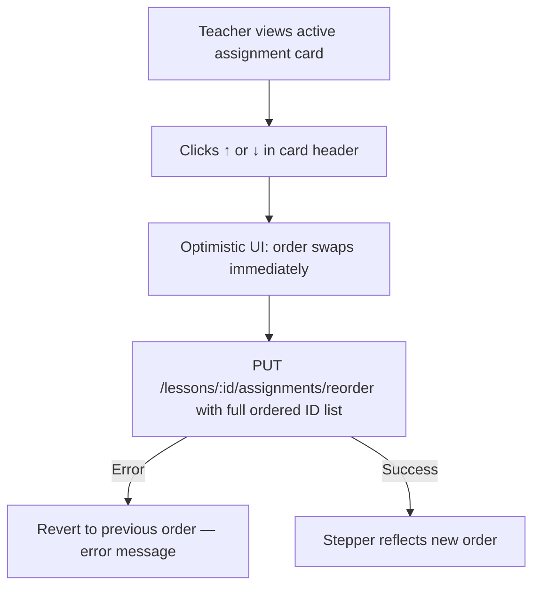
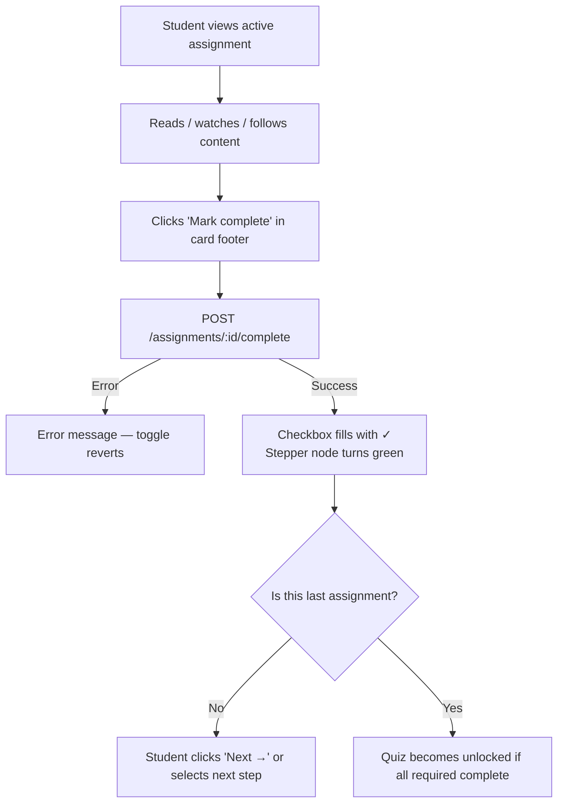
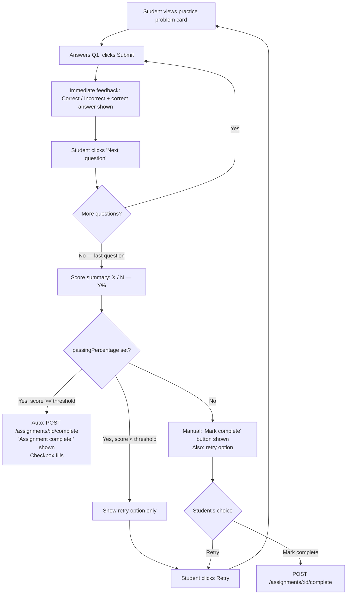

## Overview

cm-0003 adds a new **Assignment** layer to lessons. An assignment is an ordered, teacher-defined task within a lesson — one of five types: note, video, reading, vocab, or practice problem. Students progress through assignments in sequence, marking each complete.

This feature modifies a single client route: `/courses/:courseId/units/:unitId/lessons/:lessonId` (`LessonDetailPage`). The assignment list replaces the current flat resource/tool display. The "add assignment" entry is embedded inline at the bottom of the assignment list, opening a two-step modal flow. All other page chrome (left sidebar, header, `AssignmentStepper`, right student tools bar) remains unchanged.

---

## Desktop Layout

The three-column page shell is preserved exactly:

```
┌──────────────────────────────────────────────────────────────────────┐
│  [Left sidebar]          [Center column]              [Right strip]  │
│  UnitLessonSidebar       LessonDetailPage main        StudentToolsBar│
│  (unchanged)             (modified)                   (unchanged)    │
└──────────────────────────────────────────────────────────────────────┘
```

### Center Column — Teacher View

```
┌────────────────────────────────────────────────────┐
│  HEADER (unchanged)                                │
│  Lesson title                        [⚙ Settings] │
│  Lesson description                               │
├────────────────────────────────────────────────────┤
│  ASSIGNMENT STEPPER (modified)                     │
│  [📖]──[📄]──[▶]──[🔗]──[📚]──[🧠]──[📋]         │
│  Lesson Note  Video Reading Vocab  PP   Quiz       │
│  Plan                                              │
├────────────────────────────────────────────────────┤
│  MAIN SCROLL AREA                                  │
│                                                    │
│  ┌──────────────────────────────────────────────┐  │
│  │ ASSIGNMENT SECTION CARD                      │  │
│  │ bg-surface / border-border / shadow-warm-sm  │  │
│  │                                              │  │
│  │ ┌──────────────────────────────────────────┐ │  │
│  │ │ CARD HEADER  bg-surface-raised           │ │  │
│  │ │ [icon] Title text    [Required/Optional] │ │  │
│  │ │                      [↑][↓] [✏ Edit]    │ │  │
│  │ │                            [🗑 Delete]   │ │  │
│  │ └──────────────────────────────────────────┘ │  │
│  │                                              │  │
│  │  CONTENT AREA  (type-specific, see below)    │  │
│  │  px-5 py-5                                   │  │
│  │                                              │  │
│  │ ┌──────────────────────────────────────────┐ │  │
│  │ │ CARD FOOTER  border-t border-border      │ │  │
│  │ │ [ ] Mark complete              [Next →]  │ │  │
│  │ └──────────────────────────────────────────┘ │  │
│  └──────────────────────────────────────────────┘  │
│                                                    │
│  ┌──────────────────────────────────────────────┐  │
│  │ ADD ASSIGNMENT ENTRY (teacher only)          │  │
│  │ border border-dashed border-border           │  │
│  │ rounded-xl bg-transparent                    │  │
│  │                                              │  │
│  │   [+]  Add assignment                        │  │
│  │        text-muted-foreground text-sm         │  │
│  │                                              │  │
│  └──────────────────────────────────────────────┘  │
│                                                    │
└────────────────────────────────────────────────────┘
```

**Annotation — Add assignment placement:** The "+ Add assignment" entry is the last item in the assignment list, appearing immediately after the last assignment card and before the quiz step in the stepper. It is a full-width dashed-border button that looks like it belongs to the list — not a floating action or a separate section below the page content. It is only rendered when `canEdit` is true (teacher or admin role).

---

### Two-Step Add Assignment Modal

Clicking "+ Add assignment" opens a single `<Modal>` that progresses through two steps internally. No dropdown is rendered on the page — the type picker is the first screen inside the modal.

#### Step 1 — Type Picker

```
┌─────────────────────────────────────────────────────┐
│  Add Assignment                              [✕]    │
│  ─────────────────────────────────────────────────  │
│                                                     │
│  Choose a type:                                     │
│  text-sm font-medium text-muted-foreground mb-4     │
│                                                     │
│  ┌─────────────────┐   ┌─────────────────┐          │
│  │  📄              │   │  ▶              │          │
│  │  Note            │   │  Video          │          │
│  └─────────────────┘   └─────────────────┘          │
│                                                     │
│  ┌─────────────────┐   ┌─────────────────┐          │
│  │  🔗              │   │  📚             │          │
│  │  Reading         │   │  Vocab          │          │
│  └─────────────────┘   └─────────────────┘          │
│                                                     │
│  ┌─────────────────┐                               │
│  │  🧠              │                               │
│  │  Practice Problem│                               │
│  └─────────────────┘                               │
│                                                     │
│                                       [Cancel]      │
└─────────────────────────────────────────────────────┘
```

**Type picker card styles:**

- Container: `grid grid-cols-2 gap-3`
- Each card: `flex flex-col items-center justify-center gap-2 p-4 rounded-xl border border-border bg-surface-raised cursor-pointer transition-colors`
- Hover: `bg-surface border-primary/50`
- Focus (keyboard): `outline-2 outline-offset-2 outline-primary`
- Icon: `w-6 h-6 text-muted-foreground`
- Label: `text-sm font-medium text-foreground`
- Clicking a card **immediately advances to Step 2** with no additional confirmation click required.
- "Cancel" button (ghost variant) in the modal footer dismisses the entire modal with no state saved.
- X button in the modal header dismisses the entire modal with no state saved.
- Pressing Escape dismisses the entire modal with no state saved.

#### Step 2 — Assignment Form

```
┌─────────────────────────────────────────────────────┐
│  Add Note                                    [✕]    │
│  ─────────────────────────────────────────────────  │
│  [← Back]                                           │
│                                                     │
│  Title *                                            │
│  ┌─────────────────────────────────────────────┐   │
│  │ Input / text field                          │   │
│  └─────────────────────────────────────────────┘   │
│                                                     │
│  Objective (optional)                               │
│  ┌─────────────────────────────────────────────┐   │
│  │ Textarea — what should the student learn?   │   │
│  └─────────────────────────────────────────────┘   │
│                                                     │
│  ─── type-specific fields below ────────────────── │
│                                                     │
│                    [Cancel]  [Save assignment]      │
└─────────────────────────────────────────────────────┘
```

**Step 2 navigation controls:**

- "← Back" button (ghost variant, `text-muted-foreground`) appears at the top of the modal body, below the modal title bar. Clicking it returns to Step 1 and clears the form fields.
- Modal title updates to reflect the selected type: "Add Note", "Add Video", "Add Reading", "Add Vocab", "Add Practice Problem".
- X button in the modal header: dismisses the entire modal (no state saved). No confirmation dialog required — dismissal is immediate.
- "Cancel" button in the modal footer: dismisses the entire modal (no state saved). Same behavior as X.
- "Save assignment" button: submits the form. Disabled and shows a spinner during the API call.

**Discard behavior:** Because the two-step flow is fast and lightweight, there is no "are you sure?" confirmation when exiting mid-fill. The X button and Cancel button always dismiss immediately. This keeps the exit path simple and predictable.

---

### Per-Type Creation Forms (Step 2 content)

All forms appear inside Step 2 of the same modal above. Type-specific fields render below the shared Title and Objective fields.

**Note form — type-specific section:**

```
│ Content *                                           │
│ ┌─────────────────────────────────────────────────┐ │
│ │  RichTextEditor (Tiptap, same as NoteEditor)    │ │
│ │  Full toolbar: headings, bold, italic, lists,   │ │
│ │  blockquote, code, table, LaTeX                 │ │
│ └─────────────────────────────────────────────────┘ │
```

**Video form — type-specific section:**

```
│ Video URL *                                         │
│ ┌─────────────────────────────────────────────────┐ │
│ │ https://youtube.com/...                         │ │
│ └─────────────────────────────────────────────────┘ │
│ (Fetches title from GET /youtube/title on blur)     │
│                                                     │
│ Display Title (optional — auto-filled from URL)     │
│ ┌─────────────────────────────────────────────────┐ │
│ │ e.g. "Introduction to Photosynthesis"           │ │
│ └─────────────────────────────────────────────────┘ │
```

**Reading form — type-specific section:**

```
│ URL *                                               │
│ ┌─────────────────────────────────────────────────┐ │
│ │ https://...                                     │ │
│ └─────────────────────────────────────────────────┘ │
│                                                     │
│ Description (optional)                              │
│ ┌─────────────────────────────────────────────────┐ │
│ │ Textarea — context for the student              │ │
│ └─────────────────────────────────────────────────┘ │
│                                                     │
│ Estimated reading time (optional)                   │
│ ┌───────────────────────┐                           │
│ │ [ minutes ]           │  minutes                  │
│ └───────────────────────┘                           │
```

**Vocab form — type-specific section:**

```
│ Terms                                               │
│ ┌─────────────────────────────────────────────────┐ │
│ │ #1  [Term _______________] [Definition ________]│ │
│ │     [≡ drag] [↑][↓] [✕]                        │ │
│ │ #2  [Term _______________] [Definition ________]│ │
│ │     [≡ drag] [↑][↓] [✕]                        │ │
│ └─────────────────────────────────────────────────┘ │
│ [+ Add term]                                        │
```

Each row: `flex gap-2 items-start`. Term and definition inputs use `<Input>` component (`flex-1`). Move up/down buttons use `ArrowUp`/`ArrowDown` icons (`w-4 h-4 text-muted-foreground`). Delete button uses `X` icon. "+ Add term" is a ghost button.

**Practice problem form — type-specific section:**

```
│ Passing percentage (optional)                       │
│ ┌────────────────────┐                              │
│ │ [ 0–100 ]          │ %                            │
│ └────────────────────┘                              │
│ Leave empty — student marks complete manually        │
│                                                     │
│ Questions                                           │
│ ┌─────────────────────────────────────────────────┐ │
│ │ Q1  [Type ▾: multiple_choice]  [↑][↓]  [✕]     │ │
│ │     Question text: [_______________________________│ │
│ │     A [ _____ ]  B [ _____ ]  C [ _____ ]       │ │
│ │     D [ _____ ]                                  │ │
│ │     Correct answer: ( ) A  ( ) B  ( ) C  ( ) D  │ │
│ ├─────────────────────────────────────────────────┤ │
│ │ Q2  [Type ▾: true_false]       [↑][↓]  [✕]     │ │
│ │     Question text: [_______________________________│ │
│ │     Correct answer: ( ) True  ( ) False          │ │
│ └─────────────────────────────────────────────────┘ │
│ [+ Add question]                                    │
```

The question type picker is a `<select>` or dropdown with values: `multiple_choice`, `true_false`, `matching`, `fill_in_blank`. The answer fields change based on the selected type, mirroring the existing `QuestionEditor` component pattern from `features/assessments/QuestionEditor.tsx`.

---

### Edit Assignment Modal (unchanged — single step)

Editing an existing assignment opens the form directly with no type picker step, since type is immutable. The modal title is "Edit [Type]" (e.g. "Edit Note"). No "← Back" button is shown because there is no Step 1 to return to. Cancel and X dismiss without saving.

```
┌─────────────────────────────────────────────────────┐
│  Edit Note                                   [✕]    │
│  ─────────────────────────────────────────────────  │
│                                                     │
│  Title *                                            │
│  ┌─────────────────────────────────────────────┐   │
│  │ [pre-populated value]                       │   │
│  └─────────────────────────────────────────────┘   │
│                                                     │
│  Objective (optional)                               │
│  ┌─────────────────────────────────────────────┐   │
│  │ [pre-populated value]                       │   │
│  └─────────────────────────────────────────────┘   │
│                                                     │
│  ─── type-specific fields (pre-populated) ──────── │
│                                                     │
│                    [Cancel]  [Save changes]         │
└─────────────────────────────────────────────────────┘
```

---

### Center Column — Student View

The student sees the same single-active-assignment layout, but the card header shows no edit/delete/move controls. The footer shows only the completion toggle (and "Next" if not the last assignment). The "+ Add assignment" entry is not rendered for students.

**Note assignment — student content area:**

```
│  ┌─ rich-text rendered inline ──────────────────┐  │
│  │  <div class="rich-text prose">               │  │
│  │    <h2>Heading</h2>                           │  │
│  │    <p>Paragraph content...</p>                │  │
│  │  </div>                                       │  │
│  └───────────────────────────────────────────────┘  │
```

**Video assignment — student content area:**

```
│  ┌─ YouTube embed ───────────────────────────────┐  │
│  │  <iframe> youtube-nocookie.com                │  │
│  │  16:9 aspect ratio, rounded corners           │  │
│  │  (same as existing VideoCard rendering)       │  │
│  └───────────────────────────────────────────────┘  │
│  Optional display title below embed                 │
│  text-sm text-muted-foreground                      │
```

**Reading assignment — student content area:**

```
│  ┌─ Reading link card ───────────────────────────┐  │
│  │  bg-accent-subtle / border-border / rounded   │  │
│  │                                               │  │
│  │  [🔗] Open reading material ↗                 │  │
│  │       text-accent font-medium                 │  │
│  │       (opens in new tab, rel="noopener")      │  │
│  │                                               │  │
│  │  [optional] ~ 12 min read                     │  │
│  │  text-xs text-muted-foreground                │  │
│  │                                               │  │
│  │  [optional description paragraph]             │  │
│  │  text-sm text-foreground mt-2                 │  │
│  └───────────────────────────────────────────────┘  │
```

**Vocab assignment — student content area:**

```
│  ┌─ Vocab list ──────────────────────────────────┐  │
│  │  dl element (definition list semantics)       │  │
│  │                                               │  │
│  │  ┌─────────────────────────────────────────┐  │  │
│  │  │ dt  Mitochondria                        │  │  │
│  │  │     font-semibold text-foreground        │  │  │
│  │  │ dd  The powerhouse of the cell…         │  │  │
│  │  │     text-muted-foreground pl-4 mt-0.5   │  │  │
│  │  ├─────────────────────────────────────────┤  │  │
│  │  │ dt  ATP                                  │  │  │
│  │  │ dd  Adenosine triphosphate…             │  │  │
│  │  └─────────────────────────────────────────┘  │  │
│  │  divide-y divide-border                        │  │
│  └───────────────────────────────────────────────┘  │
```

**Practice problem — student content area (question runner):**

```
│  ┌─ Question runner ─────────────────────────────┐  │
│  │                                               │  │
│  │  Progress:  ██████░░░░░░  Q 2 of 5            │  │
│  │  bg-primary h-1.5 rounded-full                │  │
│  │                                               │  │
│  │  Q2: What is the powerhouse of the cell?      │  │
│  │  text-base font-medium text-foreground        │  │
│  │                                               │  │
│  │  (○) A. Nucleus                               │  │
│  │  (○) B. Mitochondria                          │  │
│  │  (○) C. Ribosome                              │  │
│  │  (○) D. Vacuole                               │  │
│  │  Radio inputs, 44px touch targets             │  │
│  │                                               │  │
│  │                        [Submit answer]        │  │
│  │                        bg-primary button      │  │
│  │                                               │  │
│  │  ── after submission ──────────────────────── │  │
│  │  [✓ Correct! / ✕ Incorrect — correct: B]     │  │
│  │  success/destructive color                    │  │
│  │                        [Next question →]      │  │
│  └───────────────────────────────────────────────┘  │
│                                                     │
│  ── after last question: score summary ─────────── │
│  ┌───────────────────────────────────────────────┐  │
│  │  Score: 4 / 5  (80%)                          │  │
│  │  text-2xl font-bold text-foreground           │  │
│  │                                               │  │
│  │  [auto-complete if passing ≥ threshold]       │  │
│  │  "Assignment complete!" (if auto-completed)   │  │
│  │  text-success                                 │  │
│  │                                               │  │
│  │  [Retry]              [Mark complete] ← only  │  │
│  │  ghost button         if no passingPct set    │  │
│  └───────────────────────────────────────────────┘  │
```

---

## Mobile Layout

The page shell collapses to a single column. The left sidebar (`UnitLessonSidebar`) becomes a drawer. The right student tools bar becomes the horizontal mobile bar above the stepper (existing pattern). No new mobile chrome is introduced.

```
┌─────────────────────────────────┐
│  HEADER                         │
│  [← Back]  Lesson title  [⚙]   │
├─────────────────────────────────┤
│  STUDENT TOOLS BAR (mobile)     │
│  [Notes] [Flashcards] [Practice]│
├─────────────────────────────────┤
│  ASSIGNMENT STEPPER (scrollable)│
│  [●][○][○][○][○][○]  Step 1 of 6│
├─────────────────────────────────┤
│  ACTIVE ASSIGNMENT CARD         │
│                                 │
│  ┌─────────────────────────────┐│
│  │ CARD HEADER                 ││
│  │ [icon] Title  [Req/Opt]     ││
│  │        (teacher: [↑][↓][✏]) ││
│  └─────────────────────────────┘│
│                                 │
│  CONTENT AREA                   │
│  (type-specific, same as        │
│   desktop, full width)          │
│                                 │
│  ┌─────────────────────────────┐│
│  │ CARD FOOTER                 ││
│  │ [✓ Mark complete]  [Next →] ││
│  └─────────────────────────────┘│
│                                 │
│  ┌─────────────────────────────┐│
│  │ Teacher only                ││
│  │ border-dashed border-border ││
│  │  [+]  Add assignment        ││
│  └─────────────────────────────┘│
└─────────────────────────────────┘
```

**Touch targets:** All interactive controls (stepper nodes, completion toggle, Next button, move up/down, edit, delete, type picker cards, quiz answer options) are a minimum of 44×44px per WCAG 2.5.5. Move up/down buttons in the card header are stacked vertically on mobile.

**Add assignment on mobile:** The dashed-border entry is full-width. Tapping it opens the two-step modal (same as desktop). The modal renders at near-full viewport height with internal scrolling (`overflow-y-auto`).

**Type picker modal on mobile:** The type card grid collapses to a single column (`grid-cols-1`) so each type card is full-width and touch-friendly (`min-h-[56px]`).

**Practice problem on mobile:** Question text and options stack vertically at full width. Radio options are spaced with `py-3` per option. Progress bar appears above the question. Submit / Next buttons are full-width on mobile (`w-full`).

**Modal forms on mobile:** `<Modal>` renders at near-full viewport height with internal scrolling (`overflow-y-auto`). Vocab and practice problem forms with multiple rows remain usable because the modal scrolls internally. The "← Back" button and X button remain visible in the modal header without scrolling.

---

## Interactive States

### Add Assignment Inline Entry (teacher only)

| State                   | Appearance                                                                           |
| ----------------------- | ------------------------------------------------------------------------------------ |
| Default                 | `border border-dashed border-border text-muted-foreground bg-transparent rounded-xl` |
| Hover                   | `border-primary/50 text-foreground bg-surface-raised`                                |
| Focus (keyboard)        | `outline-2 outline-offset-2 outline-primary`                                         |
| Loading (modal opening) | Immediate — no loading state needed                                                  |

### Type Picker Cards (Step 1 modal)

| State            | Appearance                                            |
| ---------------- | ----------------------------------------------------- |
| Default          | `bg-surface-raised border-border text-foreground`     |
| Hover            | `bg-surface border-primary/50`                        |
| Focus (keyboard) | `outline-2 outline-offset-2 outline-primary`          |
| Active (pressed) | `bg-surface-raised scale-[0.98]` — advances to Step 2 |

### Back Button (Step 2 modal header)

| State            | Appearance                                   |
| ---------------- | -------------------------------------------- |
| Default          | Ghost variant, `text-muted-foreground`       |
| Hover            | `text-foreground`                            |
| Focus (keyboard) | `outline-2 outline-offset-2 outline-primary` |

### Assignment Card — Edit / Delete / Move Controls (teacher)

| Control        | Default                 | Hover              | Disabled                        |
| -------------- | ----------------------- | ------------------ | ------------------------------- |
| Edit (pencil)  | `text-muted-foreground` | `text-foreground`  | —                               |
| Delete (trash) | `text-muted-foreground` | `text-destructive` | —                               |
| Move up ↑      | `text-muted-foreground` | `text-foreground`  | `opacity-30 cursor-not-allowed` |
| Move down ↓    | `text-muted-foreground` | `text-foreground`  | `opacity-30 cursor-not-allowed` |

### Completion Toggle (student)

| State                            | Appearance                                                                            |
| -------------------------------- | ------------------------------------------------------------------------------------- |
| Incomplete (default)             | `border-muted-foreground` checkbox, `text-muted-foreground` label                     |
| Incomplete hover                 | `text-foreground border-primary`                                                      |
| Complete                         | `bg-primary border-primary` checkbox with `✓`, `text-primary bg-primary-subtle` label |
| Auto-complete (practice problem) | Same as Complete; toggle triggers after score summary auto-POST                       |
| Disabled (locked quiz)           | `opacity-50 cursor-not-allowed`                                                       |

### Practice Problem — Answer Options

| State                   | Appearance                                                                                                                  |
| ----------------------- | --------------------------------------------------------------------------------------------------------------------------- |
| Unselected              | Radio + label `text-foreground`                                                                                             |
| Selected (pre-submit)   | Radio filled, label `font-medium text-foreground`                                                                           |
| Correct (post-submit)   | `bg-success/10 border-success text-success` row highlight                                                                   |
| Incorrect (post-submit) | `bg-destructive/10 border-destructive text-destructive` for selected; `bg-success/10 text-success` for correct answer shown |
| Disabled (after submit) | All options `pointer-events-none opacity-80`                                                                                |

### Form Fields

| State           | Appearance                                           |
| --------------- | ---------------------------------------------------- |
| Default         | `border-border bg-surface-raised`                    |
| Focus           | `border-primary outline-none ring-2 ring-primary/20` |
| Error / Invalid | `border-destructive ring-2 ring-destructive/20`      |
| Disabled        | `opacity-50 cursor-not-allowed bg-surface`           |

### Submit Button in Forms

| State                 | Appearance                              |
| --------------------- | --------------------------------------- |
| Default               | `bg-primary text-primary-foreground`    |
| Hover                 | `bg-primary/90`                         |
| Loading               | Spinner icon + `opacity-75 cursor-wait` |
| Disabled (validation) | `opacity-50 cursor-not-allowed`         |

### Assignment Stepper Nodes (extended for new types)

New assignment types (`note`, `video`, `reading`, `vocab`, `practice_problem`) follow the same stepper node pattern already established:

| State                | Appearance                                                     |
| -------------------- | -------------------------------------------------------------- |
| Incomplete (default) | `bg-surface-raised border border-border text-muted-foreground` |
| Active               | `bg-primary-subtle border-2 border-primary text-primary`       |
| Complete             | `bg-primary text-white` (shows `CheckCircle2`)                 |
| Locked               | `opacity-50 cursor-not-allowed` (shows `Lock`)                 |

---

## User Flows

### Teacher: Create an Assignment



### Teacher: Edit an Assignment



### Teacher: Delete an Assignment



### Teacher: Reorder Assignments



### Student: Complete an Assignment Manually



### Student: Complete a Practice Problem Assignment



---

## Component Inventory

### Modified Existing Components

| Component           | Location                                 | Change                                                                                                                                                                                         |
| ------------------- | ---------------------------------------- | ---------------------------------------------------------------------------------------------------------------------------------------------------------------------------------------------- |
| `LessonDetailPage`  | `features/lessons/LessonDetailPage.tsx`  | Replace flat resource/tool add buttons with inline "+ Add assignment" entry at bottom of assignment list; wire two-step modal open; extend `buildAssignmentItems` to include `assignment` kind |
| `AssignmentStepper` | `features/lessons/AssignmentStepper.tsx` | Add icon mappings for 5 new assignment types: `note`, `video`, `reading`, `vocab`, `practice_problem` (extend `StepperItem` kind and `getStepIcon`)                                            |
| `AssignmentSection` | `features/lessons/AssignmentSection.tsx` | Add Edit and Delete action buttons to the card header for `canEdit` mode; wire `onEdit` and `onDelete` props                                                                                   |

### New Components — Teacher

| Component                       | Location                                                 | Purpose                                                                                                                                                                                                                                                                             |
| ------------------------------- | -------------------------------------------------------- | ----------------------------------------------------------------------------------------------------------------------------------------------------------------------------------------------------------------------------------------------------------------------------------- |
| `AssignmentFormModal`           | `features/assignments/AssignmentFormModal.tsx`           | Two-step modal shell. Step 1: type picker grid. Step 2: shared Title + Objective fields + type-specific sub-form. Internal step state (`step: 'pick' \| 'form'`). Renders "← Back" button in Step 2. For edit mode (type known), skips Step 1 entirely and renders Step 2 directly. |
| `AssignmentTypePicker`          | `features/assignments/AssignmentTypePicker.tsx`          | Grid of type cards for Step 1. Fires `onSelect(type)` on card click. Used exclusively by `AssignmentFormModal`.                                                                                                                                                                     |
| `NoteAssignmentForm`            | `features/assignments/NoteAssignmentForm.tsx`            | `RichTextEditor` field for note content                                                                                                                                                                                                                                             |
| `VideoAssignmentForm`           | `features/assignments/VideoAssignmentForm.tsx`           | URL field + display title field (mirrors existing `VideoForm`)                                                                                                                                                                                                                      |
| `ReadingAssignmentForm`         | `features/assignments/ReadingAssignmentForm.tsx`         | URL + description `Textarea` + minutes `Input`                                                                                                                                                                                                                                      |
| `VocabAssignmentForm`           | `features/assignments/VocabAssignmentForm.tsx`           | Dynamic list of term/definition `Input` pairs with add/remove/reorder                                                                                                                                                                                                               |
| `PracticeProblemAssignmentForm` | `features/assignments/PracticeProblemAssignmentForm.tsx` | Passing percentage field + dynamic question list; re-uses `QuestionEditor` from `features/assessments/`                                                                                                                                                                             |

**Removed from previous design:** `AddAssignmentMenu` (the dropdown button + type picker list) is no longer needed. Its function is absorbed into `AssignmentFormModal` Step 1 and the inline "+ Add assignment" entry in `LessonDetailPage`.

### New Components — Student Viewers

| Component               | Location                                         | Purpose                                                                                                                         |
| ----------------------- | ------------------------------------------------ | ------------------------------------------------------------------------------------------------------------------------------- |
| `NoteAssignmentView`    | `features/assignments/NoteAssignmentView.tsx`    | Renders Tiptap JSON as `<div class="rich-text">` (same pattern as `NoteEditor` read-only)                                       |
| `VideoAssignmentView`   | `features/assignments/VideoAssignmentView.tsx`   | YouTube nocookie embed + optional title (mirrors `VideoCard` viewer)                                                            |
| `ReadingAssignmentView` | `features/assignments/ReadingAssignmentView.tsx` | Accent-subtle card with link, estimated time badge, description                                                                 |
| `VocabAssignmentView`   | `features/assignments/VocabAssignmentView.tsx`   | `<dl>` list of term/definition pairs                                                                                            |
| `PracticeProblemRunner` | `features/assignments/PracticeProblemRunner.tsx` | Sequential question runner: progress bar, question display, answer options, submit, per-question feedback, score summary, retry |

### New API Module

| Module           | Location                 | Purpose                                                 |
| ---------------- | ------------------------ | ------------------------------------------------------- |
| `assignments.ts` | `src/api/assignments.ts` | All assignment CRUD, reorder, complete/uncomplete calls |

### Reused Existing Components (no changes)

- `Modal` — wraps the two-step assignment form modal
- `ConfirmDialog` — delete confirmation
- `Input` — all single-line text fields in forms
- `Textarea` — description, objective fields
- `Button` — submit, cancel, back, retry, mark complete actions
- `RichTextEditor` — note assignment content (creation and edit)
- `QuestionEditor` — individual question editing inside `PracticeProblemAssignmentForm`
- `LoadingSpinner` — loading states within runner and form submission
- `ErrorMessage` — API error display within modals

---

## Accessibility Notes

### Page / Route Level

- `LessonDetailPage` `<main>` landmark is unchanged; assignment content remains within it.
- The active assignment section is an `<section>` with `id="assignment-{key}"` (existing pattern in `AssignmentSection`).

### Add Assignment Inline Entry

- Implemented as a `<button>` element (not a `<div>`) so it is keyboard-focusable and activatable with Enter or Space.
- `aria-label="Add assignment"` on the button.
- No `aria-haspopup` needed — clicking opens a modal, not a menu. Modal is announced by `role="dialog"` on the `<Modal>` component.

### Two-Step Modal (Add flow)

**Step 1 — Type Picker:**

- Modal has `role="dialog"` and `aria-modal="true"` (handled by existing `Modal` component).
- Modal title ("Add Assignment") is the `aria-labelledby` target.
- Each type card is a `<button>` element: `aria-label="Add [type name] assignment"` (e.g. "Add Note assignment").
- Keyboard navigation: Tab moves between cards; Enter or Space selects and advances to Step 2.
- Escape closes the modal entirely and returns focus to the "+ Add assignment" entry that opened it.
- Cancel button: `type="button"`, closes modal, returns focus to trigger.

**Step 2 — Assignment Form:**

- Modal title updates to reflect the selected type (e.g. "Add Note") — screen readers re-announce the updated `aria-labelledby` region.
- "← Back" button: `aria-label="Back to type selection"`. On activation, returns to Step 1 and moves focus to the previously selected type card (or the first card if unknown).
- X button: `aria-label="Close"`. Closes modal, returns focus to the trigger entry.
- Cancel button in footer: same behavior as X, `aria-label` not needed since text is visible.
- Required fields: `aria-required="true"` and visible `*` marker with `<span aria-hidden="true">*</span>` plus `<span class="sr-only"> (required)</span>`.
- Field errors: `<p role="alert" aria-live="polite">` beneath each field.
- Submit button: `aria-disabled="true"` and visually disabled during loading.
- Focus management on step transition (Step 1 → Step 2): focus moves to the modal title or the first form field (Title input).
- Focus management on back (Step 2 → Step 1): focus returns to the type card that was selected.

### Edit Modal (single step)

- Same as Step 2 above, except no "← Back" button is present.
- `Modal` component restores focus to the Edit trigger button on close.

### Assignment Forms — Shared

- Form fields use `<label>` elements associated via `htmlFor` / `id`.
- Field errors are rendered in `<p role="alert" aria-live="polite">` beneath each field.
- The form submit button is disabled and `aria-disabled="true"` during loading.

### Vocab Form — Term/Definition Pairs

- Each row has an accessible group label: `<fieldset>` with `<legend>Term {n}</legend>` (visually hidden with `sr-only` on the legend, but announced by screen readers).
- Delete button: `aria-label="Remove term {n}"`.
- Move up: `aria-label="Move term {n} up"`. Move down: `aria-label="Move term {n} down"`.

### Practice Problem Form — Question Builder

- Each question block is a `<fieldset>` with `<legend>Question {n}</legend>`.
- Question type `<select>` has `aria-label="Question {n} type"`.
- Delete question: `aria-label="Remove question {n}"`.

### Practice Problem Runner (Student)

- Progress bar: `<div role="progressbar" aria-valuenow={current} aria-valuemin={1} aria-valuemax={total} aria-label="Question {n} of {total}">`.
- Answer options are `<input type="radio">` within a `<fieldset>` with `<legend>` containing the question text.
- After submission, feedback is in `<p role="alert">` for immediate screen reader announcement.
- Submit button text changes from "Submit answer" to "Next question" after feedback is shown; the change is announced via `aria-live="polite"` on the button container.
- Score summary: `<h3>` heading ("Your score") followed by the score value, so screen readers reach it in document order.
- Retry button: `aria-label="Retry practice problem"`.

### Assignment Card Header — Edit / Delete / Move Controls

- Edit button: `aria-label="Edit {assignment title}"`.
- Delete button: `aria-label="Delete {assignment title}"`.
- Move up: `aria-label="Move {assignment title} up"`.
- Move down: `aria-label="Move {assignment title} down"`.
- Disabled move buttons: `disabled` attribute + `aria-disabled="true"`.

### Completion Toggle

- Uses existing `AssignmentSection` completion toggle pattern (unchanged).
- When auto-completed by practice problem score, announce with `aria-live="polite"` region: "Assignment automatically marked complete."

### Reading Assignment View

- External link has `target="_blank" rel="noopener noreferrer"` and includes `<span class="sr-only"> (opens in new tab)</span>`.
- Estimated time: `<span aria-label="{n} minute read">{n} min read</span>`.

### Vocab Assignment View

- `<dl>` semantics: each pair is a `<div>` containing `<dt>` (term) and `<dd>` (definition).
- No additional ARIA needed beyond semantic HTML.

### Color Contrast

- All text on `bg-surface` and `bg-surface-raised` uses `text-foreground` (`#1e1e24` on `#f0ede8` — > 7:1 ratio).
- `text-muted-foreground` (`#6e6860`) on `bg-surface` (`#f0ede8`) — ~4.5:1; acceptable for non-body text (labels, meta).
- Success feedback (`#16a34a`) on `#e8f5e4` — ~4.7:1 (passes AA).
- Destructive feedback (`#dc2626`) on `#fef2f2`-equivalent — ~4.8:1 (passes AA).
- Accent link (`#085287`) on `bg-accent-subtle` (`#e0eef8`) — ~6.1:1 (passes AA).

### Keyboard Navigation Order

Within the active assignment card:

1. Card header title (non-interactive, skip)
2. Required/Optional badge (non-interactive)
3. Edit button (teacher only)
4. Delete button (teacher only)
5. Move up / Move down buttons (teacher only)
6. Assignment content area (type-specific tab stops within)
7. Completion toggle button (student footer)
8. Next button (student footer)

After the last assignment card (teacher only): 9. "+ Add assignment" inline entry button

---

## Required Token Additions

No new tokens required.

All colors, spacing, shadows, and typography needed by this feature are satisfied by the existing design system:

- `bg-surface`, `bg-surface-raised`, `bg-background`, `bg-primary`, `bg-primary-subtle`, `bg-accent-subtle`, `bg-destructive`, `bg-success`
- `text-foreground`, `text-muted-foreground`, `text-primary`, `text-accent`, `text-destructive`, `text-success`
- `border-border`
- `shadow-warm-sm`, `shadow-warm-md`
- The `rich-text` CSS class (already defined in `index.css`) covers note assignment rendering.
