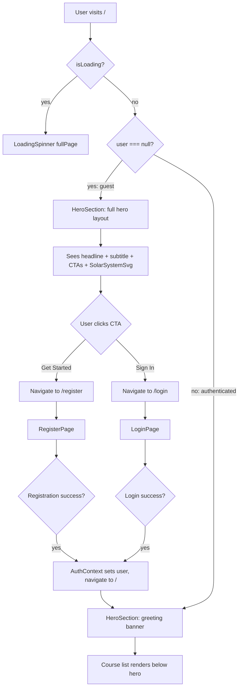

# Wireframe: Redesign Landing Page Hero Section

## 1. Overview

This wireframe covers the redesigned `HeroSection` component located at `client/src/features/home/HeroSection.tsx`. The feature serves two distinct user populations:

- **Unauthenticated guests** — presented with a full-bleed dark hero with marketing copy, two CTA buttons, and an animated solar system SVG illustration.
- **Authenticated users** — shown a compact greeting banner with no illustration, no subtitle, and no CTAs.

The component is rendered by `HomePage` (`client/src/features/home/HomePage.tsx`), which already passes a `loggedIn` boolean prop derived from `useAuth()`. No route changes are required. The feature adds one new component, `SolarSystemSvg` (`client/src/features/home/SolarSystemSvg.tsx`), and modifies `HeroSection`.

Affected client route: `/` (HomePage).

---

## 2. Desktop Layout (1280px+)

### State 1 — Unauthenticated Guest

```
┌─────────────────────────────────────────────────────────────────────────────┐
│  <section>  background: #0a0a16  w-full                                     │
│  padding: py-20 px-6                                                        │
│                                                                             │
│  ┌─────────────────────────────────────────────────────────────────────┐   │
│  │  <div>  max-w-7xl mx-auto  grid grid-cols-2 gap-12 items-center     │   │
│  │                                                                     │   │
│  │  ┌──────────────────────────────┐  ┌──────────────────────────────┐ │   │
│  │  │  LEFT COLUMN                 │  │  RIGHT COLUMN                │ │   │
│  │  │  flex flex-col justify-center│  │  flex items-center           │ │   │
│  │  │                              │  │  justify-center              │ │   │
│  │  │  <h1>                        │  │                              │ │   │
│  │  │  "Master anything,           │  │  <SolarSystemSvg />          │ │   │
│  │  │   one lesson at a time."     │  │  aria-hidden="true"          │ │   │
│  │  │  text-5xl font-bold          │  │  ~480×480px                  │ │   │
│  │  │  color: #ffffff              │  │  (see section 2a below)      │ │   │
│  │  │  tracking-tight              │  │                              │ │   │
│  │  │  leading-tight               │  │                              │ │   │
│  │  │  mb-5                        │  │                              │ │   │
│  │  │                              │  │                              │ │   │
│  │  │  <p>                         │  └──────────────────────────────┘ │   │
│  │  │  subtitle text               │                                   │   │
│  │  │  text-lg                     │                                   │   │
│  │  │  color: rgba(255,255,255,0.7)│                                   │   │
│  │  │  mb-8  leading-relaxed       │                                   │   │
│  │  │  max-w-lg                    │                                   │   │
│  │  │                              │                                   │   │
│  │  │  <div>  flex gap-4           │                                   │   │
│  │  │  ┌─────────────────┐         │                                   │   │
│  │  │  │ [Get Started]   │         │                                   │   │
│  │  │  │ Button primary  │         │                                   │   │
│  │  │  │ size="lg"       │         │                                   │   │
│  │  │  │ /register       │         │                                   │   │
│  │  │  └─────────────────┘         │                                   │   │
│  │  │  ┌──────────────────┐        │                                   │   │
│  │  │  │ [Sign In]        │        │                                   │   │
│  │  │  │ outlined variant │        │                                   │   │
│  │  │  │ size="lg"        │        │                                   │   │
│  │  │  │ /login           │        │                                   │   │
│  │  │  └──────────────────┘        │                                   │   │
│  │  └──────────────────────────────┘                                   │   │
│  └─────────────────────────────────────────────────────────────────────┘   │
└─────────────────────────────────────────────────────────────────────────────┘
```

**Annotation notes:**

- The outer `<section>` background is the hardcoded value `#0a0a16`. This is NOT a design token — it is a local inline style or a one-off Tailwind arbitrary value `bg-[#0a0a16]`. It intentionally contrasts with the page `bg-background` (#faf9f7 light / #1a1917 dark) to create a full-bleed dark band regardless of theme.
- Headline: `text-white` (always white against #0a0a16; contrast ratio > 18:1, exceeds AA). Font size `text-5xl` (3rem) on desktop.
- Subtitle: `text-white/70` (70% white, contrast ratio ~5.5:1 on #0a0a16, passes AA for normal text).
- The `<section>` has no `border-b` — the visual separation from page content is achieved by the background color contrast alone.
- The two-column grid collapses at the `md` breakpoint (see Section 3).

**"Sign In" button variant note:** The existing `Button` component's `secondary` variant (`bg-surface border border-border`) renders with a warm off-white background — this will not be legible against the #0a0a16 dark background. The implementor must apply a custom class override to produce an outlined style with white border and transparent background: `className="border border-white/60 bg-transparent text-white hover:bg-white/10"`. This does not require a new Button variant — a className override on the `<Link>`-wrapped Button is sufficient.

---

### 2a. SolarSystemSvg Zone Annotation

```
┌───────────────────────────────────────────────────┐
│  <svg>  viewBox="0 0 480 480"  aria-hidden="true"  │
│  role="img"  focusable="false"                     │
│                                                    │
│  ┌─────────────────────────────────────────────┐   │
│  │  STAR FIELD LAYER (background)              │   │
│  │  ~30-50 small <circle> elements             │   │
│  │  Scattered across full viewBox              │   │
│  │  3 twinkle animation variants               │   │
│  │  opacity oscillates 0.2→1.0→0.2            │   │
│  │  durations: 2s, 3s, 4s (staggered)         │   │
│  └─────────────────────────────────────────────┘   │
│                                                    │
│            ☀  SUN  (cx=240 cy=240)                │
│            r=28  fill=#FDB813                      │
│            pulse animation: scale 1→1.08→1         │
│            duration: 3s  ease-in-out infinite      │
│                                                    │
│  ORBIT RINGS (concentric, center=240,240)          │
│  Each ring: stroke=<planet-color>/30  fill=none    │
│                                                    │
│  r=52   MERCURY   fill=#b5b5b5  r_planet=4         │
│  r=76   VENUS     fill=#e8cda0  r_planet=5         │
│  r=100  EARTH     fill=#4fa3e0  r_planet=6         │
│  r=128  MARS      fill=#c1440e  r_planet=5         │
│  r=164  JUPITER   fill=#c88b3a  r_planet=10        │
│  r=196  SATURN    fill=#e8d5a3  r_planet=8         │
│         + ring decoration  (ellipse, tilted)       │
│  r=230  URANUS    fill=#7de8e8  r_planet=7         │
│  r=262  NEPTUNE   fill=#5b7fdb  r_planet=7         │
│                                                    │
│  ANIMATION SPEEDS (CSS keyframe, rotate 360deg)    │
│  Mercury:  3s   (base)                             │
│  Venus:    7.5s  (2.5× Mercury)                    │
│  Earth:    12s   (4× Mercury)                      │
│  Mars:     22.5s (7.5× Mercury)                    │
│  Jupiter:  142s  (47.5× Mercury)                   │
│  Saturn:   353s  (117.7× Mercury)                  │
│  Uranus:   1008s (336× Mercury)                    │
│  Neptune:  1978s (659× Mercury)                    │
│                                                    │
│  Each planet is a <g transform-origin="240 240">   │
│  with CSS animation: orbitN <Ns> linear infinite   │
│  The planet <circle> is offset from center by r    │
│                                                    │
└───────────────────────────────────────────────────┘
```

**Orbit speed rationale:** Proportional to real orbital period ratios, but Mercury is clamped to 3s (base) as specified in FR-11. Speeds increase geometrically: Venus ≈2.5×, Earth ≈4×, Mars ≈7.5×, Jupiter ≈47.5×, Saturn ≈118×, Uranus ≈336×, Neptune ≈659×. Outer planets effectively appear stationary to the user, which is visually appropriate.

**Orbit track colors:** Each `<circle>` ring stroke uses the same fill hue as its planet at ~30% opacity: e.g., Earth orbit ring `stroke="#4fa3e0" stroke-opacity="0.3"`.

**prefers-reduced-motion:** The existing global rule in `index.css` already handles this:
```css
@media (prefers-reduced-motion: reduce) {
  *, *::before, *::after {
    animation-duration: 0.01ms !important;
    animation-iteration-count: 1 !important;
  }
}
```
No additional CSS is needed inside `SolarSystemSvg` — all animations will pause automatically.

---

### State 2 — Authenticated User (Greeting Banner)

```
┌─────────────────────────────────────────────────────────────────────────────┐
│  <section>  background: #0a0a16  w-full                                     │
│  padding: py-8 px-6                                                         │
│                                                                             │
│  ┌─────────────────────────────────────────────────────────────────────┐   │
│  │  <div>  max-w-7xl mx-auto                                           │   │
│  │                                                                     │   │
│  │  <h1>                                                               │   │
│  │  "Welcome back, [user.name]."                                       │   │
│  │  text-3xl font-bold text-white                                      │   │
│  │  tracking-tight                                                     │   │
│  │                                                                     │   │
│  └─────────────────────────────────────────────────────────────────────┘   │
└─────────────────────────────────────────────────────────────────────────────┘
```

**Annotation notes:**

- No SVG, no subtitle, no CTAs (FR-07).
- Reduced vertical padding (`py-8` vs `py-20`) signals compactness.
- `user.name` is sourced from `useAuth()` in `HomePage`, passed to `HeroSection` as a prop. The component receives it as an optional `userName?: string` prop alongside the existing `loggedIn` boolean.
- Heading is `<h1>` to maintain document outline — the course list below uses `<h2>`.

---

## 3. Mobile Layout (< 640px)

### State 1 — Unauthenticated Guest

```
┌──────────────────────────────────┐
│  <section>  bg-[#0a0a16]  w-full │
│  py-12 px-5                      │
│                                  │
│  ┌──────────────────────────────┐ │
│  │  flex flex-col items-center  │ │
│  │  text-center                 │ │
│  │                              │ │
│  │  <h1>                        │ │
│  │  "Master anything,           │ │
│  │   one lesson at a time."     │ │
│  │  text-4xl font-bold          │ │
│  │  text-white mb-4             │ │
│  │                              │ │
│  │  <p>                         │ │
│  │  subtitle text               │ │
│  │  text-base text-white/70     │ │
│  │  mb-7  leading-relaxed       │ │
│  │                              │ │
│  │  <div>  flex flex-col gap-3  │ │
│  │  w-full sm:flex-row          │ │
│  │  ┌────────────────────────┐  │ │
│  │  │  [Get Started]  w-full │  │ │
│  │  │  Button primary lg     │  │ │
│  │  └────────────────────────┘  │ │
│  │  ┌────────────────────────┐  │ │
│  │  │  [Sign In]      w-full │  │ │
│  │  │  outlined variant lg   │  │ │
│  │  └────────────────────────┘  │ │
│  │                              │ │
│  │  ┌────────────────────────┐  │ │
│  │  │  <SolarSystemSvg />    │  │ │
│  │  │  320×320px  mt-8       │  │ │
│  │  │  aria-hidden="true"    │  │ │
│  │  └────────────────────────┘  │ │
│  └──────────────────────────────┘ │
└──────────────────────────────────┘
```

**Responsive reflow notes:**

- Two-column desktop grid becomes `flex flex-col` on mobile (single column, `md:grid md:grid-cols-2`).
- Text alignment: `text-center` on mobile, `text-left` on desktop (`md:text-left`).
- SVG moves below the text and CTAs on mobile. SVG size reduces: `w-full max-w-[320px]` on mobile, fixed `w-[480px]` on desktop.
- CTA buttons stack vertically on mobile (`flex-col w-full`), arrange in a row on tablet+ (`sm:flex-row sm:w-auto`).
- Touch target for both CTA buttons: `size="lg"` Button yields `py-3` (12px top+bottom) + text height ~24px = ~48px total, exceeding the 44px WCAG minimum.

### State 2 — Authenticated User (Mobile)

```
┌──────────────────────────────────┐
│  <section>  bg-[#0a0a16]  w-full │
│  py-6 px-5                       │
│                                  │
│  <h1>                            │
│  "Welcome back, [name]."         │
│  text-2xl font-bold text-white   │
└──────────────────────────────────┘
```

### Tablet (768px–1024px)

The two-column grid uses `md:grid-cols-2`. At tablet widths the grid is active — text left, SVG right — but both columns are narrower. SVG size: `w-full` inside its column (approximately 320–400px). No separate tablet-specific wireframe is needed; the `md:` breakpoint transition from stacked to grid handles it.

---

## 4. Interactive States

### "Get Started" Button (primary variant, /register)

| State | Visual Treatment |
|---|---|
| Default | `bg-primary` (#138808 light / #17a009 dark), white text, `shadow-warm-sm`, `rounded-2xl` |
| Hover | `hover:brightness-110` — green brightens slightly |
| Focus-visible | `focus-visible:ring-2 focus-visible:ring-primary focus-visible:ring-offset-2` — green ring, ring-offset on #0a0a16 background will be dark |
| Active/Pressed | Browser default active styling via brightness |
| Disabled | `opacity-50 cursor-not-allowed` (not applicable here — always enabled) |

**Note on focus-ring contrast:** `focus-visible:ring-offset-2` creates a 2px gap between the button and the ring. On the dark #0a0a16 background this offset gap will appear dark, ensuring the green ring is visible. This is acceptable contrast.

### "Sign In" Button (outlined/custom variant, /login)

| State | Visual Treatment |
|---|---|
| Default | `border border-white/60 bg-transparent text-white rounded-2xl shadow-none` |
| Hover | `hover:bg-white/10` — subtle white fill appears |
| Focus-visible | `focus-visible:ring-2 focus-visible:ring-white focus-visible:ring-offset-2 focus-visible:ring-offset-[#0a0a16]` — white ring |
| Active/Pressed | Browser default |
| Disabled | Not applicable |

### Solar System SVG (decorative, no interaction)

| State | Treatment |
|---|---|
| All states | `aria-hidden="true"` — invisible to assistive technology. No focus states, no hover states, no keyboard interaction. `focusable="false"` attribute on `<svg>` element. |
| Reduced motion | All `@keyframes` animations freeze at `0.01ms` duration per the global `index.css` rule. Planets, sun pulse, and star twinkle all stop. |

### Greeting Banner (authenticated state)

No interactive elements. The `<h1>` is static text.

---

## 5. User Flows



**Auth-gate notes:**

- `HomePage` checks `user !== null` (from `useAuth()`). `useAuth()` is already consumed in `HomePage` and `loggedIn` is passed to `HeroSection` — no change to this flow.
- `isLoading` from `useAuth()` is handled at the `HomePage` level (`if (loading) return <LoadingSpinner fullPage />`), so `HeroSection` always receives a settled `loggedIn` value.

---

## 6. Component Inventory

| Component | File | Status | Notes |
|---|---|---|---|
| `HeroSection` | `client/src/features/home/HeroSection.tsx` | Modify existing | Accept `userName?: string` prop in addition to existing `loggedIn`. Render two conditional branches. |
| `SolarSystemSvg` | `client/src/features/home/SolarSystemSvg.tsx` | Create new | Inline SVG with scoped `<style>` block containing all keyframe animations. No props needed. |
| `HomePage` | `client/src/features/home/HomePage.tsx` | Modify existing | Pass `userName={user?.name ?? ''}` to `HeroSection`. Minimal change. |
| `Button` | `client/src/components/Button.tsx` | No change | The "Sign In" CTA uses `className` override on the `<Link>`-wrapped instance, not a new variant. |

**Component decision rationale:** `SolarSystemSvg` is extracted as a separate component (per spec NFR-01 and the component listed in the spec's Systems-Level Architecture) to keep `HeroSection` readable. The SVG is complex (~200+ lines) and self-contained.

---

## 7. Accessibility Notes

### Hero Section Container `<section>`

| Concern | Requirement |
|---|---|
| Landmark role | `<section>` element implicitly creates a landmark. Add `aria-label="Hero"` so it is distinguishable in screen reader landmark navigation. |
| Keyboard navigation | No traps. Tab moves naturally from hero CTAs to rest of page. |

### Headline `<h1>`

| Concern | Requirement |
|---|---|
| Heading hierarchy | `<h1>` in the hero. The course list section uses `<h2 class="text-2xl ...">My Courses</h2>`. Document outline is correct. |
| Color contrast | `text-white` (#ffffff) on `#0a0a16` background: ratio ~21:1. Well above AA (4.5:1 normal, 3:1 large). |

### Subtitle `<p>`

| Concern | Requirement |
|---|---|
| Color contrast | `text-white/70` = rgba(255,255,255,0.7) on #0a0a16. Approximate contrast ratio: ~8:1. Passes AA for normal text (4.5:1 required). |

### CTA Buttons

| Concern | Requirement |
|---|---|
| Keyboard access | Both rendered as `<button>` via shared `Button` component. Keyboard-reachable via Tab. |
| Focus visible ring | Built into `Button`: `focus-visible:ring-2 focus-visible:ring-primary`. The "Sign In" outlined button should override ring color to `focus-visible:ring-white` for visibility on dark background. |
| Link wrapping | CTAs use `<Link to="..."><Button>...</Button></Link>` — the `<Link>` renders as `<a>`, which has native keyboard support. The inner `<Button>` renders as `<button>` inside `<a>`, which is technically invalid HTML. **Use `asChild` pattern or render `Button` as a styled `<Link>` directly to avoid nested interactive elements.** Preferred: `<Link to="/register" className="...tailwind classes...">Get Started</Link>` using the same visual styles as Button primary lg, without nesting a `<button>` inside `<a>`. |
| Touch target | `size="lg"` = `px-6 py-3 text-base rounded-2xl`. Rendered height ~48px. Width is auto. Both meet 44×44px minimum. |

### Solar System SVG

| Concern | Requirement |
|---|---|
| Decorative mark | `aria-hidden="true"` on `<svg>`. Screen readers skip entirely. |
| No keyboard focus | `focusable="false"` attribute on `<svg>` (required for SVG in IE/Edge legacy; still recommended). No `tabindex` on any child element. |
| No role needed | Since `aria-hidden="true"` hides the element entirely, no `role="img"` or `<title>` is needed. If `aria-hidden` were removed, a `<title>` with id and `aria-labelledby` would be required. |

### Greeting Banner (authenticated state)

| Concern | Requirement |
|---|---|
| Heading level | `<h1>` — same reasoning as guest hero. If the course list `<h2>` is present on the same page, document outline remains valid. |
| Color contrast | `text-white` on #0a0a16: ~21:1 ratio. Passes AA. |
| Dynamic content | When the user transitions from guest to authenticated (after login), the hero changes. No `aria-live` needed — the full page re-renders and the new `<h1>` is read naturally on focus/navigation. |

### Reduced Motion

The project's existing `index.css` global rule covers all animations:
```css
@media (prefers-reduced-motion: reduce) {
  *, *::before, *::after {
    animation-duration: 0.01ms !important;
    animation-iteration-count: 1 !important;
    transition-duration: 0.01ms !important;
  }
}
```
This satisfies FR-12 without any per-component media query. All solar system keyframes, sun pulse, and star twinkle animations will effectively freeze at their starting frame.

---

## 8. Required Token Additions

The `#0a0a16` hero background is intentionally a one-off value — it is the only hardcoded color in the feature and is specific to this section's visual identity. It does not belong in the global design token system.

However, one minor addition is recommended to avoid scattering the literal value across the codebase:

- `--hero-bg`: Purpose: dark background for the landing page hero section. Suggested value: `#0a0a16`. Define in `:root` (no `.dark` override needed — this value is fixed regardless of theme). Reference in `HeroSection` via `bg-[--hero-bg]` (Tailwind CSS 4 arbitrary CSS variable syntax) or as a class if added to `@theme inline`.

If the team prefers not to add a token for a single-use value, using `bg-[#0a0a16]` as a Tailwind arbitrary value directly in the component is also acceptable. Either approach is valid.

All other colors referenced in this wireframe (`text-white`, `text-white/70`, `bg-primary`, `bg-transparent`, `border-white/60`) use standard Tailwind utility values that do not require token additions.

No new shadow, spacing, or typography tokens are required.
