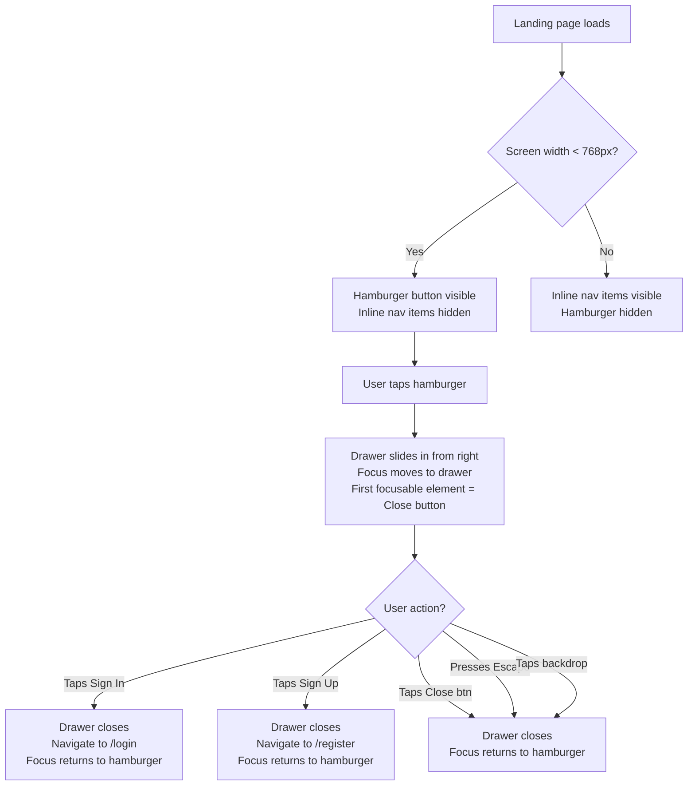
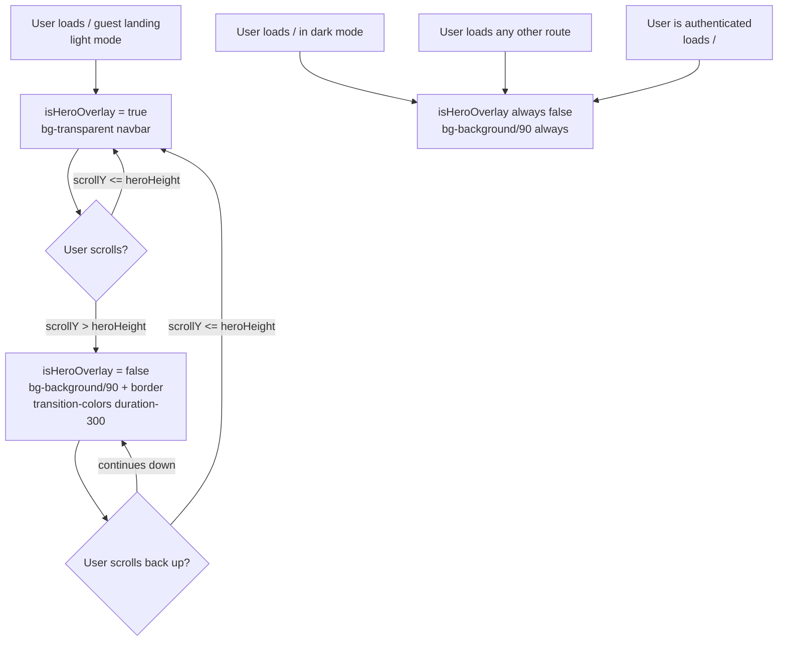

# Wireframe: Home Page UI Polish (cm-0024)

## 1. Overview

This feature delivers four focused visual improvements to the guest landing page and the signed-in home page, plus a global token migration that applies across multiple feature components.

**User goal:** The guest landing page presents a polished, contrast-correct first impression in both light and dark mode. Authenticated users see clearly-defined course cards that don't bleed into the page background. On mobile, all nav actions are accessible via a slide-out drawer rather than invisible inline items.

**Routes affected:**
- `/` — `HomePage` (renders either `LandingPage` guest variant or `CourseListPage` authenticated variant)
- All routes that render inside `<Layout>` (the sticky navbar and mobile drawer are global)

**Components modified:**
- `client/src/components/Layout.tsx` — mobile drawer + hero-overlay navbar
- `client/src/features/home/HeroSection.tsx` — signed-in hero separation
- `client/src/features/home/HomePage.tsx` — course list card-area background
- `client/src/features/courses/CourseCard.tsx` — border visibility in light mode
- `client/src/index.css` — `--success` dark token value
- Token migration only (no structural change): `ResourceCompletionCheckbox.tsx`, `LessonStatusIcon.tsx`, `UnitTestCard.tsx`, `UnitCard.tsx`, `LearningResourceNav.tsx`, `ExamCard.tsx`

---

## 2. Desktop Layout

Desktop layout is structurally unchanged. The changes at this breakpoint are:
1. Token corrections (colors) in the navbar and across feature components.
2. Hero-overlay navbar state (light mode only, guest page only).
3. Course card definition on the signed-in home page.

### 2a. Navbar — Desktop (no structural change)

```
┌─────────────────────────────────────────────────────────────────────────────────┐
│  HEADER  sticky top-0 z-40                                                      │
│  [STANDARD STATE]  bg-background/90 backdrop-blur-md border-b border-border     │
│  [HERO-OVERLAY STATE] bg-transparent (light) — see Section 3 for detail         │
│                                                                                 │
│  px-6 py-4  flex items-center justify-between                                   │
│                                                                                 │
│  ┌──────────────────────┐        ┌────────────────────────────────────────────┐ │
│  │ GraduationCap icon   │        │  [Theme toggle] [Sign In] [Sign Up]        │ │
│  │ "Course Masters"     │        │  — unauthenticated                         │ │
│  │ text-green-primary   │        │                                            │ │
│  │ (was text-primary,   │        │  [Theme toggle] [Admin?] [Profile] [Logout]│ │
│  │  token unchanged)    │        │  — authenticated                           │ │
│  └──────────────────────┘        └────────────────────────────────────────────┘ │
└─────────────────────────────────────────────────────────────────────────────────┘
```

**Token note:** The `text-primary` token on the brand logo already resolves to `--green-primary` via the alias table. No structural change needed; the color migration on other components replaces raw `green-500`/`green-600` utilities with explicit named tokens (`bg-green-primary`, `text-green-primary`, `bg-green-surface`, `text-green-surface-text`).

### 2b. Guest Landing Page — Desktop

```
┌─────────────────────────────────────────────────────────────────────────────────┐
│  NAVBAR  [transparent/dark-tinted in light mode when hero is in view]           │
├─────────────────────────────────────────────────────────────────────────────────┤
│                                                                                 │
│  HERO SECTION  bg-hero-deep  (#0a0a16)  py-20 px-6                             │
│                                                                                 │
│  ┌────────────────────────────┐   ┌─────────────────────────────────────────┐  │
│  │  h1: "Master anything,     │   │                                         │  │
│  │   one lesson at a time."   │   │      SolarSystemSvg (decorative)        │  │
│  │  text-white                │   │      aria-hidden="true"                 │  │
│  │                            │   │                                         │  │
│  │  p: subheading text/70     │   │                                         │  │
│  │                            │   └─────────────────────────────────────────┘  │
│  │  [Get Started]  bg-primary │                                                 │
│  │  [Sign In]  border-white   │                                                 │
│  └────────────────────────────┘                                                 │
│                                                                                 │
├─────────────────────────────────────────────────────────────────────────────────┤
│  BELOW HERO — navbar transitions to standard opaque state (scroll threshold)    │
└─────────────────────────────────────────────────────────────────────────────────┘
```

### 2c. Signed-In Home Page — Desktop

```
┌─────────────────────────────────────────────────────────────────────────────────┐
│  NAVBAR  [always opaque: bg-background/90 backdrop-blur-md border-b border-b]   │
├─────────────────────────────────────────────────────────────────────────────────┤
│                                                                                 │
│  SIGNED-IN HERO  bg-surface  py-10 px-5  md:py-14 md:px-6                      │
│  border-b border-border  ← NEW: separates hero from card area below             │
│                                                                                 │
│  ┌─────────────────────────────────────────────────────────────────────────┐   │
│  │  h1: "Welcome back, {name}."  text-foreground                           │   │
│  │  max-w-7xl mx-auto                                                       │   │
│  └─────────────────────────────────────────────────────────────────────────┘   │
│                                                                                 │
├─ border-b separates hero from course list area ─────────────────────────────────┤
│                                                                                 │
│  COURSE LIST  px-6 pt-8                                                         │
│  bg-background  (page background — white in light mode)                         │
│                                                                                 │
│  "My Courses"  h2  +  [+ New Course] button (teacher/admin only)                │
│                                                                                 │
│  ┌──────────────────────┐  ┌──────────────────────┐  ┌──────────────────────┐  │
│  │  COURSE CARD         │  │  COURSE CARD         │  │  COURSE CARD         │  │
│  │  bg-surface (#F9FAFB)│  │  bg-surface (#F9FAFB)│  │  bg-surface (#F9FAFB)│  │
│  │  border border-border│  │  border border-border│  │  border border-border│  │
│  │  (#E5E7EB light)     │  │  (#E5E7EB light)     │  │  (#E5E7EB light)     │  │
│  │  shadow-warm-sm      │  │  shadow-warm-sm      │  │  shadow-warm-sm      │  │
│  │  rounded-2xl         │  │  rounded-2xl         │  │  rounded-2xl         │  │
│  │  ─────────────────── │  │                      │  │                      │  │
│  │  [green accent bar]  │  │  [green accent bar]  │  │  [green accent bar]  │  │
│  │  h-1.5 bg-primary    │  │  h-1.5 bg-primary    │  │  h-1.5 bg-primary    │  │
│  │  ─────────────────── │  │                      │  │                      │  │
│  │  Course Title        │  │  Course Title        │  │  Course Title        │  │
│  │  description text    │  │                      │  │                      │  │
│  │  [N units badge]     │  │  [N units badge]     │  │  [N units badge]     │  │
│  └──────────────────────┘  └──────────────────────┘  └──────────────────────┘  │
│                                                                                 │
└─────────────────────────────────────────────────────────────────────────────────┘
```

**Card definition note:** `CourseCard` already uses `bg-surface` and `border-border`. The key change is ensuring the tokens resolve to sufficiently contrasting values in light mode. The `--surface` token maps to `#F9FAFB` and `--border` maps to `#E4E4E7` in light mode, giving the card a 1px visible edge against the `#FFFFFF` page background. No structural change to `CourseCard` is needed — only verification that the token values produce visible contrast.

---

## 3. Mobile Layout

### 3a. Mobile Navbar — Hamburger Visible (drawer closed)

```
┌────────────────────────────────────────────┐
│  HEADER  sticky top-0 z-40  px-4 py-4      │
│  [STANDARD]  bg-background/90 border-b     │
│  [HERO OVERLAY]  transparent/dark-tinted   │
│                                            │
│  ┌──────────────────┐  ┌────────────────┐  │
│  │ GraduationCap    │  │  ☰ Hamburger   │  │
│  │ "Course Masters" │  │  w-11 h-11     │  │  ← 44×44px touch target (WCAG 2.1 AA)
│  │ text-primary     │  │  rounded-xl    │  │
│  └──────────────────┘  └────────────────┘  │
│                                            │
│  All inline nav items are HIDDEN at <md:   │
│  - Theme toggle  → moved into drawer       │
│  - Sign In / Sign Up  → moved into drawer  │
│  - Admin / Profile / Logout  → in drawer   │
└────────────────────────────────────────────┘
│                                            │
│  PAGE CONTENT (Outlet)                     │
│  ...                                       │
└────────────────────────────────────────────┘
```

**Hamburger button classes:**
```
md:hidden  w-11 h-11  flex items-center justify-center
text-muted-foreground hover:text-foreground
transition-colors  rounded-xl  hover:bg-surface
```
aria-label="Open navigation menu"
aria-expanded={drawerOpen}
aria-controls="mobile-nav-drawer"

### 3b. Mobile Navbar — Drawer Open

```
┌────────────────────────────────────────────┐
│  HEADER (same as above, behind overlay)    │
│  Hamburger → aria-expanded="true"          │
└────────────────────────────────────────────┘

┌────────────────────────────────────────────┐  ← Full-screen overlay
│  BACKDROP                                  │  bg-black/40  z-50
│  (tap to close)                            │  covers entire viewport
│  ┌──────────────────────────────────────┐  │
│  │  DRAWER  z-60                        │  │  ← slides in from right
│  │  fixed top-0 right-0                 │  │
│  │  h-full  w-72 (max w-[80vw])         │  │
│  │  bg-background                       │  │
│  │  border-l border-border              │  │
│  │  shadow-warm-lg                      │  │
│  │  flex flex-col                       │  │
│  │                                      │  │
│  │  ┌────────────────────────────────┐  │  │
│  │  │  DRAWER HEADER  px-4 py-4      │  │  │
│  │  │  flex items-center justify-    │  │  │
│  │  │  between border-b border-border│  │  │
│  │  │                                │  │  │
│  │  │  "Course Masters"              │  │  │
│  │  │  text-primary  font-semibold   │  │  │
│  │  │                  [✕ Close]     │  │  │
│  │  │                  w-9 h-9 btn   │  │  │  ← aria-label="Close navigation menu"
│  │  └────────────────────────────────┘  │  │
│  │                                      │  │
│  │  DRAWER BODY  flex-1 overflow-y-auto │  │
│  │  px-4 py-4  flex flex-col gap-1      │  │
│  │                                      │  │
│  │  [UNAUTHENTICATED]                   │  │
│  │  ┌────────────────────────────────┐  │  │
│  │  │  Sign In           →  /login   │  │  │
│  │  │  ghost nav item                │  │  │
│  │  └────────────────────────────────┘  │  │
│  │  ┌────────────────────────────────┐  │  │
│  │  │  Sign Up           →  /register│  │  │
│  │  │  primary nav item (filled)     │  │  │
│  │  └────────────────────────────────┘  │  │
│  │                                      │  │
│  │  [AUTHENTICATED]                     │  │
│  │  ┌────────────────────────────────┐  │  │
│  │  │  👤 {user.name}  →  /profile   │  │  │
│  │  └────────────────────────────────┘  │  │
│  │  ┌────────────────────────────────┐  │  │  ← admin-only
│  │  │  🛡 Admin      →  /admin/users │  │  │
│  │  └────────────────────────────────┘  │  │
│  │                                      │  │
│  │  ─── divider ──────────────────────  │  │
│  │                                      │  │
│  │  DRAWER FOOTER  border-t border-border│ │
│  │  px-4 py-4  flex flex-col gap-2      │  │
│  │                                      │  │
│  │  ┌────────────────────────────────┐  │  │
│  │  │  ☀/☾ Dark Mode toggle          │  │  │
│  │  │  flex items-center justify-    │  │  │
│  │  │  between  text-muted-foreground│  │  │
│  │  └────────────────────────────────┘  │  │
│  │  ┌────────────────────────────────┐  │  │  ← authenticated only
│  │  │  Sign Out  (full-width button) │  │  │
│  │  │  variant="ghost" danger color  │  │  │
│  │  └────────────────────────────────┘  │  │
│  └──────────────────────────────────────┘  │
└────────────────────────────────────────────┘
```

**Drawer animation:** `translate-x-0` (open) / `translate-x-full` (closed) with `transition-transform duration-300 ease-in-out`.

**Touch targets in drawer:** All nav item rows must be at minimum `min-h-[44px]` with `flex items-center`.

### 3c. Mobile — Signed-In Home Page (cards stacked)

```
┌────────────────────────────────────────────┐
│  NAVBAR (hamburger visible)                │
├────────────────────────────────────────────┤
│  SIGNED-IN HERO  bg-surface                │
│  border-b border-border                    │
│  py-10 px-5                                │
│  "Welcome back, {name}."                   │
├────────────────────────────────────────────┤
│  COURSE LIST  px-6 pt-8                    │
│                                            │
│  "My Courses"  [+ New Course]              │
│                                            │
│  ┌──────────────────────────────────────┐  │
│  │  COURSE CARD                         │  │
│  │  bg-surface  border border-border    │  │
│  │  rounded-2xl  shadow-warm-sm         │  │
│  │  [green accent bar h-1.5 bg-primary] │  │
│  │  Course Title                        │  │
│  │  description (line-clamp-2)          │  │
│  │  [N units badge]                     │  │
│  └──────────────────────────────────────┘  │
│  ┌──────────────────────────────────────┐  │
│  │  COURSE CARD                         │  │
│  │  ...                                 │  │
│  └──────────────────────────────────────┘  │
└────────────────────────────────────────────┘
```

Cards use `grid-cols-1` at mobile, `sm:grid-cols-2` at 640px, `lg:grid-cols-3` at 1024px (existing layout, unchanged).

---

## 4. Interactive States

### 4a. Hamburger Button

| State | Appearance |
|---|---|
| Default | `text-muted-foreground` icon, no background |
| Hover | `text-foreground`, `bg-surface` fill on `rounded-xl` |
| Focus-visible | `outline-none ring-2 ring-green-primary ring-offset-2` |
| Active/Pressed | Same as hover with slight brightness drop |
| Drawer open | `aria-expanded="true"` — no visual change to button itself (drawer provides context) |
| Disabled | N/A — always enabled |

### 4b. Drawer Backdrop

| State | Appearance |
|---|---|
| Default (drawer closed) | Not rendered (conditional render or `opacity-0 pointer-events-none`) |
| Drawer open | `bg-black/40` full-screen overlay, `z-50` |
| Tap | Closes drawer |

### 4c. Drawer Nav Items (links and buttons)

| State | Appearance |
|---|---|
| Default | `text-text-primary` (or `text-muted-foreground`), `bg-transparent`, `py-2.5 px-3 rounded-xl` |
| Hover | `bg-surface` background |
| Focus-visible | `ring-2 ring-green-primary ring-offset-2` |
| Active/Pressed | `bg-surface` with brief opacity flash |
| Current route | `bg-green-surface text-green-surface-text font-medium` |
| Sign Out button | `text-destructive hover:bg-destructive/10` |

### 4d. Dark Mode Toggle (inside drawer)

| State | Appearance |
|---|---|
| Light mode active | Sun icon, label "Light mode" |
| Dark mode active | Moon icon, label "Dark mode" |
| Hover | Row background `bg-surface` |
| Focus-visible | `ring-2 ring-green-primary` |

aria-label="Switch to {dark/light} mode" — updates dynamically.

### 4e. Navbar Hero-Overlay Transition

| State | Trigger | Appearance |
|---|---|---|
| Transparent (hero visible) | Guest landing page (`/`), light mode, scroll position ≤ hero bottom | `bg-transparent` — no background, no border, no shadow |
| Transition | Scroll crosses hero bottom edge | CSS `transition-colors duration-300` |
| Opaque (scrolled past hero) | Scroll position > hero bottom OR dark mode OR any non-`/` page | `bg-background/90 backdrop-blur-md border-b border-border shadow-warm-sm` (existing standard state) |
| Dark mode (any page) | `.dark` class on `<html>` | Always opaque — the transparent state applies to light mode guest hero only |
| Non-hero page | Any authenticated route, or `/login`, `/register` | Always opaque — transparent state never applies |

**Implementation note:** A `useScrolled` state (boolean) toggled by `window.addEventListener('scroll')` compares `scrollY` against the hero section's `offsetHeight`. The route check (`location.pathname === '/'`) and auth check (`!user`) gate whether scroll tracking is active at all. The `isHeroOverlay` derived boolean drives a conditional class string on the `<header>`.

### 4f. Course Card (light mode definition)

| State | Appearance |
|---|---|
| Default | `bg-surface (#F9FAFB)`, `border border-border (#E4E4E7)`, `shadow-warm-sm`, `rounded-2xl` |
| Hover | `shadow-warm-md`, `-translate-y-0.5` (existing) |
| Focus-within (link) | Link shows `focus-visible:ring-2 ring-green-primary` |
| Edit/delete actions | Fade in on `group-hover` (existing) |

Dark mode token swap is automatic — `bg-surface` and `border-border` both have dark-mode values defined in `index.css`.

### 4g. Signed-In Hero Separation

| State | Appearance |
|---|---|
| Default | `bg-surface border-b border-border` — hairline bottom border creates separation from page background |
| Dark mode | `border-border` resolves to dark border token automatically (no `dark:` prefix needed) |

---

## 5. User Flows

### 5a. Mobile Navigation — Unauthenticated



### 5b. Mobile Navigation — Authenticated

```mermaid
flowchart TD
    A[Authenticated page loads] --> B[Hamburger visible, inline nav hidden]
    B --> C[User taps hamburger]
    C --> D[Drawer opens\nShows: Profile, Admin?, Dark Mode toggle, Sign Out]
    D --> E{User action?}
    E -- Taps Profile --> F[Drawer closes\nNavigate to /profile]
    E -- Taps Admin --> G[Drawer closes\nNavigate to /admin/users]
    E -- Taps Sign Out --> H[Drawer closes\nlogout() called\nNavigate to /]
    E -- Toggles Dark Mode --> I[Theme toggled\nDrawer stays open]
    E -- Dismisses --> J[Drawer closes\nFocus to hamburger]
```

### 5c. Navbar Hero-Overlay — Guest Landing Page, Light Mode



---

## 6. Component Inventory

| Component | File | Status | Changes |
|---|---|---|---|
| `Layout` | `client/src/components/Layout.tsx` | Existing — modified | Add `drawerOpen` state, hamburger button (`md:hidden`), `MobileDrawer` (inline or extracted), scroll-listener for hero-overlay, `isHeroOverlay` derived class logic |
| `MobileDrawer` | `client/src/components/MobileDrawer.tsx` OR inline in `Layout.tsx` | New or inline | Slide-out drawer with backdrop, focus trap, Escape handler, nav items, dark mode toggle, sign out — design decision left to frontend plan |
| `HeroSection` | `client/src/features/home/HeroSection.tsx` | Existing — modified | Add `border-b border-border` to the signed-in variant (`loggedIn === true`) to separate from course list area |
| `CourseCard` | `client/src/features/courses/CourseCard.tsx` | Existing — verify | Already uses `bg-surface border-border`; verify token values produce visible contrast in light mode. No code change expected unless token definitions require updating. |
| `HomePage` | `client/src/features/home/HomePage.tsx` | Existing — verify | Course list container uses `bg-background` (white in light mode); cards sit on top. May need `bg-background` to be explicit on the container if page background changes. |
| `ResourceCompletionCheckbox` | `client/src/components/ResourceCompletionCheckbox.tsx` | Existing — token migration | Replace `bg-green-500/10`, `text-green-600`, `bg-green-500/20`, `bg-green-500`, `border-green-500` with design tokens |
| `LessonStatusIcon` | `client/src/components/LessonStatusIcon.tsx` | Existing — token migration | Replace `bg-green-500`, `border-green-500` |
| `UnitTestCard` | `client/src/features/tests/UnitTestCard.tsx` | Existing — token migration | Replace `bg-green-500`, `border-green-500` |
| `UnitCard` | `client/src/features/units/UnitCard.tsx` | Existing — token migration | Replace `bg-green-500`, `text-green-500`, `text-green-600` |
| `LearningResourceNav` | `client/src/features/lessons/LearningResourceNav.tsx` | Existing — token migration | Replace `text-green-500` |
| `ExamCard` | `client/src/features/exams/ExamCard.tsx` | Existing — token migration | Replace `bg-green-500`, `text-green-600` |
| `index.css` | `client/src/index.css` | Existing — token value update | Update `--success` in `.dark` block from `#22c55e` to `#16a34a` |
| `Button` | `client/src/components/Button.tsx` | Existing — unchanged | Used in drawer for Sign In / Sign Up actions |
| `Footer` | `client/src/components/Footer.tsx` | Existing — unchanged | Not affected |

**MobileDrawer extraction decision:** The drawer is substantial enough (focus trap, Escape handler, nav items, backdrop, animation) to warrant its own file as `client/src/components/MobileDrawer.tsx`. This keeps `Layout.tsx` readable and allows the drawer to be tested in isolation. The frontend plan should confirm this.

---

## 7. Accessibility Notes

### Hamburger Button
- `aria-label="Open navigation menu"`
- `aria-expanded={drawerOpen}` — dynamically reflects drawer state
- `aria-controls="mobile-nav-drawer"` — links button to drawer element
- Minimum 44×44px touch target (`w-11 h-11` = 44px at 4px base)
- Keyboard: `Enter` and `Space` activate (native `<button>` behavior)
- Focus ring: `focus-visible:ring-2 focus-visible:ring-green-primary focus-visible:ring-offset-2`

### Mobile Drawer
- `role="dialog"` on the drawer container
- `aria-modal="true"` — informs screen readers that content outside is inert
- `aria-label="Navigation"` on the drawer container
- `id="mobile-nav-drawer"` — referenced by hamburger's `aria-controls`
- **Focus trap:** On open, focus moves to the first focusable element (Close button). Tab/Shift+Tab cycle within drawer only. Focus must not escape to the page behind the backdrop.
- **Focus return:** On close (any method), focus returns to the hamburger button via `hamburgerRef.current?.focus()`.
- **Escape key:** `keydown` listener on the drawer element (or `document`) closes drawer when key is `Escape`.
- **Backdrop:** `aria-hidden="true"` on the backdrop element — it is interactive (tap to close) but the semantic action is expressed via the `role="dialog"` container.
- Close button: `aria-label="Close navigation menu"`, minimum 36×36px (`w-9 h-9`)

### Drawer Nav Links and Buttons
- All nav items use `<Link>` (renders `<a>`) or `<button>` — never `<div onClick>`
- Each item has visible focus ring (`focus-visible:ring-2 ring-green-primary`)
- Current-route item: `aria-current="page"` on the active `<Link>`
- Sign Out: `<button>` with `aria-label="Sign out"` if icon-only, or visible text label

### Dark Mode Toggle (in drawer)
- `<button>` with dynamic `aria-label`: `"Switch to dark mode"` / `"Switch to light mode"`
- Icon updates (Sun/Moon) with screen-reader text via visually-hidden `<span>` if no visible label

### Hero-Overlay Navbar
- No ARIA changes required for the visual state transition
- Ensure `border-b` and `shadow` are always present in the opaque state so there is sufficient visual separation (non-color cue for low-vision users)
- In the transparent state on the guest hero, the navbar text (brand name `text-white`) must maintain contrast against `bg-hero-deep (#0a0a16)`:
  - White (`#FFFFFF`) on `#0a0a16`: ~19:1 contrast — AAA
- The `transition-colors duration-300` must not cause flash of unstyled content (NFR-01): initialize state synchronously based on `scrollY` on mount, not after first effect

### Course Cards
- `border border-border` provides a non-color structural cue for the card boundary (supports users who cannot distinguish `#F9FAFB` from `#FFFFFF` by hue alone)
- Card title link (`<Link>`) has `focus-visible:ring-2` focus ring
- Edit/delete buttons: existing `aria-label="Edit course"` / `aria-label="Delete course"` — unchanged

### Signed-In Hero Section
- `<section aria-label="Hero">` — existing, unchanged
- `border-b border-border` provides visual separation without relying solely on background color change

### Color Contrast — Token Migration Targets

The following token substitutions must maintain or improve AA contrast:

| Usage | Old (raw) | Replacement token | Light value | Contrast vs. white bg |
|---|---|---|---|---|
| Completion checkbox filled bg | `bg-green-500` (#22c55e) | `bg-green-primary` (#047857) | #047857 | 5.1:1 — AA normal text |
| Success text | `text-green-600` (#16a34a) | `text-green-primary` (#047857) | #047857 | 5.1:1 — AA normal text |
| Subtle wash bg | `bg-green-500/10` | `bg-green-surface` (#ECFDF5) | — | Background, not text |
| Text on wash bg | `text-green-600` on `bg-green-500/10` | `text-green-surface-text` (#065F46) on `bg-green-surface` | 7.2:1 | AAA normal text |

All substitutions meet or exceed the original contrast ratios.

### Screen Reader Announcements
- Drawer open/close: `aria-modal` and `role="dialog"` are sufficient — screen readers announce modal context automatically
- Loading states in `HomePage` use existing `<LoadingSpinner fullPage />` — `aria-live` region not required here as the page replaces entirely

---

## 8. Required Token Additions

No new tokens required.

All design decisions in this feature are covered by the existing token set:

- Transparent navbar state uses `bg-transparent` (a Tailwind built-in utility, not a custom token)
- Drawer background uses `bg-background`
- Drawer border uses `border-border`
- Card surface uses `bg-surface` (already on `CourseCard`)
- Card border uses `border-border` (already on `CourseCard`)
- Hero separation border uses `border-border`
- The `--success` dark-mode token value update in `index.css` is a value correction, not a new token

The `bg-hero-deep` token (`#0a0a16`) used for the guest hero background is already defined in `index.css` and used by the existing `HeroSection`.
