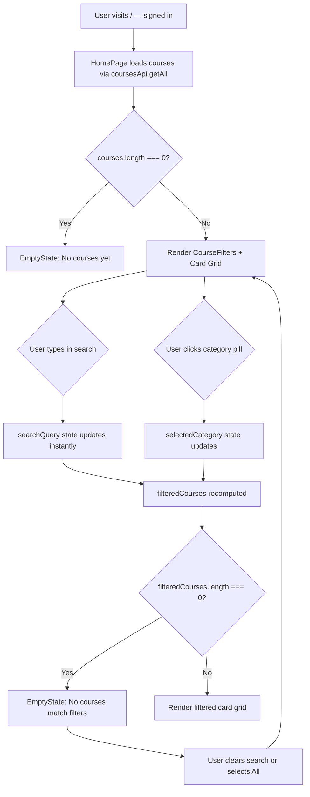
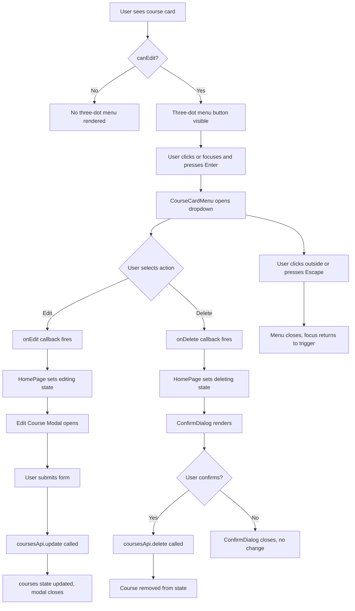
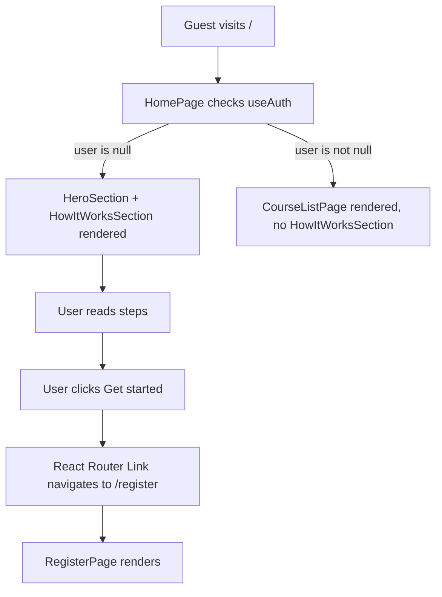

/approve .claude/designs/cm-0025/wireframe.md---
id: cm-0025
title: Landing Page Card & How It Works Updates
stage: design
status: approved
approver: human
approved_at: 2026-05-26T00:00:00Z
---

# Landing Page Card & How It Works Updates

## 1. Overview

This wireframe covers two distinct frontend-only changes to the `/` route (`HomePage`):

1. **Course Card Grid (signed-in users)** — replaces the existing 2-column card grid with a 3-column responsive grid featuring redesigned cards (subject-colored icon, three-dot action menu, category tag pill, unit/lesson count footer) plus a search input and category filter bar above the grid.

2. **How It Works Section (signed-out users)** — a new section rendered below `HeroSection` for guest visitors, showing three color-coded platform benefit steps with a connecting line and a CTA button linking to `/register`.

Components affected:
- `client/src/features/home/HomePage.tsx` — add search/filter state, conditional rendering of `HowItWorksSection`, section header refactor
- `client/src/features/courses/CourseCard.tsx` — full redesign
- New: `client/src/features/home/HowItWorksSection.tsx`
- New: `client/src/features/courses/CourseFilters.tsx`
- New: `client/src/features/courses/CourseCardMenu.tsx`

Auth gates: course grid renders only for authenticated users (via `useAuth()`). How It Works renders only for guests. Three-dot menu renders only when `useCanEdit()` returns true (teacher/admin roles). "New Course" button also gated by `useCanEdit()`.

---

## 2. Course Card Grid (Signed In)

### Section Header + Filter Bar

```
┌─────────────────────────────────────────────────────────────────────────────┐
│  SIGNED-IN VIEW — courses section (id="courses", px-6 pt-8 scroll-mt-20)   │
│                                                                             │
│  ┌─────────────────────────────────┬───────────────────────────────────┐   │
│  │  My Courses                     │              [+ New Course]       │   │
│  │  text-2xl font-bold             │              Button variant=      │   │
│  │  text-text-primary              │              primary, size=md     │   │
│  │  tracking-tight                 │              bg-green-button      │   │
│  └─────────────────────────────────┴───────────────────────────────────┘   │
│  ↑ flex items-center justify-between mb-4                                  │
│  ↑ "New Course" only rendered when canEdit === true                         │
│                                                                             │
│  ┌─────────────────────────────────────────────────────────────────────┐   │
│  │  🔍  Search courses...                                               │   │
│  │      Input, full width, rounded-xl, border-border, bg-surface       │   │
│  │      pl-10 (icon offset), text-text-primary, placeholder=           │   │
│  │      text-text-secondary                                             │   │
│  └─────────────────────────────────────────────────────────────────────┘   │
│  ↑ CourseFilters component, mb-4                                            │
│                                                                             │
│  ┌────────────────────────────────────────────────────────────────────┐    │
│  │ [All ✓] [Mathematics] [Language] [Science] [Music] [Other]        │    │
│  │  pill active: bg-green-surface text-green-surface-text             │    │
│  │  pill inactive: bg-surface border-border-subtle text-text-secondary│    │
│  │  gap-2 flex-wrap                                                   │    │
│  └────────────────────────────────────────────────────────────────────┘    │
│  ↑ CourseFilters component, mb-6                                            │
│                                                                             │
│  ┌──────────────────┐  ┌──────────────────┐  ┌──────────────────┐         │
│  │   CourseCard     │  │   CourseCard     │  │   CourseCard     │         │
│  └──────────────────┘  └──────────────────┘  └──────────────────┘         │
│  ┌──────────────────┐  ┌──────────────────┐  ┌──────────────────┐         │
│  │   CourseCard     │  │   CourseCard     │  │   CourseCard     │         │
│  └──────────────────┘  └──────────────────┘  └──────────────────┘         │
│  ↑ grid grid-cols-1 md:grid-cols-2 lg:grid-cols-3 gap-5                   │
│                                                                             │
│  EMPTY STATE — no matching courses (filter/search zero results)             │
│  ┌─────────────────────────────────────────────────────────────────────┐   │
│  │                  [ Search icon ]                                     │   │
│  │            No courses match your filters                            │   │
│  │       Try a different search term or category                       │   │
│  └─────────────────────────────────────────────────────────────────────┘   │
│  ↑ EmptyState component — only shown when filteredCourses.length === 0     │
│    but courses.length > 0 (distinct from "no courses yet" empty state)      │
└─────────────────────────────────────────────────────────────────────────────┘
```

**Behavior notes:**
- Search input filters by `course.title` (case-insensitive substring). Updates `searchQuery` state in `HomePage`.
- Active category pill stores in `selectedCategory` state. "All" resets to show everything.
- Both filters apply simultaneously: `filteredCourses = courses.filter(c => matchesSearch && matchesCategory)`.
- When `courses.length === 0` (before any courses exist), render the existing "No courses yet" `EmptyState`.
- When `filteredCourses.length === 0 && courses.length > 0`, render a distinct filter-empty `EmptyState`.

---

## 3. Course Card — Desktop

```
┌──────────────────────────────────────────────────────┐
│ rounded-2xl bg-surface border border-border-subtle   │
│ shadow-warm-sm hover:shadow-warm-md                  │
│ hover:-translate-y-0.5 transition-all overflow-hidden│
│                                                      │
│ ┌──────────┬─────────────────────────────┬────────┐ │
│ │[■ Icon  ]│                             │  [···] │ │
│ │ 48×48px  │                             │ 32×32  │ │
│ │ rounded-xl                             │ button │ │
│ │ bg-green-surface (or blue/orange)      │        │ │
│ │ text-green-primary icon color          │        │ │
│ └──────────┴─────────────────────────────┴────────┘ │
│  ↑ flex items-start justify-between gap-2 mb-3       │
│  ↑ Icon container: p-3 rounded-xl                    │
│  ↑ Icon: w-6 h-6 lucide icon (BookOpen, Beaker, etc.)│
│  ↑ Three-dot: only when canEdit; MoreVertical icon   │
│                                                      │
│ Introduction to Algebra                              │
│ text-base font-semibold text-text-primary            │
│ hover:text-green-primary transition-colors           │
│ Link to /courses/:courseId                           │
│                                                      │
│ Learn the fundamentals of algebra including          │
│ variables, equations, and graphing...                │
│ text-sm text-text-secondary line-clamp-2 mb-3       │
│                                                      │
│ [Mathematics]                                        │
│  bg-blue-surface text-blue-surface-text              │
│  (color varies by category — see token mapping)      │
│  text-xs font-semibold px-2.5 py-0.5 rounded-full   │
│  mb-4                                                │
│                                                      │
│ ┌──────────────────────────────────────────────────┐ │
│ │ 📦 4 units  ·  📖 12 lessons                     │ │
│ │ text-xs text-text-secondary                      │ │
│ │ flex items-center gap-4                          │ │
│ │ border-t border-border-subtle pt-3 mt-auto       │ │
│ └──────────────────────────────────────────────────┘ │
└──────────────────────────────────────────────────────┘
```

**Icon color assignment (deterministic by index mod 3):**
- Index % 3 === 0: `bg-green-surface`, `text-green-primary`, lucide `BookOpen`
- Index % 3 === 1: `bg-blue-surface`, `text-blue-accent`, lucide `Beaker` or `FlaskConical`
- Index % 3 === 2: `bg-orange-surface`, `text-orange-surface-text`, lucide `Music` or `Star`

**Category pill token mapping (static list):**
- Mathematics: `bg-blue-surface text-blue-surface-text`
- Science: `bg-green-surface text-green-surface-text`
- Language: `bg-orange-surface text-orange-surface-text`
- Music: `bg-blue-surface text-blue-surface-text`
- Other / default: `bg-surface border border-border-subtle text-text-secondary`

**Lesson count note:** The spec acknowledges that `GET /courses` does not currently return lesson counts. The card footer should show `unitCount` (already available via `course._count.units`), and a derived lesson count only if available. If lesson count is unavailable, show only unit count in the footer. The implementation plan should resolve whether to expose lesson counts in the API response or omit the lesson count badge for now.

---

## 4. Course Card — Mobile (Horizontal Row)

Below 768px (`md` breakpoint), the card switches from a vertical stacked layout to a horizontal row layout.

```
┌─────────────────────────────────────────────────────────────────────┐
│ rounded-2xl bg-surface border border-border-subtle shadow-warm-sm   │
│ p-4 flex flex-row gap-3 items-start                                 │
│                                                                     │
│ ┌──────────┐  ┌─────────────────────────────────────┬────────────┐ │
│ │ [■ Icon] │  │ Introduction to Algebra             │   [···]    │ │
│ │  48×48   │  │ font-semibold text-text-primary     │ top-right  │ │
│ │ shrink-0 │  │ text-sm                             │ canEdit    │ │
│ │          │  │                                     │ only       │ │
│ │          │  │ Learn the fundamentals of algebra   │            │ │
│ │          │  │ line-clamp-2 text-xs text-secondary │            │ │
│ │          │  │                                     │            │ │
│ │          │  │ [Mathematics]  📦 4 units           │            │ │
│ │          │  │  tag pill      unit count badge     │            │ │
│ │          │  │  text-xs       text-xs text-secondary            │ │
│ │          │  │  flex items-center gap-2 mt-2       │            │ │
│ └──────────┘  └─────────────────────────────────────┴────────────┘ │
│  ↑ icon column  ↑ content column, flex-1                            │
│  shrink-0                                                           │
└─────────────────────────────────────────────────────────────────────┘
```

**Responsive approach:** The card component uses a single responsive class set. Desktop: `flex-col`, mobile: `flex-row`. Implement with `flex flex-row md:flex-col`. The footer separator (`border-t`) is hidden on mobile; the category pill and unit count are displayed inline in the content area.

**Touch targets:** The three-dot menu button is at minimum 44×44px (`min-h-[44px] min-w-[44px]`). The card itself is a link-wrapped area with adequate tap size.

---

## 5. Three-Dot Card Menu

The `CourseCardMenu` component renders a `MoreVertical` icon button that toggles a floating dropdown. Only rendered when `canEdit === true`.

```
┌──────────────────────────────────┐
│  [···] button                    │
│  w-8 h-8 (min 44×44 touch area) │
│  rounded-lg                      │
│  text-text-secondary             │
│  hover:bg-surface-raised         │
│  hover:text-text-primary         │
│  aria-label="Course options"     │
│  aria-haspopup="menu"            │
│  aria-expanded={isOpen}          │
└──────────┬───────────────────────┘
           │ (opens below/above depending on viewport position)
           ▼
┌────────────────────────────────────┐
│ bg-surface-raised                  │
│ border border-border-subtle        │
│ rounded-xl shadow-warm-md          │
│ py-1 min-w-[140px]                 │
│ role="menu"                        │
│                                    │
│  ┌──────────────────────────────┐  │
│  │  ✏  Edit Course              │  │
│  │  px-3 py-2 text-sm           │  │
│  │  text-text-primary           │  │
│  │  hover:bg-surface            │  │
│  │  flex items-center gap-2     │  │
│  │  role="menuitem"             │  │
│  └──────────────────────────────┘  │
│  ┌──────────────────────────────┐  │
│  │  🗑  Delete Course            │  │
│  │  px-3 py-2 text-sm           │  │
│  │  text-destructive            │  │
│  │  hover:bg-surface            │  │
│  │  flex items-center gap-2     │  │
│  │  role="menuitem"             │  │
│  └──────────────────────────────┘  │
└────────────────────────────────────┘
```

**Positioning:** Absolute, positioned relative to the card's top-right area. `absolute top-full right-0 mt-1 z-10`. The dropdown must not overflow the viewport on cards in the rightmost column; position logic should check available space or use `right-0` anchoring consistently.

**State table:**

| State | Visual |
|---|---|
| Default (closed) | Three-dot icon, `text-text-secondary`, no dropdown |
| Hover (button) | `bg-surface-raised`, `text-text-primary` |
| Focus (button) | `focus-visible:ring-2 focus-visible:ring-green-primary` outline |
| Open | Dropdown visible, button remains highlighted |
| Edit item hover | `bg-surface` row highlight |
| Delete item hover | `bg-surface` row highlight, `text-destructive` color retained |
| Clicking Edit | Calls `onEdit()`, closes menu |
| Clicking Delete | Calls `onDelete()`, closes menu, triggers `ConfirmDialog` in parent |
| Click outside | Menu closes (`useEffect` listening to `document mousedown`) |
| Escape key | Menu closes, focus returns to the trigger button |

---

## 6. How It Works Section — Desktop

Rendered in `HomePage` below `HeroSection` when `!loggedIn`. Uses a dark/contrasting background (`bg-hero-deep`) to visually separate from the hero and the empty guest state below.

```
┌─────────────────────────────────────────────────────────────────────────────┐
│  HowItWorksSection                                                          │
│  bg-hero-deep (theme-invariant dark background, matches hero)               │
│  py-20 px-6                                                                 │
│                                                                             │
│                     How It Works                                            │
│                     text-3xl font-bold text-white                           │
│                     text-center mb-4                                        │
│                                                                             │
│       Start learning — or teaching — in minutes.                            │
│       text-base text-white/70 text-center mb-16                             │
│                                                                             │
│  ┌────────────────────────────────────────────────────────────────────────┐ │
│  │                                                                        │ │
│  │   ┌─────────────────────┐                ┌─────────────────────────┐  │ │
│  │   │    STEP BLOCK 1     │ ─── line ───── │     STEP BLOCK 2        │  │ │
│  │   └─────────────────────┘                └─────────────────────────┘  │ │
│  │           ─── line ────────────────────────────── line ───            │ │
│  │                                                                        │ │
│  │  grid grid-cols-3 gap-8 relative (contains the connecting line)        │ │
│  └────────────────────────────────────────────────────────────────────────┘ │
│                                                                             │
│  STEP BLOCK detail (each of three):                                         │
│                                                                             │
│  ┌──────────────────────────────┐                                          │
│  │ flex flex-col items-center   │                                          │
│  │ text-center relative         │                                          │
│  │                              │                                          │
│  │ [■ Icon Container]           │                                          │
│  │   w-16 h-16 rounded-2xl      │                                          │
│  │   flex items-center justify-center                                      │
│  │   mb-4                       │                                          │
│  │   Step 1: bg-green-surface   │                                          │
│  │   Step 2: bg-blue-surface    │                                          │
│  │   Step 3: bg-orange-surface  │                                          │
│  │                              │                                          │
│  │   Icon: w-8 h-8              │                                          │
│  │   Step 1: text-green-primary │                                          │
│  │   Step 2: text-blue-accent   │                                          │
│  │   Step 3: text-orange-surface-text  ← surface-text, not accent          │
│  │                              │                                          │
│  │ [Step 1]                     │                                          │
│  │   badge pill above title     │                                          │
│  │   text-xs font-bold uppercase│                                          │
│  │   px-3 py-1 rounded-full     │                                          │
│  │   Step 1: bg-green-surface text-green-surface-text                      │
│  │   Step 2: bg-blue-surface text-blue-surface-text                        │
│  │   Step 3: bg-orange-surface text-orange-surface-text                    │
│  │   mb-3                       │                                          │
│  │                              │                                          │
│  │ Build your course            │                                          │
│  │ text-xl font-bold text-white │                                          │
│  │ mb-2                         │                                          │
│  │                              │                                          │
│  │ Create units, add lessons,   │                                          │
│  │ upload resources and tools   │                                          │
│  │ text-sm text-white/70        │                                          │
│  │ max-w-[200px] mx-auto        │                                          │
│  └──────────────────────────────┘                                          │
│                                                                             │
│  CONNECTING LINE (desktop only):                                            │
│  Horizontal rule centered at the icon row height.                          │
│  Absolute-positioned pseudo-element or dedicated div inside the grid       │
│  container, z-index below the step blocks.                                 │
│  border-t border-white/20 absolute top-8 left-1/6 right-1/6               │
│  (positioned to pass through icon centers, not extend to grid edges)       │
│                                                                             │
│                  ┌──────────────────────────────┐                          │
│                  │ Get started — it's free →    │                          │
│                  │ Button variant=primary        │                          │
│                  │ size=lg                       │                          │
│                  │ bg-green-button               │                          │
│                  │ text-green-button-text        │                          │
│                  │ Link to /register             │                          │
│                  └──────────────────────────────┘                          │
│                  mt-16 flex justify-center                                 │
└─────────────────────────────────────────────────────────────────────────────┘
```

**Step content:**

| Step | Badge | Title | Description | Icon |
|---|---|---|---|---|
| 1 | Step 1 | Build your course | Create units, add lessons, upload resources and tools for your students. | `BookOpen` |
| 2 | Step 2 | Add learning tools | Include flash cards, practice problems, and vocab to reinforce every lesson. | `Layers` or `Puzzle` |
| 3 | Step 3 | Track your progress | Students complete lessons, take quizzes, and earn a course certificate. | `TrendingUp` or `BarChart2` |

**Orange step note:** `text-orange-surface-text` is used for the step 3 icon color rather than `text-orange-accent-foreground`, because `orange-accent` as a background with white foreground only passes AA for large text. The icon appears on `bg-orange-surface` (light wash background), so `text-orange-surface-text` is the correct WCAG-safe pairing.

---

## 7. How It Works — Mobile

Below 768px (`md` breakpoint), the three steps stack vertically. The connecting line shifts to a vertical rule on the left side of the step column.

```
┌────────────────────────────────────────────────────┐
│  bg-hero-deep py-16 px-6                          │
│                                                    │
│          How It Works                              │
│          text-2xl font-bold text-white text-center │
│          mb-3                                      │
│                                                    │
│  Start learning or teaching in minutes.            │
│  text-sm text-white/70 text-center mb-12           │
│                                                    │
│  ┌──────────────────────────────────────────────┐  │
│  │  flex flex-col gap-10 relative               │  │
│  │                                              │  │
│  │  │  ← vertical connecting line              │  │
│  │  │    absolute left-6 top-8 bottom-8         │  │
│  │  │    border-l border-white/20               │  │
│  │  │    z-0                                   │  │
│  │  │                                          │  │
│  │  ├──────────────────────────────────────┐   │  │
│  │  │  flex flex-row items-start gap-4     │   │  │
│  │  │                                      │   │  │
│  │  │  ┌──────────┐  ┌──────────────────┐  │   │  │
│  │  │  │[■ Icon]  │  │ [Step 1]         │  │   │  │
│  │  │  │ w-12 h-12│  │  badge pill      │  │   │  │
│  │  │  │ rounded-xl  │ Build your course│  │   │  │
│  │  │  │ bg-green-   │  text-lg         │  │   │  │
│  │  │  │  surface│  │  font-bold        │  │   │  │
│  │  │  │ shrink-0│  │  text-white mb-1  │  │   │  │
│  │  │  │ z-10    │  │                  │  │   │  │
│  │  │  │ relative│  │  Create units,   │  │   │  │
│  │  │  └─────────┘  │  add lessons...  │  │   │  │
│  │  │                │  text-sm         │  │   │  │
│  │  │                │  text-white/70   │  │   │  │
│  │  │                └──────────────────┘  │   │  │
│  │  └──────────────────────────────────────┘   │  │
│  │  [Step 2 — same layout, blue]               │  │
│  │  [Step 3 — same layout, orange]             │  │
│  └──────────────────────────────────────────────┘  │
│                                                    │
│  ┌──────────────────────────────────────────────┐  │
│  │  Get started — it's free →                  │  │
│  │  Button size=lg, full width on mobile        │  │
│  │  w-full justify-center                       │  │
│  └──────────────────────────────────────────────┘  │
│  mt-12                                             │
└────────────────────────────────────────────────────┘
```

**Vertical line implementation:** A `div` with `absolute left-6 top-8 bottom-8 w-px bg-white/20` inside the `flex-col` step container. The icon containers use `relative z-10` so they sit visually above the line. Icon size reduces to `w-12 h-12` on mobile to stay proportional. The step badge moves above the title (same as desktop, but in a left-aligned column layout).

---

## 8. Interactive States

### Search Input

| State | Visual |
|---|---|
| Default | `border-border bg-surface text-text-primary` |
| Focus | `focus:ring-2 focus:ring-green-primary focus:border-green-primary` outline |
| Active (typing) | Live filtering — no visual change beyond cursor |
| Populated | Shows clear (`×`) icon on right to reset query |
| Empty (no value) | Placeholder `text-text-secondary` |

### Category Filter Pills

| State | Visual |
|---|---|
| Default (inactive) | `bg-surface border border-border-subtle text-text-secondary` rounded-full |
| Hover | `hover:bg-surface-raised hover:text-text-primary` |
| Active (selected) | `bg-green-surface text-green-surface-text border-transparent font-semibold` |
| Focus | `focus-visible:ring-2 focus-visible:ring-green-primary` |

### Course Card

| State | Visual |
|---|---|
| Default | `shadow-warm-sm bg-surface border-border-subtle` |
| Hover | `shadow-warm-md -translate-y-0.5 transition-all` |
| Title link hover | `text-green-primary transition-colors` |
| Focus (title link) | Browser default focus ring (or `focus-visible:ring-2 focus-visible:ring-green-primary`) |
| Three-dot menu open | Dropdown visible, button state: `bg-surface-raised text-text-primary` |

### Three-Dot Menu Button

| State | Visual |
|---|---|
| Default | `text-text-secondary` |
| Hover | `bg-surface-raised text-text-primary` |
| Focus | `focus-visible:ring-2 focus-visible:ring-green-primary` |
| Active (pressed) | Dropdown opens |
| Menu open | Button retains hovered appearance |

### Menu Items (Edit / Delete)

| State | Visual |
|---|---|
| Default | `text-text-primary` (Edit), `text-destructive` (Delete) |
| Hover | `bg-surface` row highlight |
| Focus | `focus-visible:ring-2 focus-visible:ring-inset focus-visible:ring-green-primary` |
| Active | Triggers respective callback and closes menu |

### How It Works CTA Button

| State | Visual |
|---|---|
| Default | `bg-green-button text-green-button-text shadow-warm-sm` |
| Hover | `hover:brightness-110` |
| Focus | `focus-visible:ring-2 focus-visible:ring-green-primary focus-visible:ring-offset-2` |
| Active | Brief scale reduction via `active:scale-95` |

---

## 9. User Flows

### Course Filtering Flow



### Course Card Actions Flow (teacher/admin)



### How It Works CTA Flow (guest)



---

## 10. Component Inventory

| Component | File Path | Status | New / Modified | Notes |
|---|---|---|---|---|
| `HomePage` | `client/src/features/home/HomePage.tsx` | Exists | Modified | Add `searchQuery`, `selectedCategory` state; derive `filteredCourses`; render `CourseFilters` and `HowItWorksSection`; move "New Course" button into section header |
| `CourseCard` | `client/src/features/courses/CourseCard.tsx` | Exists | Modified | Full redesign: add subject icon, `CourseCardMenu`, category pill, unit/lesson footer, responsive horizontal layout |
| `CourseFilters` | `client/src/features/courses/CourseFilters.tsx` | New | New | Search input + category filter pills; props: `searchQuery`, `onSearchChange`, `selectedCategory`, `onCategoryChange`, `categories` |
| `CourseCardMenu` | `client/src/features/courses/CourseCardMenu.tsx` | New | New | Three-dot dropdown menu; props: `onEdit`, `onDelete`; manages `isOpen` state internally; handles click-outside and Escape |
| `HowItWorksSection` | `client/src/features/home/HowItWorksSection.tsx` | New | New | Three-step section for guests; no props (static content); renders CTA button as `Link` to `/register` using `Button` component |
| `Button` | `client/src/components/Button.tsx` | Exists | Unchanged | Used for "New Course" button, "Get started" CTA |
| `EmptyState` | `client/src/components/EmptyState.tsx` | Exists | Unchanged | Used for both "no courses yet" and "no matches" states |
| `LoadingSpinner` | `client/src/components/LoadingSpinner.js` | Exists | Unchanged | Existing loading state |
| `ErrorMessage` | `client/src/components/ErrorMessage.tsx` | Exists | Unchanged | Existing error state |
| `Modal` | `client/src/components/Modal.tsx` | Exists | Unchanged | Wraps `CourseForm` for create/edit |
| `ConfirmDialog` | `client/src/components/ConfirmDialog.tsx` | Exists | Unchanged | Delete confirmation |
| `Input` | `client/src/components/Input.tsx` | Exists | Unchanged | Used inside `CourseFilters` for search |

---

## 11. Accessibility Notes

### Course Card

- The card's title link (`<a>` via React Router `Link`) is the primary interactive element. It receives focus naturally in keyboard tab order.
- The title link must have descriptive text content (the course title). No `aria-label` needed unless the title is ambiguous.
- The three-dot menu button must have `aria-label="Course options"` (icon-only button).
- `aria-haspopup="menu"` on the trigger button.
- `aria-expanded={isOpen}` on the trigger button — updated dynamically.
- The dropdown container has `role="menu"`.
- Each dropdown item has `role="menuitem"`.
- Keyboard: `Enter`/`Space` opens menu; arrow keys navigate items; `Escape` closes and returns focus to trigger; `Tab` closes menu and moves to next focusable element.
- Focus must return to the three-dot trigger button when menu is closed via Escape.
- The card's hover shadow/lift transition must not be the sole indicator of interactivity — the title link provides the required affordance.

### CourseFilters — Search Input

- The search `<input>` must have an associated `<label>` (visually hidden is acceptable) or `aria-label="Search courses"`.
- The search icon (decorative) inside the input must be `aria-hidden="true"`.
- If a clear button is present, it must have `aria-label="Clear search"`.
- Dynamic result updates: the course grid section should have `aria-live="polite"` so screen readers announce result count changes. Announce as: "X courses found" (or "No courses match your filters").

### CourseFilters — Category Pills

- Pills are `<button>` elements, not `<a>` or `<div>`.
- Active pill: `aria-pressed="true"`. Inactive: `aria-pressed="false"`.
- Group has a visually-hidden label: `<fieldset>` with `<legend>Filter by category</legend>` or a `role="group"` with `aria-label="Filter by category"`.

### HowItWorksSection

- Section uses `<section aria-labelledby="how-it-works-heading">`.
- Heading: `<h2 id="how-it-works-heading">How It Works</h2>`.
- Each step block may be wrapped in `<article>` or `<div>`. Step titles use `<h3>`.
- The connecting line (decorative) must be `aria-hidden="true"`.
- Step badge pills are `<span>` elements (non-interactive), no ARIA role needed.
- The CTA button is a React Router `Link` rendered as an anchor tag — no special ARIA needed beyond descriptive text "Get started — it's free".
- All icon elements from `lucide-react` must include `aria-hidden="true"` (Lucide icons render as SVG; add the attribute or use the `aria-hidden` prop if supported).

### Color Contrast

- Course card title (`text-text-primary` on `bg-surface`): verified token pairing, meets AAA.
- Course card description (`text-text-secondary` on `bg-surface`): `#6B7280` on `#FFFFFF` — 4.6:1, passes AA normal text.
- Green surface badge (`text-green-surface-text` on `bg-green-surface`): 7.2:1 per design rules, AAA.
- Blue surface badge (`text-blue-surface-text` on `bg-blue-surface`): established token pairing, AA.
- Orange surface badge (`text-orange-surface-text` on `bg-orange-surface`): 7.0:1 per design rules, AA.
- How It Works step titles (`text-white` on `bg-hero-deep` `#0a0a16`): white on near-black, exceeds AAA.
- How It Works descriptions (`text-white/70` on `bg-hero-deep`): white at 70% opacity on `#0a0a16` — approximately 10:1 contrast, passes AA.
- CTA button (`text-green-button-text` on `bg-green-button`): 5.1:1, passes AA per design rules.
- Orange icon in step 3 uses `text-orange-surface-text` on `bg-orange-surface` — safe pairing. Do NOT use `text-white` on `bg-orange-accent` for this icon.

### Keyboard Navigation Order (course section)

1. Section heading ("My Courses")
2. Search input
3. Category filter pills (All → Mathematics → Language → ...)
4. "New Course" button (if canEdit)
5. Card 1: title link → three-dot button (if canEdit)
6. Card 2: title link → three-dot button (if canEdit)
7. ... repeating for each card

When three-dot menu is open, focus is trapped within the menu (Edit → Delete), with Escape returning to the trigger.

---

## 12. Required Token Additions

No new tokens required. All color, spacing, shadow, and typography decisions in this wireframe reference tokens already defined in `client/src/index.css`:

- `bg-green-surface`, `text-green-primary`, `text-green-surface-text` — step 1 icon and badge
- `bg-blue-surface`, `text-blue-accent`, `text-blue-surface-text` — step 2 icon and badge
- `bg-orange-surface`, `text-orange-surface-text` — step 3 icon and badge (surface pairing, not accent)
- `bg-green-button`, `text-green-button-text` — CTA button
- `bg-hero-deep` — How It Works section background
- `text-text-primary`, `text-text-secondary` — card text
- `border-border-subtle` — card border and footer separator
- `shadow-warm-sm`, `shadow-warm-md` — card shadow states
- `bg-surface`, `bg-surface-raised` — card background and dropdown background
