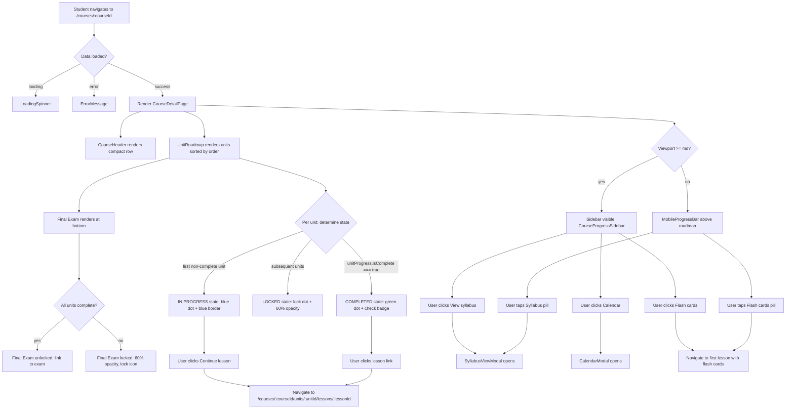
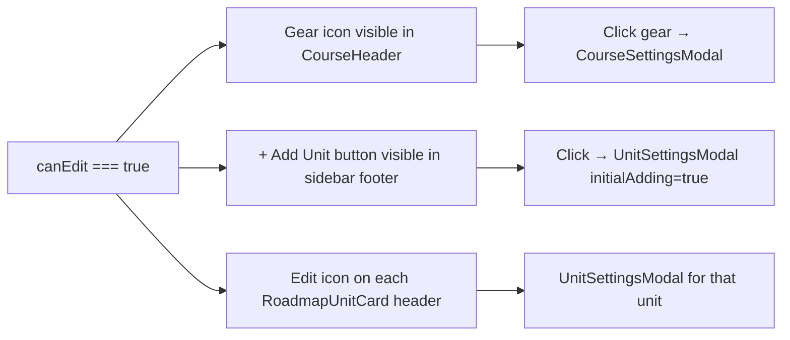

## Overview

This wireframe covers the redesign of `CourseDetailPage` (`/courses/:courseId`). The goal is to replace the current flat `CourseHero` + horizontal `UnitCardStrip` layout with a two-column desktop layout: a left main column containing a compact `CourseHeader` and a vertical `UnitRoadmap` timeline, and a right sidebar (~260px) containing a `CourseProgressSidebar`. On mobile, the sidebar collapses into a compact `MobileProgressBar` strip rendered above the roadmap.

**Affected client route:** `/courses/:courseId` — `CourseDetailPage`

**Roles:** All authenticated users see the roadmap. Teachers and admins additionally see the gear icon (course settings) and "+ Add Unit" controls.

**Data sources (unchanged):**
- `GET /courses/:courseId` — course with units and lessons
- `GET /courses/:courseId/progress` — `CourseProgress` object with per-unit/per-lesson breakdown
- `coursesApi.getAll()` — for the `CourseDropdown`

---

## Desktop Layout

Viewport: 1280px+. Two-column grid: main content area + fixed-width sidebar.

```
┌─────────────────────────────────────────────────────────────────────────────┐
│  <Layout> sticky nav (existing — unchanged)                                 │
├─────────────────────────────────────────────────────────────────────────────┤
│                                                                             │
│  ┌── CourseHeader ──────────────────────────────────────────────────────┐  │
│  │  [fx icon]  Algebra Essentials                   [Calendar] [⚙ gear] │  │
│  │             Learn algebra from first principles                       │  │
│  │             👤 Taught by Ms. Smith  ·  6 units  ·  24 lessons        │  │
│  └──────────────────────────────────────────────────────────────────────┘  │
│                                                                             │
│  ┌── main column (flex-1) ──────────────────┐  ┌── sidebar (w-[260px]) ─┐  │
│  │                                          │  │                        │  │
│  │  UnitRoadmap                             │  │  CourseProgressSidebar │  │
│  │  <ol aria-label="Course units">          │  │                        │  │
│  │                                          │  │  ┌──── Progress ─────┐ │  │
│  │  ●─ [Unit 1 Card — COMPLETED]            │  │  │  50%              │ │  │
│  │  │  ╔════════════════════════╗           │  │  │  Course complete   │ │  │
│  │  │  ║ ✓ Variables & Exprs  ║           │  │  │  [████████░░░░░░░] │ │  │
│  │  │  ║   Badge: Complete     ║           │  │  │                   │ │  │
│  │  │  ║ ─────────────────── ║           │  │  │  3/4 lessons       │ │  │
│  │  │  ║ ✓ Lesson: Vars       ║           │  │  │  12 flash cards    │ │  │
│  │  │  ║ ✓ Lesson: Exprs      ║           │  │  │  2/3 unit tests    │ │  │
│  │  │  ║ ─────────────────── ║           │  │  └───────────────────┘ │  │
│  │  │  ║  12 cards  5 probs  ║           │  │                        │  │
│  │  │  ║  Unit test passed ✓  ║           │  │  ┌──── Quick Actions ─┐ │  │
│  │  │  ╚════════════════════════╝           │  │  │  → Flash cards     │ │  │
│  │  │                                       │  │  │  → View syllabus   │ │  │
│  │  ●─ [Unit 2 Card — IN PROGRESS]          │  │  │  → Calendar        │ │  │
│  │  │  ╔════════════════════════╗           │  │  └───────────────────┘ │  │
│  │  │  ║ ◉ Equations & Ineqs  ║           │  │                        │  │
│  │  │  ║   Badge: In progress  ║           │  │  [+ Add Unit]          │  │
│  │  │  ║ ─────────────────── ║           │  │  (teacher/admin only)  │  │
│  │  │  ║ ✓ Lesson: Linear Eqs ║           │  │                        │  │
│  │  │  ║ ○ Lesson: Ineqs   [Up next] ║   │  │  └────────────────────┘  │
│  │  │  ║ ─────────────────── ║           │                              │
│  │  │  ║  8 cards  6 probs   ║           │                              │
│  │  │  ║  [Unit test locked] ║           │                              │
│  │  │  ║  Complete all lessons to        │                              │
│  │  │  ║  unlock the unit test  ║        │                              │
│  │  │  ║ ─────────────────── ║           │                              │
│  │  │  ║  [● Continue lesson]  ║  ← CTA  │                              │
│  │  │  ╚════════════════════════╝         │                              │
│  │  │                                     │                              │
│  │  ●─ [Unit 3 Card — LOCKED, 60% opacity]│                              │
│  │  │  ╔════════════════════════╗         │                              │
│  │  │  ║ 🔒 Quadratics        ║         │                              │
│  │  │  ║ ─────────────────── ║         │                              │
│  │  │  ║   Lesson A (dimmed)  ║         │                              │
│  │  │  ║   Lesson B (dimmed)  ║         │                              │
│  │  │  ╚════════════════════════╝         │                              │
│  │  │                                     │                              │
│  │  ○  [Final Exam — LOCKED, 60% opacity] │                              │
│  │     ┌───────────────────────────┐      │                              │
│  │     │ 🏆 🔒 Final Exam         │      │                              │
│  │     │  Complete all units to    │      │                              │
│  │     │  unlock                   │      │                              │
│  │     └───────────────────────────┘      │                              │
│  └─────────────────────────────────────────┘                              │
│                                                                             │
└─────────────────────────────────────────────────────────────────────────────┘
```

### Layout Tokens and Structure

**Page wrapper:**
```
<div class="container mx-auto px-4 md:px-6 py-6">
  <CourseHeader />
  <div class="flex gap-6 mt-6 items-start">
    <main class="flex-1 min-w-0">          ← UnitRoadmap
    <aside class="w-[260px] shrink-0 hidden md:block sticky top-[72px]">  ← CourseProgressSidebar
  </div>
</div>
```

The sidebar uses `sticky top-[72px]` (72px = approximate sticky nav height) so it remains visible as the user scrolls the roadmap.

---

### CourseHeader

```
┌──────────────────────────────────────────────────────────────────┐
│  [Icon 40px]  [Title — text-xl font-bold text-text-primary]      │
│               [Description — text-sm text-text-secondary]         │
│               [Meta row: User icon · "Ms. Smith" · 6 units · 24] │
│                                                    [Cal] [Gear]   │
└──────────────────────────────────────────────────────────────────┘
```

- Root: `bg-surface border border-border-subtle rounded-xl p-4 shadow-warm-sm`
- Icon: 40x40px, category-matched from the same icon set used in `CourseCard`. Lucide icon, `text-green-primary` tint, `bg-green-surface` background, `rounded-lg p-2`
- Title: `text-xl font-bold text-text-primary`
- Description: `text-sm text-text-secondary mt-0.5` (truncate to 2 lines with `line-clamp-2`)
- Meta row: `flex items-center gap-3 mt-2 text-xs text-text-secondary`
  - Items: `<User w-3.5 h-3.5>` + teacher name, separator `·`, unit count, separator `·`, lesson count, separator `·`, estimated time
- Controls (top-right, `absolute top-4 right-4` or `ml-auto flex gap-1`):
  - Calendar button: `p-2 rounded-lg text-text-secondary hover:text-text-primary hover:bg-surface-raised transition-colors`
  - Gear icon (teacher/admin only): same styling
- `CourseDropdown` replaces plain title for users with multiple courses (reuse existing component)

---

### UnitRoadmap (vertical timeline)

Root element: `<ol aria-label="Course units" class="relative flex flex-col gap-0">`

The vertical connecting line is a pseudo-element or a positioned `<div>` running from the first dot to the last, `border-l-2 border-border-subtle` aligned to dot center (offset `ml-[11px]`).

Each `<li>` is a relative-positioned row: `relative flex gap-4`.

**Dot column:** `flex flex-col items-center` — a 24px circular dot + a vertical line segment below it (extends to the next dot).

**Card column:** `flex-1 pb-6` — the `RoadmapUnitCard`.

#### Unit State: COMPLETED

```
● (green check dot)
│
RoadmapUnitCard:
╔─────────────────────────────────────────────╗
║  ✓ Unit 1: Variables and Expressions         ║
║  Badge: [Complete]  (bg-green-surface text-green-surface-text)
║ ─────────────────────────────────────────── ║
║  ✓ Introduction to Variables    (link)      ║
║  ✓ Expressions and Operations   (link)      ║
║ ─────────────────────────────────────────── ║
║  [💳 12 cards]  [📝 5 problems]             ║
║  Unit test passed ✓                          ║
╚─────────────────────────────────────────────╝
```

Tokens:
- Card: `bg-surface border border-border-subtle rounded-xl p-4 shadow-warm-sm`
- Dot: `w-6 h-6 rounded-full bg-green-primary flex items-center justify-center` — `<Check w-3.5 h-3.5 text-green-primary-foreground>`
- Title: `text-base font-semibold text-text-primary`
- "Complete" badge: `text-xs font-medium px-2 py-0.5 rounded-full bg-green-surface text-green-surface-text`
- Lesson rows: `flex items-center gap-2 text-sm text-text-primary hover:text-green-primary` — each is a `<Link>`
- Lesson checkmark: `<Check w-4 h-4 text-green-primary>`
- Tool counts row: `flex items-center gap-4 text-xs text-text-secondary mt-2`
- "Unit test passed": `text-xs text-green-surface-text font-medium`

#### Unit State: IN PROGRESS

```
◉ (blue filled dot)
│
RoadmapUnitCard:
╔═════════════════════════════════════════════╗  ← blue border
║  ◉ Unit 2: Equations and Inequalities        ║
║  Badge: [In progress]  (bg-blue-surface text-blue-surface-text)
║ ─────────────────────────────────────────── ║
║  ✓ Linear Equations     (link)              ║
║  ○ Inequalities  [Up next]  (link)          ║
║ ─────────────────────────────────────────── ║
║  [💳 8 cards]  [📝 6 problems]              ║
║  Unit test locked                            ║
║  Complete all lessons to unlock the unit test║
║ ─────────────────────────────────────────── ║
║  [● Continue lesson]                         ║  ← CTA button
╚═════════════════════════════════════════════╝
```

Tokens:
- Card: `bg-surface border-2 border-blue-accent rounded-xl p-4 shadow-warm-md`
- Dot: `w-6 h-6 rounded-full bg-blue-accent`
- Title: `text-base font-semibold text-text-primary`
- "In progress" badge: `text-xs font-medium px-2 py-0.5 rounded-full bg-blue-surface text-blue-surface-text`
- "Up next" badge (inline on lesson row): `text-xs font-medium px-1.5 py-0.5 rounded bg-orange-surface text-orange-surface-text ml-2`
- "Continue lesson" button: `<Button variant="primary" size="sm">` — maps to `bg-green-button text-green-button-text` (existing `Button` component, `variant="primary"`)
- Unit test locked text: `text-xs text-text-secondary italic`

#### Unit State: LOCKED

```
🔒 (dimmed lock dot)
│
RoadmapUnitCard (opacity-60):
╔─────────────────────────────────────────────╗
║  🔒 Unit 3: Quadratic Functions              ║
║ ─────────────────────────────────────────── ║
║    Lesson A (not clickable, text-text-secondary)
║    Lesson B (not clickable)                  ║
╚─────────────────────────────────────────────╝
```

Tokens:
- Wrapper `<li>`: `opacity-60 pointer-events-none`
- Card: `bg-surface border border-border-subtle rounded-xl p-4`
- Dot: `w-6 h-6 rounded-full bg-surface border-2 border-border-subtle flex items-center justify-center` — `<Lock w-3 h-3 text-text-secondary>`
- Lesson items: `<span>` (not `<Link>`), `text-sm text-text-secondary`

Note: `pointer-events-none` on the `<li>` wrapper prevents click/keyboard interaction, but because the element is still in the DOM, it needs `aria-disabled="true"` and `tabIndex={-1}` on focusable children. See Accessibility Notes.

#### Final Exam Item

```
○ (trophy dot or dimmed dot)

┌───────────────────────────────────────────┐
│  🏆  Final Exam                           │
│  🔒  Complete all units to unlock.        │  (locked state)
│                                           │
│  OR                                       │
│                                           │
│  🏆  Final Exam  → [Take Exam]            │  (unlocked state)
└───────────────────────────────────────────┘
```

- Root: `border border-border-subtle rounded-xl p-4` — NOT inside `<ol>`, or rendered as the final `<li>` with a distinct layout
- Locked: `opacity-60`, `text-text-secondary`, lock icon left of text
- Unlocked: `bg-surface shadow-warm-sm`, trophy icon `text-orange-accent`, link or `<Button variant="secondary">`

---

## Mobile Layout

Viewport: < 768px (`md` breakpoint). The sidebar is hidden; its content collapses into `MobileProgressBar` above the roadmap.

```
┌─────────────────────────────────────────────────┐
│  <Layout> sticky nav (existing)                 │
├─────────────────────────────────────────────────┤
│  CourseHeader                                   │
│  ┌─────────────────────────────────────────┐   │
│  │ [fx icon]  Algebra Essentials  [Cal][⚙] │   │
│  │            Learn algebra...             │   │
│  │            👤 Ms. Smith · 6 units       │   │
│  └─────────────────────────────────────────┘   │
│                                                 │
│  MobileProgressBar                              │
│  ┌─────────────────────────────────────────┐   │
│  │  50%  [█████████░░░░░░░░░]              │   │
│  │  [💳 Flash cards]  [📋 Syllabus]       │   │
│  └─────────────────────────────────────────┘   │
│                                                 │
│  UnitRoadmap (full width)                       │
│  ● ─ [Unit 1 Card — full width]                │
│  │                                             │
│  ● ─ [Unit 2 Card — in progress, full width]   │
│  │   [● Continue lesson]  ← CTA full width      │
│  │                                             │
│  🔒 ─ [Unit 3 Card — locked, full width]        │
│  │                                             │
│  ○  [Final Exam — full width]                  │
└─────────────────────────────────────────────────┘
```

### MobileProgressBar

```
┌─────────────────────────────────────────────────┐
│  50%  [█████████████░░░░░░░░░░]                 │
│  [💳 Flash cards]       [📋 Syllabus]           │
└─────────────────────────────────────────────────┘
```

- Root: `flex flex-col gap-2 p-3 bg-surface border border-border-subtle rounded-xl md:hidden`
- Progress row: `flex items-center gap-3`
  - Percentage: `text-sm font-bold text-text-primary w-10 shrink-0`
  - `<ProgressBar>` (existing component): `flex-1`
- Action row: `flex items-center gap-2`
  - Each pill: `<button class="flex items-center gap-1.5 px-3 py-1.5 rounded-full text-xs font-medium bg-surface-raised text-text-primary border border-border-subtle hover:border-blue-accent hover:text-blue-accent transition-colors">` — min 44px height (touch target)

### Mobile — RoadmapUnitCard adjustments

- Cards are full width (`w-full`)
- "Continue lesson" CTA button spans full width on mobile: `w-full`
- Tool count chips stack vertically if viewport is very narrow, via `flex-wrap`

### Sidebar visibility

- Sidebar: `hidden md:block` — completely hidden on mobile
- MobileProgressBar: `block md:hidden` — shown only on mobile

---

## Interactive States

### CourseHeader — Calendar button

| State | Visual |
|---|---|
| Default | `text-text-secondary` icon, no background |
| Hover | `text-text-primary bg-surface-raised` |
| Focus-visible | `outline-2 outline-offset-2 outline-blue-accent` ring |
| Active/Pressed | `bg-surface` scale-95 |

### CourseHeader — Gear icon (teacher/admin only)

| State | Visual |
|---|---|
| Default | `text-text-secondary` |
| Hover | `text-text-primary bg-surface-raised` |
| Focus-visible | `outline-2 outline-offset-2 outline-blue-accent` ring |

### Lesson link (completed/in-progress unit)

| State | Visual |
|---|---|
| Default | `text-sm text-text-primary` |
| Hover | `text-green-primary underline` |
| Focus-visible | `outline-2 outline-offset-2 outline-blue-accent rounded` |
| Locked (no interaction) | `text-text-secondary cursor-default` — rendered as `<span>`, not `<a>` |

### "Continue lesson" CTA button

| State | Visual |
|---|---|
| Default | `bg-green-button text-green-button-text` (via `Button variant="primary"`) |
| Hover | `brightness-110` |
| Focus-visible | Existing `Button` focus ring pattern |
| Active | `scale-95` |
| Loading (if async) | Spinner inside, `disabled` |

### Quick Actions links (sidebar)

| State | Visual |
|---|---|
| Default | `text-sm text-text-primary flex items-center gap-2` with right-arrow icon |
| Hover | `text-blue-accent` |
| Focus-visible | `outline-2 outline-offset-2 outline-blue-accent rounded` |

### MobileProgressBar action pills

| State | Visual |
|---|---|
| Default | `bg-surface-raised border-border-subtle text-text-primary` |
| Hover | `border-blue-accent text-blue-accent` |
| Focus-visible | `outline-2 outline-offset-2 outline-blue-accent` |
| Active | `bg-blue-surface` |

### Final Exam item — unlocked

| State | Visual |
|---|---|
| Default | Full opacity, `text-text-primary`, trophy icon `text-orange-accent` |
| Hover (whole row) | `bg-surface-raised` tint |
| Focus-visible on link | `outline-2 outline-offset-2 outline-blue-accent rounded` |

### Empty state (no units)

Uses existing `<EmptyState>` component. The two-column layout still renders, but the left column shows the empty state instead of the roadmap. The sidebar remains visible.

### Loading state

Full-page `<LoadingSpinner />` until all three parallel fetches resolve (matching existing behavior per FR-27).

### Error state

`<ErrorMessage message={error} />` inline, full width.

---

## User Flows



**Teacher/admin additional flow:**



---

## Component Inventory

| Component | Status | Location |
|---|---|---|
| `CourseDetailPage` | Modify (restructure to two-column layout) | `client/src/features/courses/CourseDetailPage.tsx` |
| `CourseHero` | Retire (replaced by `CourseHeader`) | `client/src/features/courses/CourseHero.tsx` |
| `UnitCardStrip` | Retire (replaced by `UnitRoadmap`) | `client/src/features/units/UnitCardStrip.tsx` |
| `UnitCard` | Retire (replaced by `RoadmapUnitCard`) | `client/src/features/units/UnitCard.tsx` |
| `CourseHeader` | Create new | `client/src/features/courses/CourseHeader.tsx` |
| `UnitRoadmap` | Create new | `client/src/features/courses/UnitRoadmap.tsx` |
| `RoadmapUnitCard` | Create new | `client/src/features/courses/RoadmapUnitCard.tsx` |
| `CourseProgressSidebar` | Create new | `client/src/features/courses/CourseProgressSidebar.tsx` |
| `MobileProgressBar` | Create new | `client/src/features/courses/MobileProgressBar.tsx` |
| `CourseDropdown` | Reuse unchanged | `client/src/features/courses/CourseDropdown.tsx` |
| `CourseSettingsModal` | Reuse unchanged | `client/src/features/courses/CourseSettingsModal.tsx` |
| `SyllabusViewModal` | Reuse unchanged | `client/src/features/courses/SyllabusViewModal.tsx` |
| `SyllabusEditModal` | Reuse unchanged | `client/src/features/courses/SyllabusEditModal.tsx` |
| `CalendarModal` | Reuse unchanged | `client/src/features/courses/CalendarModal.tsx` |
| `UnitSettingsModal` | Reuse unchanged | `client/src/features/units/UnitSettingsModal.tsx` |
| `ProgressBar` | Reuse unchanged | `client/src/features/progress/ProgressBar.tsx` |
| `LessonStatusIcon` | Reuse unchanged | `client/src/components/LessonStatusIcon.tsx` |
| `LoadingSpinner` | Reuse unchanged | `client/src/components/LoadingSpinner.tsx` |
| `ErrorMessage` | Reuse unchanged | `client/src/components/ErrorMessage.tsx` |
| `EmptyState` | Reuse unchanged | `client/src/components/EmptyState.tsx` |
| `Button` | Reuse unchanged | `client/src/components/Button.tsx` |

**New component props sketches:**

```
CourseHeader:
  course: Course
  courses: Course[]        (for CourseDropdown)
  canEdit: boolean
  onOpenSettings: () => void
  onOpenCalendar: () => void

UnitRoadmap:
  courseId: string
  units: Unit[]
  progress: CourseProgress | null
  canEdit: boolean
  onEditUnit: (unit: Unit) => void

RoadmapUnitCard:
  courseId: string
  unit: Unit
  unitProgress: CourseProgress['units'][number] | undefined
  state: 'completed' | 'in-progress' | 'locked'
  canEdit: boolean
  onEditUnit: () => void

CourseProgressSidebar:
  progress: CourseProgress | null
  onOpenSyllabus: () => void
  onOpenCalendar: () => void
  onReviewFlashCards: () => void
  canEdit: boolean
  onAddUnit: () => void

MobileProgressBar:
  progress: CourseProgress | null
  onOpenSyllabus: () => void
  onReviewFlashCards: () => void
```

---

## Accessibility Notes

### CourseHeader

- The entire header is a `<header>` landmark or a `<div role="banner">` if a page-level `<header>` already exists in `<Layout>`. Prefer a `<div>` with no landmark role here since `<Layout>` already owns the page header.
- Calendar and gear buttons: `<button>` with `aria-label="Open course calendar"` and `aria-label="Course settings"`.
- Course description: rendered as `<p>`, no special ARIA needed.
- `CourseDropdown` retains its existing ARIA pattern.

### UnitRoadmap

- Root element: `<ol aria-label="Course units">`. An ordered list communicates the sequential nature of the roadmap to screen readers.
- Each `<li>` represents one unit. No additional ARIA role needed.
- The vertical line connector is purely decorative: `aria-hidden="true"`.
- The dot indicator is decorative — `aria-hidden="true"` on the dot element. The state is communicated via the badge text inside the card ("Complete", "In progress") and the card's heading.

### RoadmapUnitCard

- Unit title: `<h3>` (assuming `<h2>` is used for page-level section headings). This creates a proper heading hierarchy navigable by screen reader users.
- State badge ("Complete", "In progress"): `<span>` with `aria-label` on the badge element providing context (e.g., `aria-label="Unit status: Complete"`).
- Lesson list: `<ul>` with `<li>` per lesson.
- Completed lesson links: standard `<Link>` (renders as `<a>`). Check icon: `aria-hidden="true"` since the link text communicates the lesson name.
- "Up next" badge on a lesson row: `<span aria-label="Up next">` — visible text is sufficient.
- "Continue lesson" button: `<Button>` with text label "Continue lesson" — no additional ARIA needed. The button must also carry context for screen readers: consider `aria-label="Continue lesson: Inequalities"` to include the lesson name.
- Locked unit wrapper `<li>`: add `aria-disabled="true"` to the `<li>`. Focusable children inside (`<span>` lesson labels) do not receive focus (`tabIndex={-1}` not needed since they are `<span>`, not interactive). Do not use `pointer-events-none` alone — that only suppresses mouse input, not keyboard focus on any accidentally focusable elements.
- Locked unit: the lock icon is `aria-hidden="true"`. An `aria-label` or visually-hidden `<span>` on the card title should indicate "locked": e.g., `<h3>Unit 3: Quadratics <span class="sr-only">(locked)</span></h3>`.

### ProgressBar (in sidebar and MobileProgressBar)

Per NFR-06: the `<ProgressBar>` element must receive `role="progressbar"`, `aria-valuenow={percent}`, `aria-valuemin={0}`, `aria-valuemax={100}`, and `aria-label="Course progress"`. The existing `ProgressBar` component does not currently set these — they will need to be added or passed as props.

### CourseProgressSidebar

- Sidebar `<aside aria-label="Course progress">` — using the `<aside>` element creates a complementary landmark.
- Progress card heading: `<h2>Course progress</h2>` or `<h3>` depending on heading hierarchy.
- Stats rows: description list `<dl>` with `<dt>`/`<dd>` pairs is semantically appropriate: `<dt>Lessons</dt><dd>3/4</dd>`.
- Quick Actions card: `<nav aria-label="Quick actions">` with `<ul>` of links/buttons.
- Each quick action that opens a modal uses `<button>` (not `<a>`), since it triggers an in-page action rather than navigation.
- "Review flash cards" uses `<Link>` (navigates to a lesson).

### MobileProgressBar

- Root: `role="region" aria-label="Course progress summary"`.
- Flash cards and Syllabus pills: `<button>` elements with descriptive labels. Touch targets must be at least 44×44px.
- Progress bar: same `role="progressbar"` requirements as above.

### Keyboard Navigation Order (Tab order)

1. Sticky nav (existing)
2. CourseDropdown
3. Calendar button
4. Gear button (if canEdit)
5. MobileProgressBar pills (mobile only)
6. UnitRoadmap — each unit card's interactive children in source order:
   - Completed lesson links (tab-accessible, Enter navigates)
   - In-progress unit: completed lesson links → "Up next" lesson link → "Continue lesson" button → unit edit button (if canEdit)
   - Locked units: no tab stops (all content is `aria-hidden` or non-interactive)
7. CourseProgressSidebar quick action buttons (desktop only)
8. "+ Add Unit" button (if canEdit, desktop sidebar footer)

### Color Contrast Verification

All pairings below use project tokens and are confirmed passing from `design.md`:

| Pairing | Token | Contrast | Passes |
|---|---|---|---|
| Unit title on card | `text-text-primary` on `bg-surface` | > 7:1 | AAA |
| Secondary text (meta, tool counts) | `text-text-secondary` on `bg-surface` | > 4.5:1 | AA |
| "Complete" badge | `text-green-surface-text` on `bg-green-surface` | 7.2:1 | AAA |
| "In progress" badge | `text-blue-surface-text` on `bg-blue-surface` | > 4.5:1 | AA |
| "Up next" badge | `text-orange-surface-text` on `bg-orange-surface` | 7.0:1 | AA |
| CTA button | `text-green-button-text` on `bg-green-button` | 5.1:1 | AA |
| Locked text | `text-text-secondary` on `bg-surface` at 60% opacity | Note below | — |

**Opacity note:** Locked cards are rendered at `opacity-60`. The underlying contrast of `text-text-secondary` on `bg-surface` passes AA at full opacity; at 60% opacity the effective contrast drops. Per WCAG 1.4.3, the contrast requirement still applies to disabled/dimmed elements in some interpretations. Since locked content is intentionally non-interactive and conveys "unavailable" status, the 60% opacity is acceptable as a design affordance — but the unit title (e.g., the locked unit name) should use `text-text-primary` (not `text-text-secondary`) so it remains readable even at 60% opacity.

---

## Required Token Additions

No new tokens are required. All visual treatments are covered by existing tokens:

- `bg-green-primary`, `text-green-primary-foreground`, `bg-green-surface`, `text-green-surface-text` — completed state
- `bg-blue-accent`, `bg-blue-surface`, `text-blue-surface-text` — in-progress state
- `bg-orange-surface`, `text-orange-surface-text` — "Up next" badge
- `text-text-primary`, `text-text-secondary` — body and secondary text
- `border-border-subtle` — timeline line and card dividers
- `bg-surface`, `bg-surface-raised` — card backgrounds
- `shadow-warm-sm`, `shadow-warm-md` — card elevation
- `bg-green-button`, `text-green-button-text` — CTA button (via existing `Button variant="primary"`)

One implementation detail to confirm during development: the existing `ProgressBar` component does not currently pass `role="progressbar"` or `aria-value*` attributes. The frontend implementer should either extend `ProgressBar` to accept and forward these props, or wrap it with the necessary ARIA attributes at the call site in `CourseProgressSidebar` and `MobileProgressBar`.
