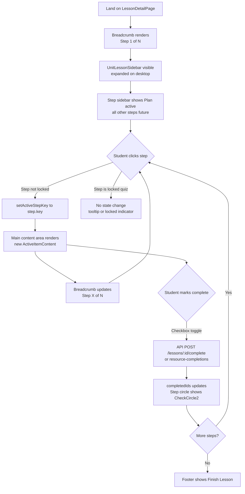
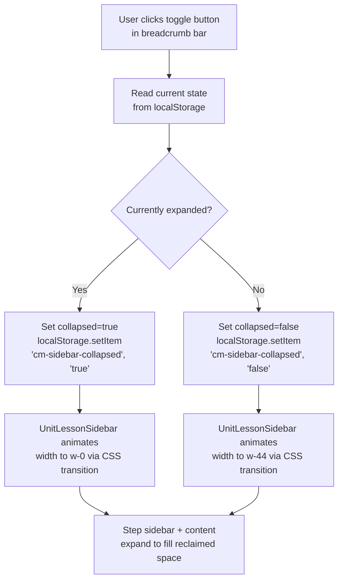
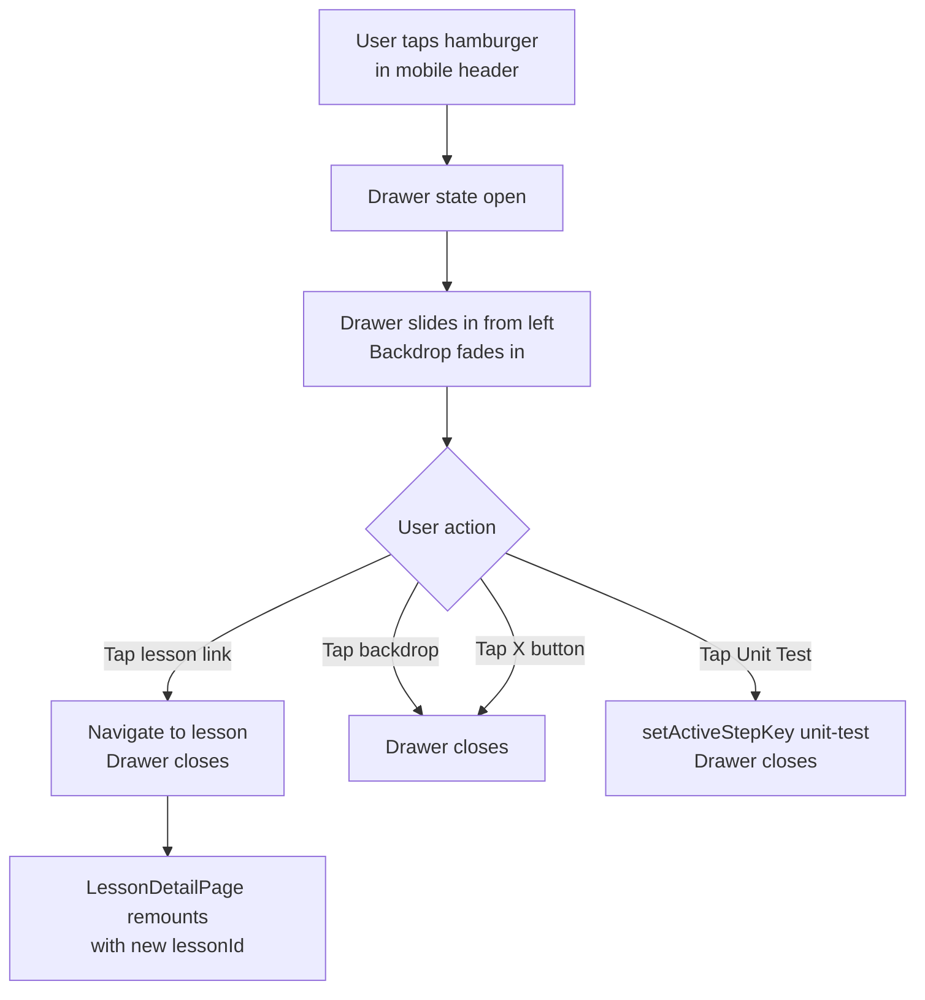
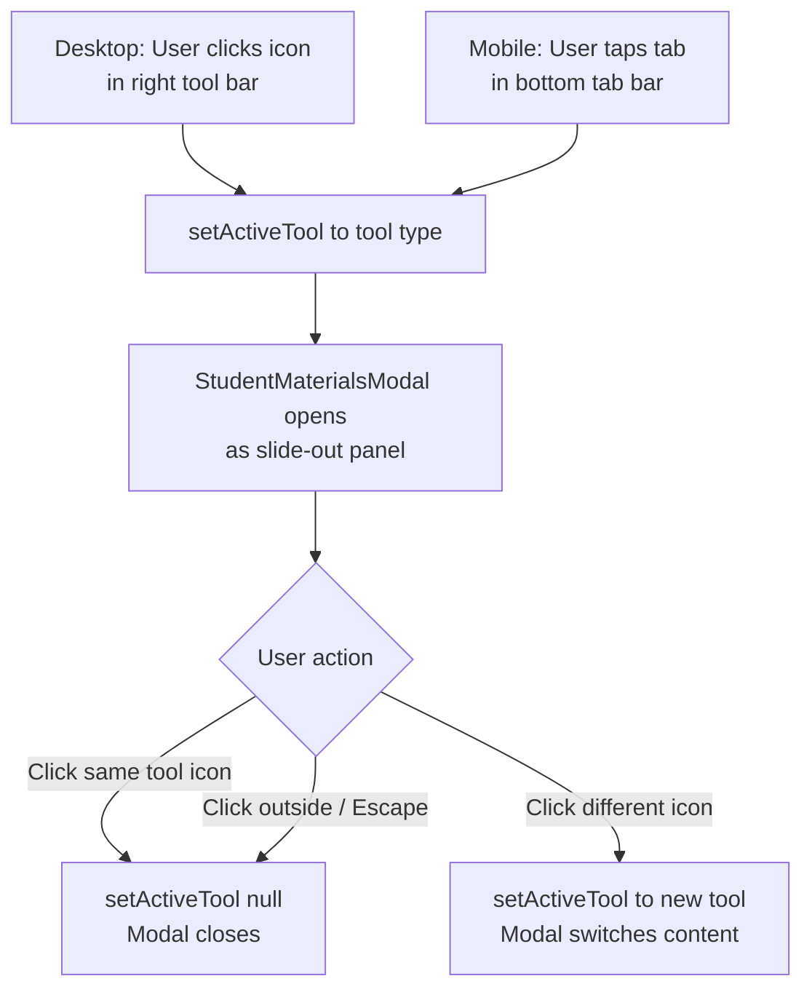

# Wireframe: Refactor Lesson Detail Page Layout and Navigation

## 1. Overview

This feature refactors `LessonDetailPage` (`/courses/:courseId/units/:unitId/lessons/:lessonId`) from its current two-panel layout (UnitLessonSidebar + content column + narrow right StudentToolsBar) into a structured three-panel desktop layout with a new vertical step sidebar. The horizontal `AssignmentStepper` is replaced entirely.

**User goal:** Students navigate lesson steps through a persistent, scannable vertical sidebar rather than a horizontal overflow bar. Teachers retain all editing controls within the new layout. The mobile experience is simplified to remove the non-functional "Saved" tab.

**Affected components (existing, to be modified):**
- `client/src/features/lessons/LessonDetailPage.tsx`
- `client/src/features/lessons/AssignmentStepper.tsx`
- `client/src/features/lessons/UnitLessonSidebar.tsx`
- `client/src/features/student-notes/StudentToolsBar.tsx`

**Route:** `/courses/:courseId/units/:unitId/lessons/:lessonId` — auth required (all roles).

---

## 2. Desktop Layout (lg: 1024px and above)

### Panel Structure

The page breaks the full viewport width into four vertical columns. The existing `LessonDetailPage` wrapper already escapes the layout container with negative margins and `100vw` width — this pattern is preserved.

```
┌──────────────────────────────────────────────────────────────────────────────────────────┐
│  BREADCRUMB BAR  (full width, sticky top-0 z-20, border-b border-border, bg-surface)     │
│  [≡] toggle  Course › Unit › Lesson Name                          Step 2 of 6            │
└──────────────────────────────────────────────────────────────────────────────────────────┘
┌──────────────┬──────────────┬──────────────────────────────────────────────┬─────────────┐
│  UNIT LESSON │  STEP        │  MAIN CONTENT AREA                           │  STUDENT    │
│  SIDEBAR     │  SIDEBAR     │                                              │  TOOLS BAR  │
│  (collapsible│  (fixed 56px │  flex-1, overflow-y-auto                     │  (fixed     │
│  w-44, or    │  wide)       │                                              │  w-11)      │
│  w-0 when    │              │  ┌──────────────────────────────────────────┐│             │
│  collapsed)  │  ○  Plan     │  │  LEARNING OBJECTIVE                      ││  [N]        │
│              │  │           │  │  (text-green-primary uppercase text-xs)  ││  Notes      │
│  Course Name │  ●  Video    │  │  Objective text here...                  ││             │
│  (link)      │  │  (active) │  └──────────────────────────────────────────┘│  [C]        │
│              │  ○  Read     │                                              │  Cards      │
│  v Unit Name │  │           │  ┌──────────────────────────────────────────┐│             │
│  (dropdown)  │  ○  Cards    │  │  bg-[#F9FAFB]  shadow-warm-sm            ││  [V]        │
│  ─────────   │  │           │  │  Lesson overview / content body          ││  Vocab      │
│  1. Lesson   │  ○  Practice │  │  (rich-text prose)                       ││             │
│     (current,│  │           │  └──────────────────────────────────────────┘│             │
│     bg-green-│  ○  Quiz     │                                              │             │
│     surface) │  │  (locked) │                                              │             │
│  2. Lesson   │              │                                              │             │
│  3. Lesson   │  [+] Add     │                                              │             │
│  ─ ─ ─ ─ ─  │  (canEdit)   │                                              │             │
│  [Unit Test] │              │                                              │             │
└──────────────┴──────────────┴──────────────────────────────────────────────┴─────────────┘
┌──────────────────────────────────────────────────────────────────────────────────────────┐
│  FOOTER ACTION BAR  (sticky bottom-0, border-t border-border, bg-surface, px-4 py-3)     │
│  [ ] Mark complete                                              [Next step →]             │
└──────────────────────────────────────────────────────────────────────────────────────────┘
```

### Panel Dimensions and Tokens

| Panel | Width | Background | Border |
|---|---|---|---|
| Breadcrumb bar | 100% | `bg-surface` | `border-b border-border-subtle` |
| UnitLessonSidebar (expanded) | `w-44` (176px) | `bg-surface` | `border-r border-border-subtle` |
| UnitLessonSidebar (collapsed) | `w-0` (hidden, or `w-8` with toggle only) | — | — |
| Step Sidebar | `w-14` (56px) | `bg-surface` | `border-r border-border-subtle` |
| Main content | `flex-1 min-w-0` | `bg-background` | — |
| Student Tools Bar | `w-11` (44px) | `bg-surface` | `border-l border-border-subtle` |
| Footer action bar | 100% | `bg-surface` | `border-t border-border-subtle` |

### Breadcrumb Bar

```
┌──────────────────────────────────────────────────────────────────────────────┐
│ [≡]   Course Name  ›  Unit Name  ›  Lesson Title            Step 2 of 6 [⚙] │
└──────────────────────────────────────────────────────────────────────────────┘
```

- `[≡]` — sidebar toggle button, `w-8 h-8`, `aria-label="Toggle lesson sidebar"`, `aria-expanded={!collapsed}`
- Breadcrumb links: `text-text-secondary text-xs`, current lesson rendered as plain text (not a link)
- `Course Name` links to `/courses/:courseId` (uses React Router `<Link>`)
- `Unit Name` text only (no link needed; UnitDropdown in sidebar handles unit switching)
- Separator `›` is `aria-hidden="true"` decorative
- "Step X of Y" — `text-text-secondary text-xs`, right-aligned via `ml-auto`
- `[⚙]` — settings gear (`Settings` from lucide-react), shown only when `canEdit === true`

### UnitLessonSidebar (Desktop — Expanded)

```
┌──────────────────────────────┐
│  Course Name  (text-green-   │  ← Link to /courses/:courseId
│  primary text-xs font-semibold│
│  truncate)                   │
│  ─────────────────────────── │
│  v Unit Name  (UnitDropdown) │  ← ChevronDown + unit title, opens unit picker
│  ─────────────────────────── │
│  1. Intro to the Topic       │  ← text-text-secondary hover:bg-surface-raised
│  2. Core Concepts            │  ← ACTIVE: bg-green-surface text-green-surface-text
│     (current lesson)         │     font-medium, full-width rounded-lg
│  3. Advanced Reading         │  ← text-text-secondary
│  4. Practice Session         │
│  ─ ─ ─ ─ ─ ─ ─ ─ ─ ─ ─ ─  │  ← border-t border-border-subtle dashed or solid
│  [✓] Unit Test               │  ← ClipboardCheck icon, text-text-secondary
│                              │     active state: bg-green-surface text-green-primary
│  [+] Add Lesson (canEdit)    │  ← text-green-primary, hover:bg-surface
└──────────────────────────────┘
```

**Collapse behavior:**
- Toggle button appears in the breadcrumb bar (leftmost position)
- On collapse: sidebar animates to `w-0` with `overflow-hidden` and CSS `transition-[width]`
- When collapsed, `w-0` hides content; the step sidebar and main content expand via `flex-1` reflow
- `localStorage` key: `cm-sidebar-collapsed` (boolean, namespaced per NFR-04)
- The sidebar reads initial state from `localStorage` on mount

### Step Sidebar (Desktop — Vertical)

The `AssignmentStepper` is refactored to render vertically on `lg:` and above. Width is fixed at `w-14` (56px). Steps scroll vertically when the lesson has many items (NFR-03).

```
┌──────────────┐
│   ●          │  ← active: filled circle bg-green-primary (w-8 h-8), white icon
│  Plan        │  ← text-[10px] text-green-primary font-medium, centered below circle
│   │          │  ← connecting line: h-4 w-px bg-border-subtle centered
│   ✓          │  ← completed: bg-green-primary, CheckCircle2 icon white
│  Video       │  ← text-[10px] text-text-secondary
│   │          │
│   ○          │  ← future: border border-border bg-background text-text-secondary
│  Read        │  ← text-[10px] text-text-secondary
│   │          │
│   ○          │
│  Cards       │
│   │          │
│  🔒          │  ← locked quiz: opacity-50 cursor-not-allowed, Lock icon
│  Quiz        │  ← text-[10px] text-text-secondary opacity-50
│              │
│  [+]         │  ← teacher only; dashed border circle, Plus icon
│  Add         │  ← text-[10px] text-text-secondary
└──────────────┘
```

**Step circle states:**

| State | Circle style | Icon | Label |
|---|---|---|---|
| Active | `bg-green-primary w-8 h-8 rounded-full` | White content icon, `w-4 h-4` | `text-green-primary font-medium text-[10px]` |
| Completed | `bg-green-primary w-8 h-8 rounded-full` | `CheckCircle2` white `w-4 h-4` | `text-text-secondary text-[10px]` |
| Future | `border border-border w-8 h-8 rounded-full bg-background` | Muted content icon `w-4 h-4 text-text-secondary` | `text-text-secondary text-[10px]` |
| Locked (quiz) | `border border-border w-8 h-8 rounded-full bg-background opacity-50` | `Lock w-3.5 h-3.5 text-text-secondary` | `text-text-secondary text-[10px] opacity-50` |

**Connector line:** `w-px h-4 bg-border-subtle mx-auto` between each step. When the step above is completed, the connector uses `bg-green-primary` instead.

**Dynamic step labels (single word):**

| StepperItem kind/type | Label |
|---|---|
| `kind: 'lessonPlan'` | Plan |
| `kind: 'resource', resourceType: 'note'` | Read |
| `kind: 'resource', resourceType: 'video'` | Video |
| `kind: 'resource', resourceType: 'lecture'` | Lecture |
| `kind: 'tool', toolType: 'flash_card'` | Cards |
| `kind: 'tool', toolType: 'practice_problem'` | Practice |
| `kind: 'tool', toolType: 'vocab'` | Vocab |
| `kind: 'quiz'` | Quiz |
| `kind: 'assignment', assignmentType: 'note'` | Read |
| `kind: 'assignment', assignmentType: 'video'` | Video |
| `kind: 'assignment', assignmentType: 'reading'` | Link |
| `kind: 'assignment', assignmentType: 'vocab'` | Vocab |
| `kind: 'assignment', assignmentType: 'practice_problem'` | Practice |

This mapping is implemented as a pure function `getStepLabel(item: StepperItem): string` co-located in `AssignmentStepper.tsx`.

### Main Content Area

```
┌───────────────────────────────────────────────────────────┐
│  LEARNING OBJECTIVE                                       │  ← text-xs uppercase tracking-wider
│  (text-green-primary font-semibold)                       │     font-semibold text-green-primary
│  Students will understand the core data model...          │  ← text-text-primary text-sm
│                                                           │
│  ┌───────────────────────────────────────────────────┐   │
│  │  bg-[#F9FAFB]  rounded-lg shadow-warm-sm          │   │
│  │  p-4 md:p-6                                       │   │
│  │                                                   │   │
│  │  [Content from ActiveItemContent renders here]    │   │
│  │  rich-text prose for notes/lectures               │   │
│  │  VideoCard for videos                             │   │
│  │  FlashCardList for flash cards                    │   │
│  │  etc.                                             │   │
│  └───────────────────────────────────────────────────┘   │
│                                                           │
│  (teacher controls: move up/down, edit, delete, required  │
│   toggle — remain part of AssignmentSection header)       │
└───────────────────────────────────────────────────────────┘
```

The main content area is `flex-1 overflow-y-auto px-4 py-6`. The "LEARNING OBJECTIVE" label and objective text come from `lesson.description` or the lesson plan content and are rendered above the surface card. This matches the spec's flat layout with a single `#F9FAFB` surface card.

### Student Tools Bar (Desktop — Right)

Width is `w-11` (44px). Each icon button is `w-8 h-8` (satisfies 44px touch target with padding). Renders only tools present in `availableTools`, which excludes `practice` on mobile (practice remains in desktop bar).

```
┌─────────────┐
│  [N]        │  ← NotebookPen icon, aria-label="My Notes"
│             │
│  [C]        │  ← Layers icon, aria-label="Flash Cards"
│             │
│  [V]        │  ← BookOpen icon, aria-label="Vocabulary"
└─────────────┘
```

Active state: `bg-green-surface text-green-primary`. Inactive: `text-text-secondary hover:text-text-primary hover:bg-surface`. Opens `StudentMaterialsModal` (slide-out panel) — unchanged from existing behavior.

### Footer Action Bar (Desktop)

```
┌──────────────────────────────────────────────────────────────────────────────┐
│  [ ] Mark complete                                         [← Prev] [Next →] │
└──────────────────────────────────────────────────────────────────────────────┘
```

- `sticky bottom-0 z-10 bg-surface border-t border-border-subtle px-4 py-3`
- "Mark complete" checkbox: `<input type="checkbox">` with associated `<label>`, `text-text-primary text-sm`
- "Next step" button: `bg-green-button text-green-button-text`, `Button` component with `variant="primary"` or equivalent
- "Prev" button: ghost/secondary variant, shown only when not on first step
- Hidden when `unitTestActive === true` (unit test has its own navigation)

---

## 3. Mobile Layout (below lg: below 1024px)

### Mobile Page Structure

```
┌──────────────────────────────────────────────────────────┐
│  MOBILE HEADER  (sticky top-0 z-20, bg-surface)          │
│  [←]  Lesson Title                              [⚙]      │
└──────────────────────────────────────────────────────────┘
┌──────────────────────────────────────────────────────────┐
│  UNIT SIDEBAR DRAWER  (hidden by default)                │
│  Opens as a left drawer via hamburger → overlay          │
│  Contains the same UnitLessonSidebar content             │
│  Closes on lesson click or overlay tap                   │
└──────────────────────────────────────────────────────────┘
┌──────────────────────────────────────────────────────────┐
│  COMPACT STEP PROGRESS BAR                               │
│  1/6  [●][●][○][○][○][○]  [Video icon]                  │
│       (filled=green-primary, empty=border-border)        │
└──────────────────────────────────────────────────────────┘
┌──────────────────────────────────────────────────────────┐
│  MAIN CONTENT AREA  (flex-1, overflow-y-auto, px-4 py-4) │
│                                                          │
│  LEARNING OBJECTIVE                                      │
│  Objective text...                                       │
│                                                          │
│  ┌──────────────────────────────────────────────────┐   │
│  │  bg-[#F9FAFB] rounded-lg shadow-warm-sm p-4      │   │
│  │  [Content renders here]                          │   │
│  └──────────────────────────────────────────────────┘   │
└──────────────────────────────────────────────────────────┘
┌──────────────────────────────────────────────────────────┐
│  ACTION BAR  (sticky, above bottom tab bar)              │
│  [ ] Mark complete                  [Next step →]        │
└──────────────────────────────────────────────────────────┘
┌──────────────────────────────────────────────────────────┐
│  BOTTOM TAB BAR  (fixed bottom-0, bg-surface, border-t)  │
│  [Notes]        [Cards]        [Vocab]                   │
│  NotebookPen    Layers         BookOpen                  │
└──────────────────────────────────────────────────────────┘
```

### Mobile Header

```
┌──────────────────────────────────────────────────────────┐
│  [≡]  2. Core Concepts                            [⚙]    │
└──────────────────────────────────────────────────────────┘
```

- `[≡]` hamburger: `Menu` icon from lucide-react, `w-8 h-8`, `aria-label="Open lesson navigation"`, opens UnitLessonSidebar as a left drawer
- Lesson title truncated: `text-base font-bold text-text-primary truncate`
- `[⚙]` settings: `Settings` icon, shown when `canEdit === true` only

### Compact Step Progress Bar

Replaces the horizontal `AssignmentStepper` mobile view. The spec calls for N small filled/empty segments plus a "1/N" label and the current step icon.

```
┌──────────────────────────────────────────────────────────┐
│  1/6  ████░░░░░░░░  [Video icon]                         │
└──────────────────────────────────────────────────────────┘
```

- Left: `1/6` — `text-xs text-text-secondary font-medium`
- Center: N small segment pills (`h-1.5 rounded-full flex-1`): completed/active = `bg-green-primary`, future = `bg-border-subtle`
- Right: current step type icon from `getStepIcon(activeItem)`, `w-4 h-4 text-text-secondary`
- Container: `px-4 py-2 border-b border-border-subtle bg-surface flex items-center gap-2`
- Tapping the progress bar area opens the step list (scrollable horizontal icon row) in a bottom sheet or expands inline — implementation detail deferred to frontend plan

### Mobile Navigation Drawer

The UnitLessonSidebar slides in from the left as a drawer overlay:
- Full-height overlay: `fixed inset-0 z-50`
- Backdrop: `bg-black/40` tap-to-close
- Drawer: `absolute left-0 top-0 bottom-0 w-64 bg-surface shadow-warm-lg overflow-y-auto`
- Contains identical content to the desktop sidebar (course link, unit dropdown, lesson list, unit test, add lesson)
- Close button (`X`) in drawer header, or backdrop tap

### Mobile Bottom Tab Bar

Renders only `notes`, `flashcards`, and `vocab` — `practice` is excluded (FR-06, FR-14).

```
┌──────────────────────────────────────────────────────────┐
│       [Notes]          [Cards]          [Vocab]          │
│      NotebookPen        Layers          BookOpen         │
│      text-[10px]      text-[10px]      text-[10px]       │
└──────────────────────────────────────────────────────────┘
```

- `fixed bottom-0 left-0 right-0 z-40 bg-surface border-t border-border-subtle`
- Each tab: `flex flex-col items-center gap-0.5 flex-1 py-2`, min touch target `min-h-[44px]`
- Active tab: `text-green-primary`, icon `text-green-primary`
- Inactive tab: `text-text-secondary`, icon `text-text-secondary`
- Hidden when `isQuizActive === true` or `availableTools` (mobile-filtered) is empty

The mobile-filtered tools list excludes `practice` at the render site. The `availableTools` prop passed to `StudentToolsBar` in mobile mode will filter out `'practice'` before rendering the bottom bar.

### Mobile Action Bar

Positioned above the bottom tab bar using `bottom-[calc(44px+env(safe-area-inset-bottom))]` or a stacked layout:

```
┌──────────────────────────────────────────────────────────┐
│  [ ] Mark complete                  [Next step →]        │
└──────────────────────────────────────────────────────────┘
```

- `bg-surface border-t border-border-subtle px-4 py-2`

---

## 4. Interactive States

### Step Sidebar — Step Button

| State | Visual | Notes |
|---|---|---|
| Default (future) | `border border-border bg-background text-text-secondary` circle | Cursor pointer |
| Hover | `border-green-primary/50 bg-green-surface/20` circle | Focus visible ring |
| Focus (keyboard) | `ring-2 ring-green-primary ring-offset-2` | WCAG 2.1 AA focus indicator |
| Active (current step) | `bg-green-primary text-white` filled circle | `aria-current="step"` |
| Completed | `bg-green-primary text-white` circle with CheckCircle2 | Cursor pointer |
| Locked (quiz, prereqs unmet) | `opacity-50 cursor-not-allowed` | `disabled` attr, `aria-disabled="true"` |
| Pressed | `scale-95 transition-transform` | 100ms transition |

### UnitLessonSidebar — Toggle Button

| State | Visual |
|---|---|
| Default (expanded sidebar) | `ChevronLeft` or `Menu` icon, `text-text-secondary` |
| Hover | `bg-surface-raised text-text-primary` |
| Focus | `ring-2 ring-green-primary ring-offset-2` |
| Sidebar collapsed | `ChevronRight` or `PanelLeft` icon reflecting reversed direction |

### Student Tools Bar — Icon Button

| State | Visual |
|---|---|
| Default | `text-text-secondary` icon |
| Hover | `bg-surface-raised text-text-primary` |
| Focus | `ring-2 ring-green-primary ring-offset-2` |
| Active (panel open) | `bg-green-surface text-green-primary` |

### "Mark Complete" Checkbox

| State | Visual |
|---|---|
| Unchecked | Standard checkbox, `border-border` |
| Checked | Green filled, `accent-green-primary` (via CSS) or custom checkbox |
| Disabled (locked quiz) | `opacity-50 cursor-not-allowed` |
| Loading (toggle in flight) | Spinner replaces checkbox, button `disabled` |

### "Next Step" Button

| State | Visual |
|---|---|
| Default | `bg-green-button text-green-button-text rounded-lg px-4 py-2 text-sm font-medium` |
| Hover | Slight brightness shift (CSS filter or `opacity-90`) |
| Focus | `ring-2 ring-green-primary ring-offset-2` |
| Loading | `disabled` + `<LoadingSpinner />` inline |
| Last step | Button label changes to "Finish Lesson" or is hidden |

### Mobile Navigation Drawer

| State | Visual |
|---|---|
| Closed | Off-screen left, backdrop absent |
| Opening | `translate-x-0` with `transition-transform duration-200` |
| Open | Visible, backdrop `bg-black/40` |
| Closing | `translate-x-[-100%]` transition |

### Empty / Zero-Data States

| Scenario | Display |
|---|---|
| Lesson has no resources or tools (no steps beyond Plan) | Step sidebar shows only the Plan step; no connectors |
| `availableTools` is empty | `StudentToolsBar` returns `null` (existing behavior) |
| No lessons in unit | UnitLessonSidebar shows "No lessons yet" placeholder |

---

## 5. User Flows

### Happy Path — Student Navigates Steps



### Sidebar Collapse Flow



### Mobile Drawer Flow



### Student Tool Slide-Out



### Auth-Gated Actions

All views on this route require `authenticate()` server-side. Client-side, `RequireAuth` wraps `LessonDetailPage`. Teacher-only actions (gear icon, add assignment, reorder, edit/delete) are gated by `canEdit` (derived from `useCanEdit()` which checks `role === 'teacher' || role === 'admin'`).

---

## 6. Component Inventory

| Component | File | Status | Change Required |
|---|---|---|---|
| `LessonDetailPage` | `features/lessons/LessonDetailPage.tsx` | Exists | Modify — layout restructure, add breadcrumb bar, add footer action bar, wire sidebar collapse state |
| `AssignmentStepper` | `features/lessons/AssignmentStepper.tsx` | Exists | Modify significantly — refactor horizontal desktop layout to vertical, add `getStepLabel()`, preserve mobile horizontal icon row but integrate compact progress bar |
| `UnitLessonSidebar` | `features/lessons/UnitLessonSidebar.tsx` | Exists | Modify — add `collapsed`/`onToggle` props, localStorage read on mount, CSS collapse transition, remove mobile dropdown (drawer replaces it on mobile) |
| `StudentToolsBar` | `features/student-notes/StudentToolsBar.tsx` | Exists | Modify — mobile tab bar excludes `practice` type; receives filtered `availableTools` or handles filtering internally |
| `StudentMaterialsModal` | `features/student-notes/StudentMaterialsModal.tsx` | Exists | Unchanged |
| `AssignmentSection` | `features/lessons/AssignmentSection.tsx` | Exists | Unchanged |
| `ActiveItemContent` | `features/lessons/ActiveItemContent.tsx` | Exists | Unchanged |
| `AssessmentSection` | `features/assessments/AssessmentSection.tsx` | Exists | Unchanged |
| `LessonSettingsModal` | `features/lessons/LessonSettingsModal.tsx` | Exists | Unchanged |
| `LessonPlanModal` | `features/lessons/LessonPlanModal.tsx` | Exists | Unchanged |
| `ErrorBoundary` | `components/ErrorBoundary.tsx` | Exists | Unchanged |
| `LoadingSpinner` | `components/LoadingSpinner.tsx` | Exists | Unchanged |
| `ErrorMessage` | `components/ErrorMessage.tsx` | Exists | Unchanged |
| `Button` | `components/Button.tsx` | Exists | Unchanged — used for "Next step" CTA |
| `Modal` | `components/Modal.tsx` | Exists | Unchanged — used for drawer or existing modals |
| `getStepLabel()` utility | Inside `AssignmentStepper.tsx` | New | Create — pure function mapping `StepperItem` to single-word label string |
| Mobile drawer wrapper | Within `UnitLessonSidebar.tsx` or `LessonDetailPage.tsx` | New | Create — replaces existing `lg:hidden` dropdown with overlay drawer |
| Compact progress bar | Within refactored `AssignmentStepper.tsx` | New | Create — `lg:hidden` segment row replaces existing mobile icon strip |

**Note on step label utility:** Given the spec says it "could live within the refactored `AssignmentStepper` or be extracted as a utility if needed by multiple components," co-location in `AssignmentStepper.tsx` is sufficient unless the frontend plan identifies additional consumers.

---

## 7. Accessibility Notes

### Breadcrumb Bar

- Wrap in `<nav aria-label="Breadcrumb">` and use `<ol>` with `<li>` elements
- Separators (`›`) wrapped in `<span aria-hidden="true">`
- Current page (lesson title) has `aria-current="page"`
- Toggle button: `aria-label="Toggle lesson sidebar"`, `aria-expanded={!collapsed}`, `aria-controls="unit-lesson-sidebar"`

### Step Sidebar (`AssignmentStepper` — vertical)

- The vertical step list is `<nav aria-label="Lesson steps">`
- Each step button: `aria-current="step"` when active, `aria-label="{stepLabel}: {item.title}"` (combines dynamic label and full title for screen readers)
- Locked quiz button: `disabled` attribute, `aria-disabled="true"`, `title="Complete all required items to unlock the quiz"`
- Connector lines: `aria-hidden="true"` decorative
- Step labels below circles: `aria-hidden="true"` (the full title is on the button `aria-label`)
- Keyboard navigation: Tab moves between step buttons. Enter/Space activates. No arrow key roving tabindex required (standard tab order is sufficient for a list of up to ~20 items)
- The vertical step list uses `overflow-y-auto` on its container; if content overflows, `tabIndex={0}` on the scroll container allows keyboard scrolling

### UnitLessonSidebar

- Desktop sidebar: `<nav aria-label="Unit lessons" id="unit-lesson-sidebar">`
- Active lesson item: `aria-current="page"` (it is a non-link `<div>` representing the current page)
- Collapse transition: sidebar gets `aria-hidden={collapsed}` when fully collapsed (after transition ends) so screen readers skip hidden content
- Unit Test button: `aria-pressed={unitTestActive}` to communicate toggle state

### Student Tools Bar (Desktop)

- Container: `<aside aria-label="Student tools">`
- Each tool button: `aria-label="{label}"`, `aria-pressed={activeTool === tool}` to reflect active state
- When a tool panel is open: `aria-expanded="true"` on the button

### Student Tools Bar (Mobile Bottom Tab Bar)

- Container: `<nav aria-label="Student tools">`
- Each tab: `role="tab"`, `aria-selected={activeTool === tool}`, `aria-label="{label}"`
- Tab text labels (`text-[10px]`) are present and visible — icon-only buttons are not used here, satisfying the requirement for visible labels

### Mobile Navigation Drawer

- Backdrop button: `aria-label="Close navigation"`, `role="button"`
- Drawer: `role="dialog"`, `aria-modal="true"`, `aria-label="Lesson navigation"`
- Focus trap: when drawer opens, focus moves to the first focusable element inside; `Escape` key closes the drawer and returns focus to the hamburger button
- Drawer close `X` button: `aria-label="Close navigation"`

### "Mark Complete" Checkbox

- `<input type="checkbox" id="mark-complete">` with `<label htmlFor="mark-complete">Mark complete</label>`
- When loading: `aria-busy="true"` on the checkbox wrapper, `disabled` on the input

### Main Content Area

- `<main>` element with `id="lesson-content"` and `aria-live="polite"` to announce step changes to screen readers
- When the active step changes, the content region announces the new step title

### Footer Action Bar

- `<footer>` or a `<div role="contentinfo">` wrapping the action bar
- "Next step" button when on last step: `aria-label="Finish lesson"` or `aria-disabled="true"` if no further navigation

### Color Contrast

All interactive text uses design tokens verified to meet WCAG 2.1 AA 4.5:1 for normal text:
- `text-green-surface-text` on `bg-green-surface`: 7.2:1 (AAA)
- White on `bg-green-button` (`#047857`): 5.1:1 (AA)
- `text-text-primary` on `bg-background`: verified in design system
- `text-text-secondary` (`#6B7280`) on white background: ~4.6:1 (AA normal text — verify against actual background value)

Do not use `text-green-primary` on `bg-green-primary` (same color). The active step label uses `text-green-primary` on `bg-background` (white/near-white) — this is acceptable.

---

## 8. Required Token Additions

No new tokens required.

All color, spacing, shadow, and typography decisions in this wireframe reference existing tokens from `client/src/index.css`:

- `bg-green-primary`, `text-green-primary` — active step fill, labels
- `bg-green-surface`, `text-green-surface-text` — active lesson background in sidebar
- `bg-green-button`, `text-green-button-text` — "Next step" CTA button
- `text-text-primary`, `text-text-secondary` — body text and labels
- `border-border-subtle` — hairline dividers, connector lines
- `shadow-warm-sm` — content surface card
- `bg-surface`, `bg-background`, `bg-surface-raised` — panel and card backgrounds

The `bg-[#F9FAFB]` reference in the spec for the content surface card is equivalent to the light-mode value of `bg-background` or can use `bg-surface` depending on exact token mapping. The frontend plan should confirm which token best represents the `#F9FAFB` surface — if neither existing token resolves to this value, a single new token `--content-surface` may be needed. This is flagged as a low-priority implementation decision, not a blocking token gap.
