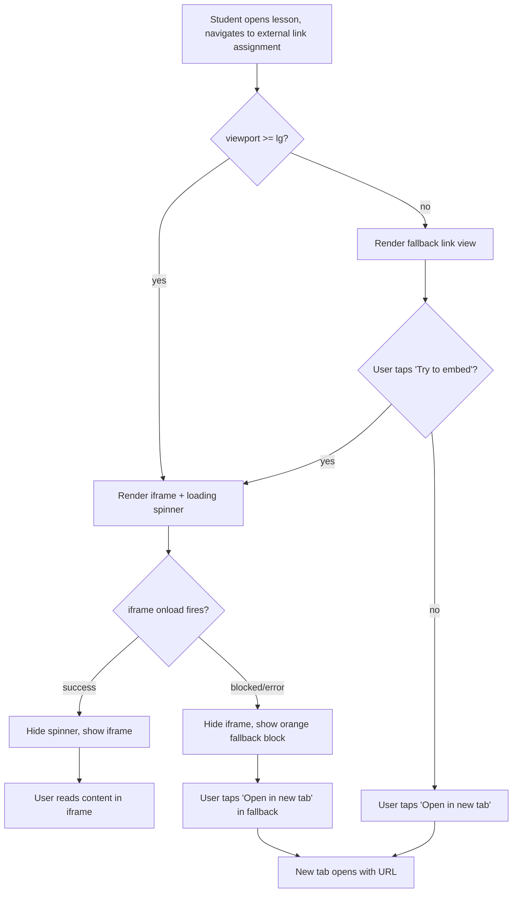
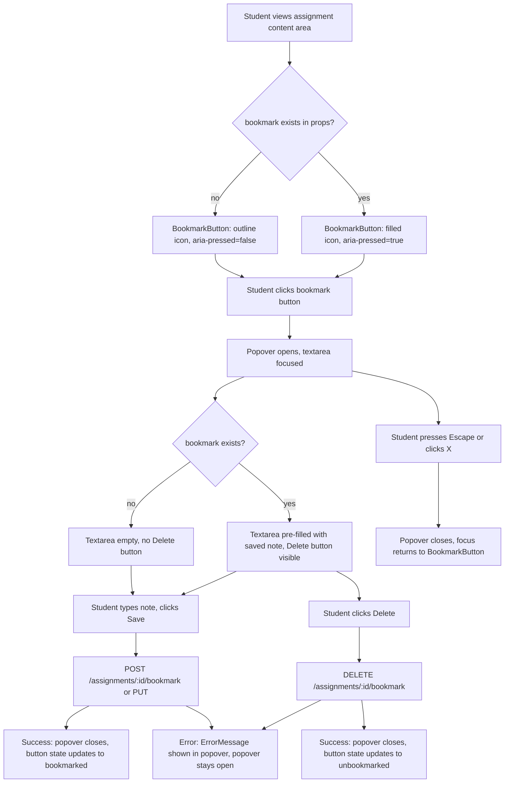

# Wireframe: Lesson Activities — Overhaul Reading, Student Tools, and Persistence

## 1. Overview

This feature overhauls four areas of the `LessonDetailPage` (`/courses/:courseId/units/:unitId/lessons/:lessonId`):

1. **ExternalLinkAssignmentView** — replaces `ReadingAssignmentView` with an iframe-first embed and fallback link. All "Reading" labels become "External Link" throughout the assignment stepper, type picker, and content header.
2. **BookmarkButton** — a bookmark icon added to the assignment content header row, opening an inline popover for a free-text note (per `(userId, assignmentId)`). Students only.
3. **ChecklistPanel** — a new "Checklist" tool panel inside `StudentMaterialsModal`, replacing the removed "Practice" panel. Per `(userId, lessonId)`.
4. **StudentToolsBar / StudentMaterialsModal** — updated tool set: Notes, Flash Cards, Vocab, Checklist (Practice removed).

Routes affected: `LessonDetailPage` only. No changes to `CourseDetailPage`, `ProfilePage`, or any auth pages.

Auth scope: Bookmark and Checklist UI renders only for `role === 'student'`. Teachers see no bookmark icon and no Checklist tab.

---

## 2. Desktop Layout

### 2a. ExternalLinkAssignmentView — Iframe Embed (success state)

The component renders inside the assignment content area of `LessonDetailPage`. The outer frame is the existing `ActiveItemContent` / `LessonAssignmentContent` container.

```
┌─────────────────────────────────────────────────────────────────┐
│  ASSIGNMENT CONTENT AREA  (bg-surface, rounded-xl, border-border,│
│  shadow-warm-md, p-4)                                            │
│                                                                  │
│  ┌── Header row ──────────────────────────────────────────────┐  │
│  │  [ExternalLink icon 16px, text-accent]                     │  │
│  │  "External Link"  (text-sm font-semibold text-foreground)  │  │
│  │                                              [Bookmark btn] │  │
│  │                             [Open in new tab btn ↗]        │  │
│  └────────────────────────────────────────────────────────────┘  │
│                                                                  │
│  ┌── Iframe container ────────────────────────────────────────┐  │
│  │  bg-surface-raised, rounded-lg, overflow-hidden            │  │
│  │  min-h: 400px, w: 100%                                     │  │
│  │                                                            │  │
│  │  [LoadingSpinner — centered, shown while iframe loads]     │  │
│  │                                                            │  │
│  │  <iframe                                                   │  │
│  │    src={url}                                               │  │
│  │    sandbox="allow-scripts allow-same-origin                │  │
│  │             allow-forms allow-popups"                      │  │
│  │    loading="lazy"                                          │  │
│  │    title="External Link content"                           │  │
│  │    className="w-full h-full border-0"                      │  │
│  │    style={{ minHeight: '400px' }}                          │  │
│  │  />                                                        │  │
│  └────────────────────────────────────────────────────────────┘  │
│                                                                  │
│  {description && (                                               │
│    <p className="text-sm text-muted-foreground mt-2">           │
│      {description}                                              │
│    </p>                                                         │
│  )}                                                             │
└─────────────────────────────────────────────────────────────────┘
```

Token annotations:
- Container: `bg-surface rounded-xl border border-border shadow-warm-md p-4`
- Header label: `text-sm font-semibold text-foreground`
- Header icon: `text-accent w-4 h-4`
- Iframe wrapper: `bg-surface-raised rounded-lg overflow-hidden w-full` + inline `min-height: 400px`
- "Open in new tab" button: `Button` component, `variant="ghost"` `size="sm"`, `text-accent`, `ExternalLink` icon
- Description text: `text-sm text-muted-foreground mt-2`

---

### 2b. ExternalLinkAssignmentView — Load Failure / Blocked Fallback

Triggered when iframe fires `onerror` or a reliable X-Frame-Options signal is detected.

```
┌─────────────────────────────────────────────────────────────────┐
│  ASSIGNMENT CONTENT AREA                                         │
│                                                                  │
│  ┌── Header row ──────────────────────────────────────────────┐  │
│  │  [ExternalLink icon]  "External Link"      [Bookmark btn]  │  │
│  │                             [Open in new tab btn ↗]        │  │
│  └────────────────────────────────────────────────────────────┘  │
│                                                                  │
│  ┌── Fallback block ──────────────────────────────────────────┐  │
│  │  bg-orange-surface, rounded-lg, p-4                        │  │
│  │                                                            │  │
│  │  [AlertTriangle icon 20px text-orange-accent]              │  │
│  │  "This page cannot be embedded."                           │  │
│  │  (text-sm text-orange-surface-text)                        │  │
│  │                                                            │  │
│  │  [Open in new tab  ↗]  (Button variant="accent" size="sm") │  │
│  │  "Opens: https://example.com/..."                          │  │
│  │  (text-xs text-muted-foreground, truncated)                │  │
│  └────────────────────────────────────────────────────────────┘  │
│                                                                  │
│  {description && <p className="text-sm text-muted-foreground">} │
└─────────────────────────────────────────────────────────────────┘
```

Token annotations:
- Fallback block: `bg-orange-surface rounded-lg p-4 flex flex-col gap-3`
- Alert icon: `text-orange-accent w-5 h-5`
- Message text: `text-sm text-orange-surface-text`
- URL preview: `text-xs text-muted-foreground truncate`
- CTA: `Button variant="accent" size="sm"` with `ExternalLink` icon

---

### 2c. BookmarkButton — Desktop (header row placement)

`BookmarkButton` sits in the header row of the assignment content area, to the right of the title label and left of the "Open in new tab" button. Only rendered when `user?.role === 'student'`.

```
Header row (flex items-center gap-2):
┌────────────────────────────────────────────────────────────────┐
│ [ExternalLink 16px]  "External Link"         [☆ Bookmark] [↗] │
└────────────────────────────────────────────────────────────────┘
                                                    ▲         ▲
                                            BookmarkButton  Open-in-new-tab
                                            (icon button)   (ghost button)
```

BookmarkButton — Unbookmarked state:
```
┌──────────────┐
│  ☆  (Bookmark icon, outline)                          │
│  w-7 h-7, rounded-md                                  │
│  text-muted-foreground                                │
│  hover: bg-surface-raised text-foreground             │
│  aria-label="Add bookmark"                            │
│  aria-pressed="false"                                 │
└──────────────┘
```

BookmarkButton — Bookmarked state:
```
┌──────────────┐
│  ★  (BookmarkCheck icon, filled appearance)           │
│  text-primary  bg-primary-subtle                      │
│  aria-label="Edit bookmark"                           │
│  aria-pressed="true"                                  │
└──────────────┘
```

---

### 2d. Bookmark Popover (inline, not a Modal)

Clicking the bookmark button opens an inline popover anchored below-right of the button. Keyboard-closeable with `Escape`. Focus moves into the textarea on open. Focus returns to the bookmark button on close.

```
         [☆ Bookmark]
              │
              ▼
┌─────────────────────────────────┐
│  bg-surface-raised              │
│  border border-border           │
│  rounded-xl shadow-warm-lg      │
│  p-3 w-72                       │
│  z-50 (portal to document.body) │
│                                 │
│  ┌── Header ─────────────────┐  │
│  │ [Bookmark icon 14px]      │  │
│  │ "Bookmark"  (text-xs      │  │
│  │  font-semibold            │  │
│  │  text-foreground)         │  │
│  │              [X close btn]│  │
│  └───────────────────────────┘  │
│                                 │
│  <textarea                      │
│    rows={4}                     │
│    maxLength={500}              │
│    placeholder="Add a note..."  │
│    className="w-full text-sm    │
│      bg-surface rounded-lg      │
│      border border-border       │
│      p-2 resize-none            │
│      focus:outline-none         │
│      focus:ring-2               │
│      focus:ring-primary"        │
│    aria-label="Bookmark note"   │
│    aria-describedby="bm-chars"  │
│  />                             │
│                                 │
│  <div id="bm-chars"             │
│    className="text-xs           │
│      text-muted-foreground      │
│      text-right">               │
│    {charCount}/500              │
│  </div>                         │
│                                 │
│  ┌── Footer row ─────────────┐  │
│  │ [Delete btn — danger/ghost]│  │
│  │           (if bookmarked)  │  │
│  │               [Save btn]  │  │
│  └───────────────────────────┘  │
└─────────────────────────────────┘
```

Token annotations:
- Popover container: `bg-surface-raised border border-border rounded-xl shadow-warm-lg p-3 w-72`
- Header text: `text-xs font-semibold text-foreground`
- Close button: `Button variant="ghost" size="sm"` with `X` icon, `aria-label="Close bookmark"`
- Textarea: `w-full text-sm bg-surface rounded-lg border border-border p-2 resize-none focus:ring-2 focus:ring-primary`
- Char count: `text-xs text-muted-foreground text-right`
- Delete button: `Button variant="danger" size="sm"` — only shown when bookmark already exists
- Save button: `Button variant="primary" size="sm"` — disabled while loading, shows `LoadingSpinner` during save

---

## 3. Mobile Layout

### 3a. ExternalLinkAssignmentView — Mobile Default (fallback-first)

On viewports below the `lg` breakpoint (`< 1024px`), the iframe is NOT attempted by default. The component renders the fallback link view immediately.

```
┌──────────────────────────────────────┐  (full width, p-3)
│  [ExternalLink icon]  External Link  │
│                         [Bookmark ☆] │
│                                      │
│  ┌── Link card ─────────────────────┐│
│  │  bg-accent-subtle rounded-lg p-3  ││
│  │                                   ││
│  │  [↗ Open in new tab]              ││
│  │  (Button variant="accent"         ││
│  │   size="md" full-width)           ││
│  │                                   ││
│  │  "https://example.com/..."        ││
│  │  (text-xs text-muted-foreground   ││
│  │   truncate)                       ││
│  └───────────────────────────────────┘│
│                                      │
│  ┌── Toggle ─────────────────────────┐│
│  │  [Try to embed ↓]                 ││
│  │  (Button variant="ghost" size="sm"││
│  │   text-muted-foreground)          ││
│  └───────────────────────────────────┘│
│                                      │
│  {description && <p text-sm>}        │
└──────────────────────────────────────┘
```

If the user taps "Try to embed", the iframe renders below the link card (non-replacing), capped at `min-h: 300px` on mobile. The toggle button changes to "Hide embed".

Touch target notes:
- "Open in new tab" button: full-width, `min-h-[44px]`
- "Try to embed" toggle: `min-h-[44px] w-full`
- Bookmark button: `w-9 h-9` (36px base, meets 44px with padding)

---

### 3b. Bookmark Popover — Mobile

On mobile, the popover renders as a bottom sheet overlay (fixed, full-width, slides up from bottom) rather than an anchored popover. It uses the same `document.body` portal target.

```
┌──────────────────────────────────────┐
│  Overlay: bg-black/50 fixed inset-0  │
├──────────────────────────────────────┤
│  Bottom sheet:                       │
│  bg-surface-raised rounded-t-2xl p-4 │
│  fixed bottom-0 left-0 right-0       │
│  pb-[env(safe-area-inset-bottom)]    │
│                                      │
│  ── Drag indicator ──────────────────│
│        [  ▬  ] (rounded pill,        │
│         bg-border w-10 h-1 mx-auto)  │
│                                      │
│  [Bookmark icon] "Bookmark"  [X]     │
│                                      │
│  <textarea rows={5} maxLength={500}  │
│    full-width, same styling>         │
│                                      │
│  {charCount}/500  (right-aligned)    │
│                                      │
│  [Delete]              [Save]        │
│  (full-row on mobile: flex gap-2)    │
└──────────────────────────────────────┘
```

---

### 3c. StudentToolsBar — Mobile (updated tool set)

Fixed bottom tab bar. Four tabs: Notes, Cards, Vocab, Checklist. Practice tab removed.

```
┌──────────────────────────────────────────┐
│  [Notes]  [Cards]  [Vocab]  [Checklist]  │  fixed bottom-0, z-40
│   icon     icon     icon       icon      │  bg-surface border-t border-border
│   label    label    label      label     │  flex lg:hidden
└──────────────────────────────────────────┘
```

Each tab: `flex-1 py-2 min-h-[44px] flex flex-col items-center gap-0.5`
Active tab: `text-primary`
Inactive tab: `text-muted-foreground`

---

### 3d. StudentMaterialsModal — Mobile

On mobile the modal is full-screen (or near full-screen), triggered from the bottom tab bar. The drag handle and tool switcher remain at top. Checklist panel replaces the Practice panel.

```
┌──────────────────────────────────────┐
│  [≡ grip]  Student Materials  [X]    │  drag handle header
├──────────────────────────────────────┤
│  [My Notes] [Flash Cards] [Vocab]    │  tool switcher tabs
│  [Checklist]                         │  (scrollable row)
├──────────────────────────────────────┤
│                                      │
│  [active tool content panel]         │  flex-1 overflow-y-auto
│                                      │
└──────────────────────────────────────┘
```

---

## 4. Interactive States

### 4a. ExternalLinkAssignmentView

| Element | Default | Hover/Focus | Active/Pressed | Loading | Error/Fallback | Empty |
|---|---|---|---|---|---|---|
| Iframe container | Renders with spinner overlay | N/A | N/A | `LoadingSpinner` centered, `aria-busy="true"` on container | Hidden; fallback block shown | N/A |
| "Open in new tab" button | `variant="ghost" size="sm" text-accent` | `bg-surface-raised` | `opacity-80` | N/A | Always visible | N/A |
| "Try to embed" toggle (mobile) | `variant="ghost" text-muted-foreground` | `text-foreground` | N/A | N/A | N/A | N/A |

### 4b. BookmarkButton

| State | Visual | Notes |
|---|---|---|
| Unbookmarked | `Bookmark` icon (outline), `text-muted-foreground` | `aria-pressed="false"`, `aria-label="Add bookmark"` |
| Bookmarked | `BookmarkCheck` icon, `text-primary bg-primary-subtle` | `aria-pressed="true"`, `aria-label="Edit bookmark"` |
| Hover (unbookmarked) | `bg-surface-raised text-foreground` | `transition-colors` |
| Hover (bookmarked) | `bg-green-surface text-primary` | Same token as `bg-primary-subtle` |
| Focus | `ring-2 ring-primary ring-offset-2` | Keyboard focus ring |
| Popover open | Button stays active-styled | Popover rendered in portal |

### 4c. Bookmark Popover

| Element | Default | Hover/Focus | Loading | Error |
|---|---|---|---|---|
| Textarea | `border-border` | `ring-2 ring-primary` | Disabled, `opacity-50` | `border-destructive` + `ErrorMessage` below |
| Save button | `variant="primary" size="sm"` | `bg-primary/90` | Disabled + `LoadingSpinner` inside | N/A |
| Delete button | `variant="danger" size="sm"` | `bg-destructive/90` | Disabled + `LoadingSpinner` | N/A |
| Char counter | `text-muted-foreground` | N/A | N/A | `text-destructive` when at 500 |
| Popover backdrop | N/A (desktop: no backdrop) | N/A | N/A | N/A |

### 4d. ChecklistPanel — Item Row

| Element | Default | Hover | Checked | Deleting | Dragging |
|---|---|---|---|---|---|
| Checkbox | `rounded border-border` unchecked | `border-primary` | `bg-primary border-primary` checked icon | N/A | N/A |
| Item text | `text-sm text-foreground` | N/A | `line-through text-muted-foreground` | N/A | N/A |
| Delete button | `text-muted-foreground opacity-0` (hidden until row hover) | `opacity-100 text-destructive` | Same | `LoadingSpinner` inline | N/A |
| Drag handle | `GripVertical icon text-muted-foreground/40 cursor-grab` | `text-muted-foreground cursor-grab` | N/A | N/A | `cursor-grabbing shadow-warm-sm` |
| Row | `bg-surface` | `bg-surface-raised` | `bg-surface` | `opacity-50` | `bg-surface-raised ring-1 ring-border` |

### 4e. Checklist Add-Item Input

| State | Visual |
|---|---|
| Default (empty) | `Input` component, placeholder "Add a checklist item…", `border-border` |
| Focused | `ring-2 ring-primary` |
| With text | Shows inline submit icon/button `[+ Add]` or `Enter` key hint |
| Submitting | Input disabled, `LoadingSpinner` small inline |
| Error | `border-destructive` + `ErrorMessage` below |
| At char limit (200) | Char counter turns `text-destructive` |

---

## 5. User Flows

### 5a. External Link Assignment — Load Flow



### 5b. Bookmark Create / Edit / Delete Flow



### 5c. Checklist CRUD Flow

```mermaid
flowchart TD
    A[Student opens Checklist panel in StudentMaterialsModal] --> B[GET /lessons/:id/checklist]
    B --> C{items exist?}
    C -- no --> D[Empty state: icon + 'No checklist items yet.' + add input]
    C -- yes --> E[Render ordered list of items]
    E --> F{Student interaction}
    D --> F
    F --> G[Toggle checkbox] --> H[PUT /checklist-items/:itemId {checked: bool}]
    F --> I[Edit text inline] --> J[PUT /checklist-items/:itemId {text: string}]
    F --> K[Type in add input + Enter/+ button] --> L[POST /lessons/:id/checklist {text}]
    F --> M[Click delete on item] --> N[DELETE /checklist-items/:itemId]
    F --> O[Drag item to reorder] --> P[PUT /lessons/:id/checklist/reorder {itemIds}]
    H --> E
    J --> E
    L --> E
    N --> E
    P --> E
```

---

## 6. Component Inventory

| Component | File Path | Status | Notes |
|---|---|---|---|
| `ExternalLinkAssignmentView` | `client/src/features/assignments/ExternalLinkAssignmentView.tsx` | **New** | Replaces `ReadingAssignmentView.tsx` (delete old file) |
| `ExternalLinkAssignmentForm` | `client/src/features/assignments/ExternalLinkAssignmentForm.tsx` | **New** | Replaces `ReadingAssignmentForm.tsx` (delete old file) |
| `BookmarkButton` | `client/src/features/lessons/BookmarkButton.tsx` | **New** | Bookmark icon + popover editor |
| `ChecklistPanel` | `client/src/features/lessons/ChecklistPanel.tsx` | **New** | Checklist tool panel for `StudentMaterialsModal` |
| `StudentToolsBar` | `client/src/features/student-notes/StudentToolsBar.tsx` | **Modified** | Remove `'practice'`; add `'checklist'` with `CheckSquare` icon |
| `StudentMaterialsModal` | `client/src/features/student-notes/StudentMaterialsModal.tsx` | **Modified** | Remove `PracticeProblemList` panel; add `ChecklistPanel` |
| `LessonAssignmentContent` | `client/src/features/lessons/LessonAssignmentContent.tsx` | **Modified** | Swap `ReadingAssignmentView` import → `ExternalLinkAssignmentView`; thread `bookmark` prop to `BookmarkButton` |
| `AssignmentTypePicker` | `client/src/features/assignments/AssignmentTypePicker.tsx` | **Modified** | Rename `'reading'` label to "External Link" |
| `AssignmentStepper` / `AssignmentSection` | Existing lesson feature files | **Modified** | Update "Reading" display label to "External Link" |
| `Button` | `client/src/components/Button.tsx` | Exists | Used for "Open in new tab", Save, Delete in popover |
| `Input` / `Textarea` | `client/src/components/Input.tsx` / `Textarea.tsx` | Exists | Used in add-item input and bookmark textarea |
| `ErrorMessage` | `client/src/components/ErrorMessage.tsx` | Exists | Inline errors in popover and checklist |
| `LoadingSpinner` | `client/src/components/LoadingSpinner.tsx` | Exists | Iframe loading overlay, button loading states |
| `EmptyState` | `client/src/components/EmptyState.tsx` | Exists | Checklist empty state |

---

## 7. Accessibility Notes

### ExternalLinkAssignmentView

| Element | ARIA / Keyboard |
|---|---|
| Iframe container | `role="region"`, `aria-label="External link content"`, `aria-busy="true"` during load, `aria-busy="false"` on resolve |
| Iframe element | `title="External Link content"` (required for screen readers) |
| "Open in new tab" link/button | `aria-label="Open [URL] in new tab"`, `<span className="sr-only">(opens in new tab)</span>` or equivalent |
| Fallback block | `role="alert"` on error state so screen readers announce the failure immediately |
| Loading spinner | `aria-live="polite"` region announcing "Loading external link" while active |

### BookmarkButton

| Element | ARIA / Keyboard |
|---|---|
| Bookmark icon button | `<button>` element, `aria-label="Add bookmark"` (unbookmarked) / `"Edit bookmark"` (bookmarked), `aria-pressed={!!bookmark}`, `aria-expanded={isOpen}` |
| Popover container | `role="dialog"`, `aria-label="Bookmark editor"`, `aria-modal="false"` (it does not trap all focus on desktop) |
| Textarea | `aria-label="Bookmark note"`, `aria-describedby="bookmark-char-count"` |
| Char counter | `id="bookmark-char-count"`, `aria-live="polite"` to announce count changes |
| Save button | `aria-label="Save bookmark"` |
| Delete button | `aria-label="Delete bookmark"` |
| Keyboard close | `Escape` key closes popover and returns focus to `BookmarkButton` |
| Focus management | On open: focus moves to textarea. On close: focus returns to the trigger `BookmarkButton` |

### ChecklistPanel

| Element | ARIA / Keyboard |
|---|---|
| Checklist container | `role="list"` (or `<ul>`) |
| Each item row | `role="listitem"` (or `<li>`) |
| Checkbox | `<input type="checkbox">` with `aria-label={item.text}` or associated `<label>` via `htmlFor` |
| Checked item text | No additional ARIA needed; `line-through` is visual only — do not rely on CSS alone. Add `aria-checked` on the checkbox element |
| Delete button | `aria-label="Delete: {item.text}"` (include item text for context) |
| Drag handle | `aria-hidden="true"` (drag is enhancement; keyboard reorder is separate concern — see below) |
| Keyboard reorder | `useOrderedList` hook provides swap-based reorder. Consider `aria-label="Move up"` / `"Move down"` buttons as accessible alternative to drag |
| Add input | `<input type="text">` with `aria-label="New checklist item"`, `maxLength={200}` |
| Add button / Enter | Submit with `Enter` key in input field; no additional button required if hint is visible |
| Empty state | `role="status"` on the empty state container so screen readers announce it when the list clears |
| Error messages | `aria-describedby` linking each form control to its `<ErrorMessage>` |

### StudentToolsBar (updated)

| Element | ARIA / Keyboard |
|---|---|
| Desktop vertical strip | `<aside>` with existing `aria-label` pattern; each button already has `aria-label={longLabel}` |
| Checklist button | `aria-label="Checklist"`, `aria-pressed={activeTool === 'checklist'}` |
| Mobile tab bar | Existing `<nav aria-label="Student tools">` pattern preserved |
| Mobile Checklist tab | `aria-pressed={activeTool === 'checklist'}` |

### Color Contrast

All interactive states use design tokens verified in the project's WCAG notes:
- Primary-on-white: 5.1:1 (AA normal text) — used for active tab indicators and Save button
- `text-muted-foreground` is for non-interactive secondary text only; never used as the sole label on a control
- Orange fallback block uses `bg-orange-surface` + `text-orange-surface-text` (7.0:1 AA)
- Do NOT use white text on `bg-orange-accent` background for body text (only 3.1:1)

---

## 8. Required Token Additions

No new tokens required.

All states use existing tokens:
- `bg-primary-subtle` / `text-primary` — bookmark active state
- `bg-orange-surface` / `text-orange-surface-text` — iframe failure fallback block
- `bg-surface-raised` — popover and modal surface
- `bg-surface` — checklist item rows, textarea
- `border-border` — all borders
- `text-muted-foreground` — secondary labels, hidden delete buttons
- `text-destructive` — delete button, char count at limit
- `shadow-warm-lg` — bookmark popover and `StudentMaterialsModal`
- `shadow-warm-md` — assignment content area card
- `shadow-warm-sm` — dragging checklist item

All shadow and color utilities are already defined in `client/src/index.css`.
