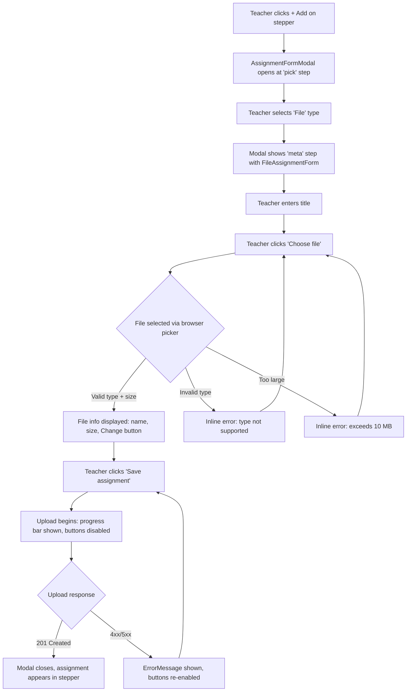
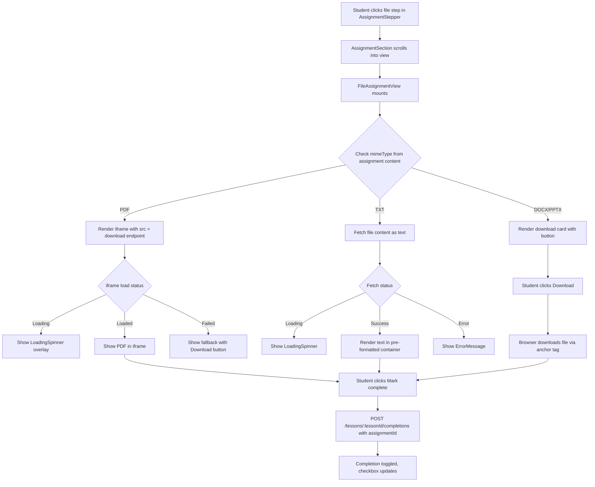
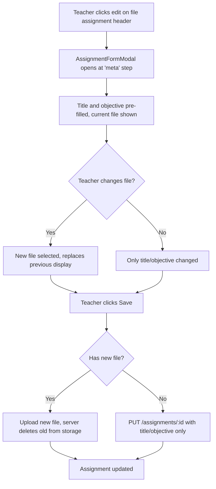
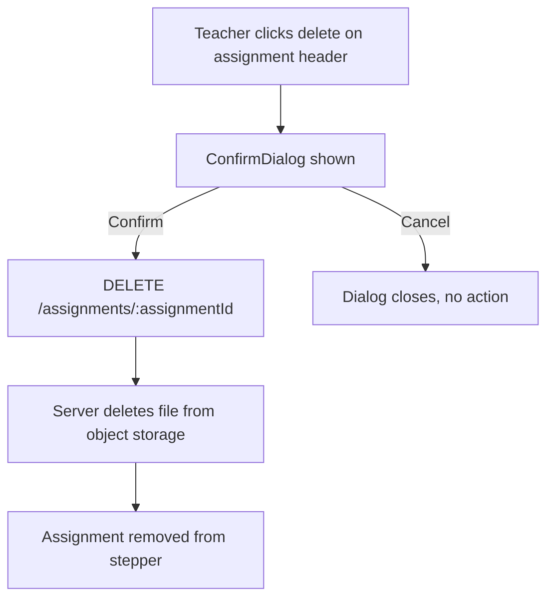

# Wireframe: Add File Assignment Type with Object Storage

## 1. Overview

This feature adds a `file` assignment type to Course Masters, enabling teachers to upload files (PDF, DOCX, TXT, PPT, PPTX) as lesson assignments and students to view or download them inline within the assignment stepper.

**Affected routes:**
- `/courses/:courseId/units/:unitId/lessons/:lessonId` (LessonDetailPage) -- both teacher editing and student viewing

**Affected components:**
- `AssignmentFormModal` -- new `file` type in the type picker and a `FileAssignmentForm` meta fields sub-form
- `AssignmentStepper` -- new icon mapping for `file` type
- `LessonAssignmentContent` -- new branch for `file` type rendering `FileAssignmentView`
- `FileAssignmentView` (new) -- renders PDF inline, TXT as text, DOCX/PPTX as download

**Auth:** Teachers and admins can upload files. All authenticated users (students included) can view/download.

---

## 2. Desktop Layout

### Surface 1: Teacher -- Creating a File Assignment (AssignmentFormModal)

The file type integrates into the existing `AssignmentFormModal` multi-step flow. Step 1 is the type picker (add `File` option); step 2 is the meta form with title, objective, and file upload.

#### Step 1: Type Picker (existing modal, new option added)

```
┌─────────────────────────────────────────────────────────┐
│  Add Assignment                              [X] close  │
│─────────────────────────────────────────────────────────│
│  Choose the type of assignment to add.                  │
│                                    text-muted-foreground│
│                                                         │
│  ┌──────────┐ ┌──────────┐ ┌──────────┐                │
│  │  FileText │ │  Video   │ │  ExtLink │                │
│  │  Note     │ │  Video   │ │  Ext Link│                │
│  └──────────┘ └──────────┘ └──────────┘                │
│  ┌──────────┐ ┌──────────┐ ┌──────────┐                │
│  │ BookMark │ │  Brain   │ │ FileUp   │  <-- NEW       │
│  │  Vocab   │ │ Practice │ │  File    │                │
│  └──────────┘ └──────────┘ └──────────┘                │
└─────────────────────────────────────────────────────────┘
```

- New entry uses `FileUp` icon from lucide-react (or `File`), label "File"
- Registered in `TYPE_CONFIG` as `file: { label: 'File', icon: FileUp, MetaFields: FileAssignmentForm }`
- No `ItemsForm` -- single-step meta form like `note`, `video`, and `reading`

#### Step 2: Meta Form -- FileAssignmentForm

```
┌─────────────────────────────────────────────────────────┐
│  Add File                                    [X] close  │
│─────────────────────────────────────────────────────────│
│  < Back                        text-muted-foreground    │
│                                                         │
│  Title *                                                │
│  ┌─────────────────────────────────────────────────┐    │
│  │ e.g. Chapter 3 Study Guide              Input   │    │
│  └─────────────────────────────────────────────────┘    │
│                                                         │
│  Objective (optional)                                   │
│  ┌─────────────────────────────────────────────────┐    │
│  │                                        Textarea │    │
│  └─────────────────────────────────────────────────┘    │
│                                                         │
│  ─── FileAssignmentForm (MetaFields) ───────────────    │
│                                                         │
│  File *                                                 │
│  ┌─────────────────────────────────────────────────┐    │
│  │                                                 │    │
│  │   [Choose file]  Button variant="secondary"     │    │
│  │                                                 │    │
│  │   Accepted: PDF, DOCX, TXT, PPT, PPTX          │    │
│  │   Maximum size: 10 MB                           │    │
│  │                    text-xs text-muted-foreground │    │
│  └─────────────────────────────────────────────────┘    │
│                                                         │
│  {apiError && <ErrorMessage />}                         │
│                                                         │
│─────────────────────────── border-t border-border ──────│
│                          [Cancel]  [Save assignment]    │
│                          secondary    primary/disabled  │
└─────────────────────────────────────────────────────────┘
```

**After file selected (pre-upload):**

```
│  File *                                                 │
│  ┌─────────────────────────────────────────────────┐    │
│  │  [FileText icon]  chapter-3-guide.pdf            │    │
│  │                   2.4 MB                         │    │
│  │                   text-xs text-muted-foreground  │    │
│  │                                                  │    │
│  │   [Change file]  Button variant="ghost" size="sm"│    │
│  └─────────────────────────────────────────────────┘    │
```

**Upload in progress (after clicking Save):**

```
│  File                                                   │
│  ┌─────────────────────────────────────────────────┐    │
│  │  [FileText icon]  chapter-3-guide.pdf            │    │
│  │                   2.4 MB                         │    │
│  │                                                  │    │
│  │  ┌──────────────────────────────────────────┐    │    │
│  │  │████████████░░░░░░░░░░░░░░  45%           │    │    │
│  │  └──────────────────────────────────────────┘    │    │
│  │  Uploading...       text-xs text-muted-foreground│    │
│  └─────────────────────────────────────────────────┘    │
│                                                         │
│─────────────────────────── border-t border-border ──────│
│                          [Cancel]  [Saving...]          │
│                          disabled    disabled           │
```

- Progress bar: `h-2 rounded-full bg-border` track, `bg-primary` fill
- Upload uses `XMLHttpRequest` or fetch with progress tracking
- Both Cancel and Save buttons disabled during upload

**Tokens and classes for FileAssignmentForm:**

| Element | Classes |
|---|---|
| File constraints hint | `text-xs text-muted-foreground` |
| File info (name) | `text-sm text-foreground font-medium` |
| File info (size) | `text-xs text-muted-foreground` |
| File icon | `w-5 h-5 text-accent` (lucide `FileText`) |
| Progress bar track | `h-2 w-full rounded-full bg-border` |
| Progress bar fill | `h-2 rounded-full bg-primary transition-all` |
| Upload status text | `text-xs text-muted-foreground` |
| Choose file button | `Button variant="secondary"` |
| Change file button | `Button variant="ghost" size="sm"` |
| Container | `rounded-lg border border-border p-4 bg-surface` |

---

### Surface 2: Student -- Viewing a File Assignment (FileAssignmentView)

`FileAssignmentView` renders inside the `AssignmentSection` component, which provides the header (type label, edit/delete for teachers), title (`h2`), and footer (Mark complete, Back/Next navigation). The view component only needs to render the file content area.

The component receives file metadata from the `Assignment.content` JSON: `fileName`, `fileSize` (bytes), `mimeType`, and `storageKey`. It fetches/streams the file from the download endpoint.

#### State A: PDF -- Inline Viewer

```
┌─────────────────────────────────────────────────────────┐
│  FILE                                AssignmentSection  │
│  header: type label           bg-surface-raised px-5    │
├─────────────────────────────────────────────────────────┤
│  Chapter 3 Study Guide        text-base font-semibold   │
│                                text-foreground px-5 pt-4│
├─────────────────────────────────────────────────────────┤
│  ── FileAssignmentView ──────────────────────────────── │
│                                                         │
│  [FileText]  chapter-3-guide.pdf  |  2.4 MB             │
│  text-accent  text-sm text-foreground  text-muted-fg    │
│                                                         │
│  ┌─────────────────────────────────────────────────┐    │
│  │                                                 │    │
│  │                                                 │    │
│  │            PDF VIEWER (iframe)                   │    │
│  │         src="/api/files/:storageKey"             │    │
│  │                                                 │    │
│  │         w-full rounded-lg border                │    │
│  │         border-border overflow-hidden           │    │
│  │         min-h-[500px]                           │    │
│  │                                                 │    │
│  │                                                 │    │
│  └─────────────────────────────────────────────────┘    │
│                                                         │
│  [Download]  Button variant="ghost" size="sm"           │
│  text-muted-foreground                                  │
│                                                px-5 py-4│
├─────────────────────────────────────────────────────────┤
│  [x Mark complete]                    [< Back] [Next >] │
│  AssignmentSection footer               border-t px-5   │
└─────────────────────────────────────────────────────────┘
```

- iframe `src` points to the server download endpoint which sets `Content-Type: application/pdf`
- iframe: `w-full rounded-lg border border-border overflow-hidden`, min-height 500px
- A secondary "Download" link is provided below the viewer for users who prefer to save locally
- On mobile, the PDF iframe renders at a shorter min-height (300px) -- see Mobile Layout

#### State B: TXT -- Inline Text Display

```
│  ── FileAssignmentView ──────────────────────────────── │
│                                                         │
│  [FileText]  lecture-notes.txt  |  12 KB                │
│  text-accent  text-sm text-foreground  text-muted-fg    │
│                                                         │
│  ┌─────────────────────────────────────────────────┐    │
│  │                                                 │    │
│  │  Text content rendered here as preformatted     │    │
│  │  text in a scrollable container.                │    │
│  │                                                 │    │
│  │  whitespace-pre-wrap font-mono text-sm          │    │
│  │  text-foreground p-4 bg-surface rounded-lg      │    │
│  │  border border-border max-h-[500px]             │    │
│  │  overflow-y-auto                                │    │
│  │                                                 │    │
│  └─────────────────────────────────────────────────┘    │
│                                                         │
│  [Download]  Button variant="ghost" size="sm"           │
```

- Text is fetched from the download endpoint as plain text and rendered in a `<pre>` or `<div>` with `whitespace-pre-wrap`
- Scrollable with `max-h-[500px] overflow-y-auto`
- Uses `font-mono` for code-like fidelity

#### State C: DOCX / PPT / PPTX -- Download Only

```
│  ── FileAssignmentView ──────────────────────────────── │
│                                                         │
│  [FileText]  midterm-review.pptx  |  4.7 MB             │
│  text-accent  text-sm text-foreground  text-muted-fg    │
│                                                         │
│  ┌─────────────────────────────────────────────────┐    │
│  │                                                 │    │
│  │  This file type cannot be viewed in the         │    │
│  │  browser. Download it to view in a compatible   │    │
│  │  application.                                   │    │
│  │                  text-sm text-muted-foreground   │    │
│  │                                                 │    │
│  │  [Download icon]  [Download File]               │    │
│  │                   Button variant="primary"      │    │
│  │                   bg-green-button               │    │
│  │                   text-green-button-text         │    │
│  │                                                 │    │
│  └─────────────────────────────────────────────────┘    │
│                                                         │
```

- Container: `rounded-lg border border-border bg-surface p-6 flex flex-col items-center gap-4 text-center`
- Download button: `Button variant="primary"` with `Download` icon from lucide-react
- The download triggers a browser download via an `<a>` tag with `download` attribute pointing to the file endpoint

#### Stepper Icon and Label

In `AssignmentStepper`:
- Icon: `FileUp` from lucide-react (or `File` -- matches the upload concept)
- Label: `'File'` returned by `getStepLabel`

```typescript
// In getStepIcon:
if (item.assignmentType === 'file') return FileUp;

// In getStepLabel:
if (item.assignmentType === 'file') return 'File';
```

---

## 3. Mobile Layout

### Surface 1: FileAssignmentForm (in Modal)

The `Modal` component already handles responsive sizing. The form content reflows naturally:

```
┌─────────────────────────────┐
│  Add File            [X]    │
│─────────────────────────────│
│  < Back                     │
│                             │
│  Title *                    │
│  ┌─────────────────────┐    │
│  │                     │    │
│  └─────────────────────┘    │
│                             │
│  File *                     │
│  ┌─────────────────────┐    │
│  │ [Choose file]       │    │
│  │                     │    │
│  │ Accepted: PDF, ...  │    │
│  │ Max: 10 MB          │    │
│  └─────────────────────┘    │
│                             │
│─────────────────────────────│
│  [Cancel] [Save assignment] │
└─────────────────────────────┘
```

- All inputs are full-width (`w-full`)
- Touch target for "Choose file" button: min 44x44px (`min-h-[44px]`)
- The modal itself uses `Modal size="lg"` which already has mobile-responsive max-width

### Surface 2: FileAssignmentView (in AssignmentSection)

#### PDF on Mobile

```
┌─────────────────────────────┐
│  FILE                       │
├─────────────────────────────┤
│  Chapter 3 Study Guide      │
├─────────────────────────────┤
│  [icon] chapter-3.pdf | 2MB │
│                             │
│  ┌─────────────────────┐    │
│  │                     │    │
│  │   PDF VIEWER        │    │
│  │   min-h-[300px]     │    │
│  │                     │    │
│  └─────────────────────┘    │
│                             │
│  [Download]                 │
├─────────────────────────────┤
│  [Mark complete]    [Next>] │
└─────────────────────────────┘
```

- PDF iframe height reduces to `min-h-[300px]` on small screens
- Download link is always visible as a fallback since mobile PDF rendering can be unreliable

#### DOCX/PPTX on Mobile

Layout is identical to desktop -- the centered download card stacks naturally. The download button remains full touch-target size (`min-h-[44px]`).

---

## 4. Interactive States

### FileAssignmentForm (Teacher Upload)

| Element | State | Visual |
|---|---|---|
| Choose file button | Default | `Button variant="secondary"` -- standard border, muted text |
| Choose file button | Hover | `hover:bg-surface-raised` per Button secondary variant |
| Choose file button | Focus | `focus-visible:ring-2 focus-visible:ring-primary focus-visible:ring-offset-2` |
| Choose file button | Disabled (uploading) | `opacity-50 cursor-not-allowed` |
| File info row | File selected | Shows filename, size, and "Change file" ghost button |
| File info row | No file | Shows "Choose file" button and constraints hint |
| Progress bar | Uploading | Animated fill width proportional to upload %, `transition-all duration-300` |
| Upload status | Uploading | "Uploading..." text below progress bar |
| Upload status | Complete | Progress bar disappears, modal closes (on success) |
| Save button | Default | `Button variant="primary"` |
| Save button | Disabled (no file) | `opacity-50 cursor-not-allowed` -- disabled until a file is selected |
| Save button | Submitting | Text changes to "Saving...", disabled state |
| Error: file too large | Shown | `ErrorMessage variant="inline"` below file input: "File exceeds the 10 MB limit" |
| Error: wrong type | Shown | `ErrorMessage variant="inline"`: "File type not supported. Accepted: PDF, DOCX, TXT, PPT, PPTX" |
| Error: upload failed | Shown | `ErrorMessage` at bottom of form with server error message |

### FileAssignmentView (Student Viewing)

| Element | State | Visual |
|---|---|---|
| Entire view | Loading | `LoadingSpinner` centered in the content area, `aria-busy="true"` on region |
| Entire view | Error (fetch failed) | `ErrorMessage` with retry prompt |
| PDF iframe | Loading | `LoadingSpinner` overlay on iframe container (same pattern as `ExternalLinkAssignmentView`) |
| PDF iframe | Loaded | Spinner hidden, iframe visible |
| PDF iframe | Failed | Fallback message: "Unable to display PDF" with prominent Download button |
| TXT content | Loading | `LoadingSpinner` in the text container area |
| TXT content | Loaded | Text rendered in scrollable pre-formatted container |
| TXT content | Empty file | Container with message: "This file is empty." `text-sm text-muted-foreground` |
| Download button (DOCX/PPTX) | Default | `Button variant="primary"` with Download icon |
| Download button | Hover | Standard primary button hover (opacity shift) |
| Download button | Focus | `focus-visible:ring-2 focus-visible:ring-primary focus-visible:ring-offset-2` |
| Download button | Active/Pressed | Standard button active state |
| Download link (PDF/TXT secondary) | Default | `Button variant="ghost" size="sm"` with download icon |
| Mark complete | Default | Checkbox + "Mark complete" -- `text-muted-foreground` (handled by `AssignmentSection`) |
| Mark complete | Completed | Checkbox filled green + "Completed" -- `text-primary bg-primary-subtle` |

---

## 5. User Flows

### Flow A: Teacher Uploads a File Assignment



**Auth gate:** `authorize('teacher')` + `requireCourseOwnership()` enforced server-side. Client-side, the Add button is only visible when `canEdit` is true (teacher or admin role).

### Flow B: Student Views a File Assignment



### Flow C: Teacher Edits a File Assignment



### Flow D: Teacher Deletes a File Assignment



---

## 6. Component Inventory

### New Components

| Component | Location | Purpose |
|---|---|---|
| `FileAssignmentView` | `client/src/features/assignments/FileAssignmentView.tsx` | Renders file assignments in the stepper (PDF inline, TXT as text, DOCX/PPTX as download) |
| `FileAssignmentForm` | `client/src/features/assignments/FileAssignmentForm.tsx` | MetaFields sub-form for the file type in `AssignmentFormModal` (file picker, constraints, progress) |

### Existing Components (modifications needed)

| Component | Change |
|---|---|
| `AssignmentFormModal` | Add `file` entry to `TYPE_CONFIG` registry |
| `AssignmentTypePicker` | No change needed -- it reads from `TYPE_CONFIG` dynamically |
| `AssignmentStepper` (`getStepIcon`, `getStepLabel`) | Add `file` case returning `FileUp` icon and `'File'` label |
| `LessonAssignmentContent` | Add `else if (assignment.type === 'file' && assignment.fileAssignment)` branch rendering `FileAssignmentView` |

### Existing Components (used as-is)

| Component | Usage |
|---|---|
| `Button` | Choose file, Change file, Download, Save, Cancel buttons |
| `Input` | Title field (already in AssignmentFormModal shared fields) |
| `Textarea` | Objective field (already in AssignmentFormModal shared fields) |
| `Modal` | AssignmentFormModal wrapper |
| `ErrorMessage` | Validation and API errors |
| `LoadingSpinner` | Loading states for file fetch and iframe load |
| `ConfirmDialog` | Delete confirmation (already wired in LessonDetailPage) |
| `AssignmentSection` | Wraps FileAssignmentView with header, title, footer, Mark complete |

### API Module

| File | Change |
|---|---|
| `client/src/api/types.ts` | Add `'file'` to `AssignmentType` union, add `FileAssignmentData` interface |
| `client/src/api/assignments.ts` | Add `uploadFileAssignment` function using multipart form data (cannot use standard `apiClient.post` which sets `Content-Type: application/json`) |

---

## 7. Accessibility Notes

### FileAssignmentForm (Teacher)

| Element | Requirement |
|---|---|
| File input | Use a visually hidden `<input type="file">` with a visible `<button>` trigger. The button must have `aria-label="Choose file"`. The hidden input must have an associated `<label>` via `htmlFor`. |
| File constraints hint | Use `aria-describedby` on the file input linking to the hint text element (accepted types + size limit). |
| File selected state | Announce file name and size to screen readers. Use `aria-live="polite"` on the file info region so selection is announced. |
| Validation errors | Each error message must be linked to the file input via `aria-describedby`. Use `role="alert"` on error messages. |
| Upload progress | Progress bar must use `role="progressbar"` with `aria-valuenow`, `aria-valuemin="0"`, `aria-valuemax="100"`, and `aria-label="File upload progress"`. |
| Upload status text | Use `aria-live="polite"` so "Uploading..." and completion are announced. |
| Change file button | `aria-label="Change selected file"` |

### FileAssignmentView (Student)

| Element | Requirement |
|---|---|
| File info region | `role="region"` with `aria-label="File details"` containing filename and size. |
| PDF iframe | `title="PDF document: [filename]"` for screen readers. Wrap in `role="region"` with `aria-label="Document viewer"` and `aria-busy="true"` during load. |
| TXT content container | `role="region"` with `aria-label="File content"`. Use `tabindex="0"` on the scrollable container so keyboard users can scroll. |
| Download button (DOCX/PPTX) | `aria-label="Download [filename]"`. Must be a native `<a>` element with `href` and `download` attribute, styled as a button. |
| Download link (PDF/TXT secondary) | `aria-label="Download [filename]"`. |
| Loading state | `aria-busy="true"` on the content region. `LoadingSpinner` should have `aria-label="Loading file"`. |
| Error state | `role="alert"` on the error message container. |
| Fallback message (PDF failed) | Visible text explaining the issue + download alternative. Not just an icon. |

### Keyboard Navigation

- **Tab order in FileAssignmentForm:** Title input > Objective textarea > Choose file button > (if file selected: Change file button) > Cancel button > Save button
- **Tab order in FileAssignmentView (PDF):** File info region > iframe (browser handles internal PDF nav) > Download link > Mark complete button > Back/Next
- **Tab order in FileAssignmentView (TXT):** File info region > scrollable text container (focusable via tabindex) > Download link > Mark complete button > Back/Next
- **Tab order in FileAssignmentView (DOCX/PPTX):** File info region > Download button > Mark complete button > Back/Next
- **Focus management:** When the assignment stepper navigates to a file assignment, focus moves to the AssignmentSection heading (existing behavior via scroll-into-view)

### Color Contrast

- File icon uses `text-accent` which passes AA on both `bg-surface` and `bg-background`
- File name uses `text-foreground` (high contrast in both themes)
- File size and hints use `text-muted-foreground` which meets AA minimums on `bg-surface`
- Download button uses `bg-green-button` + `text-green-button-text` (5.1:1, AA normal text)
- Progress bar uses `bg-primary` on `bg-border` track -- sufficient visual distinction

---

## 8. Required Token Additions

No new tokens required.

All visual elements use existing design tokens:
- `bg-surface`, `bg-surface-raised`, `bg-border` for containers and progress track
- `bg-primary` for progress bar fill
- `text-foreground`, `text-muted-foreground`, `text-accent` for text hierarchy
- `bg-green-button`, `text-green-button-text` for primary download CTA
- `border-border` for all borders
- `shadow-warm-sm` for the AssignmentSection card (already applied)
- All `Button` variants (`primary`, `secondary`, `ghost`) are pre-existing
