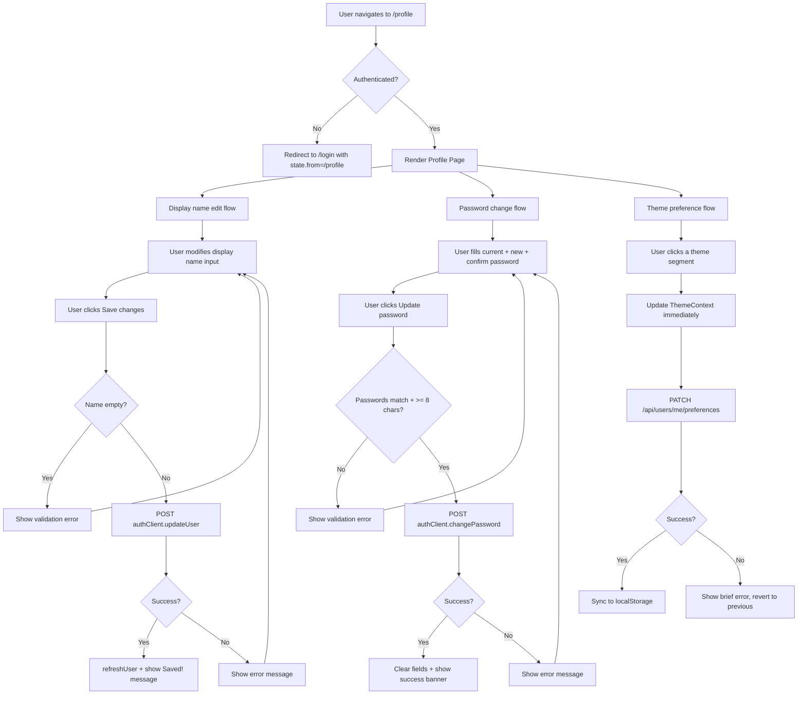

# Profile Page Modernization — Wireframe

## 1. Overview

This wireframe defines the modernized Profile Page (`/profile`, `ProfilePage` component in `client/src/features/auth/`). The redesign replaces the current single-column layout with a structured header + two-column card grid + full-width preferences section. It removes the redundant Courses section, replaces the pencil-icon inline edit with a standard form, and adds a segmented theme toggle (Light / Dark / System).

**Affected route:** `/profile` (requires authentication, any role).
**Affected components:** `ProfilePage`, `ThemeContext`, new `ThemeSegmentedControl` component.

---

## 2. Desktop Layout

Container: `max-w-4xl mx-auto` (wider than current `max-w-2xl` to accommodate two columns).

```
+------------------------------------------------------------------------+
|  PAGE CONTAINER  (max-w-4xl mx-auto py-8 px-4 flex flex-col gap-8)     |
|                                                                        |
|  +------------------------------------------------------------------+  |
|  |  PROFILE HEADER  (flex items-center gap-5 pb-6 border-b           |  |
|  |                    border-border-subtle)                          |  |
|  |                                                                   |  |
|  |  +--------+   Name (text-2xl font-bold text-text-primary)        |  |
|  |  |   BT   |   email@example.com (text-sm text-text-secondary)    |  |
|  |  | avatar |   [Student] role badge (pill)                        |  |
|  |  +--------+                                                       |  |
|  |  (64x64px)                                                        |  |
|  +------------------------------------------------------------------+  |
|                                                                        |
|  +-------------------------------+  +-------------------------------+  |
|  |  ACCOUNT CARD                 |  |  CHANGE PASSWORD CARD         |  |
|  |  (bg-surface rounded-2xl      |  |  (bg-surface rounded-2xl      |  |
|  |   shadow-warm-sm border       |  |   shadow-warm-sm border       |  |
|  |   border-border p-6)          |  |   border-border p-6)          |  |
|  |                               |  |                               |  |
|  |  "Account" (h2, text-lg       |  |  "Change Password" (h2)      |  |
|  |            font-semibold)     |  |                               |  |
|  |                               |  |  [Current Password] input     |  |
|  |  Display Name                 |  |  [New Password] input         |  |
|  |  label (text-xs               |  |  [Confirm Password] input     |  |
|  |         text-muted-foreground)|  |                               |  |
|  |  +-------------------------+  |  |  [ Update password ]          |  |
|  |  | Brandon Thornburg       |  |  |  (Button variant="secondary") |  |
|  |  +-------------------------+  |  |                               |  |
|  |  (Input component, editable)  |  |                               |  |
|  |                               |  |                               |  |
|  |  Email                        |  |                               |  |
|  |  label (text-xs               |  |                               |  |
|  |         text-muted-foreground)|  |                               |  |
|  |  +-------------------------+  |  |                               |  |
|  |  | user@example.com  [RO]  |  |  |                               |  |
|  |  +-------------------------+  |  |                               |  |
|  |  (read-only, muted styling)   |  |                               |  |
|  |                               |  |                               |  |
|  |  Role                         |  |                               |  |
|  |  label (text-xs               |  |                               |  |
|  |         text-muted-foreground)|  |                               |  |
|  |  +-------------------------+  |  |                               |  |
|  |  | Student           [RO]  |  |  |                               |  |
|  |  +-------------------------+  |  |                               |  |
|  |  (read-only, muted styling)   |  |                               |  |
|  |                               |  |                               |  |
|  |  [ Save changes ]             |  |                               |  |
|  |  (Button variant="primary",   |  |                               |  |
|  |   bg-green-button             |  |                               |  |
|  |   text-green-button-text)     |  |                               |  |
|  +-------------------------------+  +-------------------------------+  |
|     grid-cols-1 md:grid-cols-2 gap-6                                   |
|                                                                        |
|  +------------------------------------------------------------------+  |
|  |  PREFERENCES CARD  (full-width, bg-surface rounded-2xl           |  |
|  |                     shadow-warm-sm border border-border p-6)     |  |
|  |                                                                   |  |
|  |  "Preferences" (h2, text-lg font-semibold)                      |  |
|  |                                                                   |  |
|  |  +------------------------------------------------------------+  |  |
|  |  |  Theme                                                      |  |  |
|  |  |  (text-sm font-medium          [  Sun | Moon | Monitor  ]  |  |  |
|  |  |   text-text-primary)            segmented control          |  |  |
|  |  |  "Choose your preferred          (right-aligned)           |  |  |
|  |  |   color theme"                                             |  |  |
|  |  |  (text-xs text-text-secondary)                             |  |  |
|  |  +------------------------------------------------------------+  |  |
|  |   flex items-center justify-between                              |  |
|  +------------------------------------------------------------------+  |
|                                                                        |
+------------------------------------------------------------------------+
```

**Grid layout classes:** `grid grid-cols-1 md:grid-cols-2 gap-6`

---

## 3. Mobile Layout

Below the `md` breakpoint (< 768px), the two-column grid collapses to a single column.

```
+----------------------------------------+
|  PAGE CONTAINER                        |
|  (px-4 py-6 flex flex-col gap-6)       |
|                                        |
|  +----------------------------------+  |
|  |  PROFILE HEADER                  |  |
|  |  (flex flex-col items-center     |  |
|  |   text-center gap-3 pb-6        |  |
|  |   border-b border-border-subtle) |  |
|  |                                  |  |
|  |         +--------+              |  |
|  |         |   BT   |              |  |
|  |         +--------+              |  |
|  |     Brandon Thornburg            |  |
|  |     email@example.com            |  |
|  |        [Student]                 |  |
|  +----------------------------------+  |
|                                        |
|  +----------------------------------+  |
|  |  ACCOUNT CARD                    |  |
|  |  Display Name [input]           |  |
|  |  Email [read-only]              |  |
|  |  Role [read-only]               |  |
|  |  [ Save changes ]               |  |
|  +----------------------------------+  |
|                                        |
|  +----------------------------------+  |
|  |  CHANGE PASSWORD CARD            |  |
|  |  Current Password [input]       |  |
|  |  New Password [input]           |  |
|  |  Confirm Password [input]       |  |
|  |  [ Update password ]            |  |
|  +----------------------------------+  |
|                                        |
|  +----------------------------------+  |
|  |  PREFERENCES CARD                |  |
|  |  Theme                           |  |
|  |  "Choose your preferred..."      |  |
|  |  [ Sun | Moon | Monitor ]        |  |
|  |  (segmented control full-width   |  |
|  |   stacked below label on mobile) |  |
|  +----------------------------------+  |
|                                        |
+----------------------------------------+
```

**Mobile-specific adjustments:**
- Header switches to `flex-col items-center text-center` (avatar above name).
- Cards stack via `grid-cols-1`.
- Preferences card: label and segmented control stack vertically (`flex-col gap-3`) instead of `justify-between`.
- All buttons and segmented control segments meet the 44x44px minimum touch target.

---

## 4. Component Anatomy

### 4.1 Avatar

```
+----------+
|          |
|    BT    |   Initials derived from user.name
|          |   (first char, or first + last initials)
+----------+

Size:     w-16 h-16 (64px)
Shape:    rounded-full
Bg:       bg-green-surface
Border:   border-2 border-green-primary
Text:     text-green-surface-text text-xl font-bold
Layout:   flex items-center justify-center
```

### 4.2 Role Badge (pill)

```
[Student]

Shape:    rounded-full px-2.5 py-0.5
Text:     text-xs font-semibold capitalize
Variants:
  admin:   bg-success/10 text-success border border-success/20
  teacher: bg-accent-subtle text-accent border border-accent/20
  student: bg-surface-raised text-muted-foreground border border-border
```

Reuses existing `roleBadge` record from current `ProfilePage`.

### 4.3 Form Card

```
+-----------------------------------------------+
|  Card Title (text-lg font-semibold             |
|              text-foreground)                  |
|                                                |
|  FIELD LABEL (text-xs text-muted-foreground    |
|               uppercase tracking-wide)         |
|  +------------------------------------------+ |
|  | Field value                               | |
|  +------------------------------------------+ |
|  (Input component — see state table below)     |
|                                                |
|  ...more fields...                             |
|                                                |
|  [ Action Button ]                             |
+-----------------------------------------------+

Card:     bg-surface rounded-2xl shadow-warm-sm border border-border p-6
Fields:   flex flex-col gap-5
Button:   self-start (left-aligned)
```

### 4.4 Segmented Theme Control

```
+---------------------------------------------------+
|  +-------------+  +-------------+  +-------------+ |
|  | [Sun] Light |  | [Moon] Dark |  | [Mon] System| |
|  +-------------+  +-------------+  +-------------+ |
+---------------------------------------------------+

Outer:    inline-flex bg-surface-raised rounded-xl p-1 border border-border
Segment:  px-4 py-2 rounded-lg text-sm font-medium
          flex items-center gap-2
          cursor-pointer transition-all
Icon:     w-4 h-4 (lucide-react: Sun, Moon, Monitor)

Selected: bg-green-surface text-green-surface-text shadow-warm-sm
Inactive: text-muted-foreground hover:text-foreground
```

Component name: `ThemeSegmentedControl` in `client/src/features/auth/`.
Uses a `role="radiogroup"` container with individual `role="radio"` buttons.

---

## 5. Interactive States

### 5.1 Form Inputs

| Element | State | Visual Treatment |
|---|---|---|
| Text input (editable) | Default | `bg-surface-raised border-2 border-border text-foreground` (light: `bg-[#F9FAFB] border-[#E5E7EB]`) |
| Text input (editable) | Focus | `border-primary ring-0 outline-none` — border color changes to green-primary |
| Text input (editable) | Error | `border-destructive` — red border, error text below in `text-xs text-destructive` |
| Text input (editable) | Disabled | `opacity-50 cursor-not-allowed` |
| Read-only field | Default | `bg-muted border border-border-subtle text-muted-foreground cursor-default` — visually dimmer than editable fields |
| Password input | Default | Same as editable text input, `type="password"` |

### 5.2 Buttons

| Element | State | Visual Treatment |
|---|---|---|
| Save changes (primary) | Default | `bg-green-button text-green-button-text shadow-warm-sm` |
| Save changes (primary) | Hover | `brightness-110` filter |
| Save changes (primary) | Focus | `ring-2 ring-primary ring-offset-2` |
| Save changes (primary) | Loading | `disabled:opacity-50 disabled:cursor-not-allowed` + "Saving..." text + `LoadingSpinner` inline |
| Save changes (primary) | Disabled | `opacity-50 cursor-not-allowed` |
| Update password (secondary) | Default | `bg-transparent border border-border text-foreground shadow-warm-sm` (Button variant="secondary") |
| Update password (secondary) | Hover | `bg-surface-raised` |
| Update password (secondary) | Focus | `ring-2 ring-primary ring-offset-2` |
| Update password (secondary) | Loading | `disabled:opacity-50` + "Updating..." text |

### 5.3 Theme Segmented Control

| Element | State | Visual Treatment |
|---|---|---|
| Segment (inactive) | Default | `text-muted-foreground bg-transparent` |
| Segment (inactive) | Hover | `text-foreground` |
| Segment (inactive) | Focus-visible | `ring-2 ring-primary ring-offset-1` |
| Segment (active) | Default | `bg-green-surface text-green-surface-text shadow-warm-sm` |
| Segment (active) | Focus-visible | `ring-2 ring-primary ring-offset-1` |

### 5.4 Success / Error Feedback

| Event | Display | Duration |
|---|---|---|
| Name saved successfully | Inline `text-xs text-success font-medium` message "Saved!" below the Save button | Auto-dismiss after 3s |
| Name save error | `text-xs text-destructive` below display name field | Persists until user modifies field |
| Password changed successfully | Banner: `rounded-md bg-success/10 border border-success/20 px-4 py-3 text-success text-sm` | Auto-dismiss after 3s |
| Password change error | `<ErrorMessage>` component above password form | Persists until user modifies a field |
| Theme preference saved | No visible feedback (instant, silent save) | N/A |
| Theme preference save error | Brief toast or inline `text-xs text-destructive` below the segmented control | Auto-dismiss after 3s |

---

## 6. User Flows



---

## 7. Component Inventory

| Component | Status | Location |
|---|---|---|
| `ProfilePage` | **Exists** — major refactor required | `client/src/features/auth/ProfilePage.tsx` |
| `Button` (primary, secondary variants) | **Exists** | `client/src/components/Button.tsx` |
| `Input` | **Exists** | `client/src/components/Input.tsx` |
| `ErrorMessage` | **Exists** | `client/src/components/ErrorMessage.tsx` |
| `LoadingSpinner` | **Exists** | `client/src/components/LoadingSpinner.tsx` |
| `ThemeSegmentedControl` | **New** — segmented radio group with icons | `client/src/features/auth/ThemeSegmentedControl.tsx` |
| `ProfileAvatar` | **New** — initials-based avatar circle | `client/src/features/auth/ProfileAvatar.tsx` |
| `ThemeContext` | **Exists** — needs extension for 3-way preference | `client/src/context/ThemeContext.tsx` |

**Removed:** The Courses section is removed entirely. The `coursesApi` import and all courses-related state (`courses`, `coursesLoading`, `coursesError`) are deleted from `ProfilePage`.

---

## 8. Accessibility Notes

### 8.1 Landmarks and Semantics

- Page wrapped in `<main>` (provided by `Layout`).
- Profile header uses a heading `<h1>` (visually hidden or the user's name as page title).
- Each card section uses `<section>` with `aria-labelledby` pointing to its `<h2>`.
- Cards use `<h2>` headings: "Account", "Change Password", "Preferences".

### 8.2 Avatar

- `aria-hidden="true"` on the avatar element (decorative — the name is displayed as text beside it).

### 8.3 Form Fields

- All `<Input>` components use `htmlFor`/`id` pairs linking labels to inputs.
- Read-only fields use `readOnly` attribute (not `disabled`) and `aria-readonly="true"` to remain focusable and announced.
- Error messages use `aria-describedby` linking the input to its error `<p>` element via matching IDs.

### 8.4 Buttons

- "Save changes" and "Update password" buttons use native `<button>` elements.
- Loading states disable the button and change text to "Saving..." / "Updating..." — screen readers announce the disabled state.

### 8.5 Theme Segmented Control

- Container: `role="radiogroup"` with `aria-label="Theme preference"`.
- Each segment: `role="radio"` with `aria-checked="true"` for the active option.
- Keyboard navigation: `ArrowLeft`/`ArrowRight` move between options, `Space`/`Enter` select.
- Focus management: only the currently selected radio is in the tab order (`tabIndex={0}`); others are `tabIndex={-1}`. Arrow keys move focus and selection together (roving tabindex pattern).
- Icon-only labels are not used — each segment includes visible text ("Light", "Dark", "System") alongside the icon, so no `aria-label` is needed on individual segments.

### 8.6 Success / Error Messages

- Success messages use `role="status"` (implicit `aria-live="polite"`) so screen readers announce them without interrupting.
- Error messages associated with inputs use `aria-describedby`.
- The password error banner uses `role="alert"` for immediate announcement.

### 8.7 Keyboard Navigation Order

1. Display Name input
2. Email field (read-only, still focusable)
3. Role field (read-only, still focusable)
4. Save changes button
5. Current Password input
6. New Password input
7. Confirm Password input
8. Update password button
9. Theme segmented control (roving tabindex within radiogroup)

### 8.8 Color Contrast

- All text/background pairings use design tokens verified to meet WCAG AA:
  - White on `--green-button` (#047857): 5.1:1 (passes AA normal text)
  - `--text-primary` on `--surface`: passes AA in both themes
  - `--green-surface-text` on `--green-surface`: 7.2:1 (passes AAA)
  - `--text-secondary` / `--muted-foreground` on `--surface`: meets AA for the label size used (12px is small text, 4.5:1 required)

---

## 9. Design Token Mapping

| UI Element | Token(s) Used |
|---|---|
| Page background | `bg-background` |
| Card background | `bg-surface` |
| Card border | `border-border` |
| Card shadow | `shadow-warm-sm` |
| Card border radius | `rounded-2xl` |
| Header divider | `border-border-subtle` |
| Avatar background | `bg-green-surface` |
| Avatar border | `border-green-primary` |
| Avatar text | `text-green-surface-text` |
| User name | `text-text-primary text-2xl font-bold` |
| User email | `text-text-secondary text-sm` |
| Field labels | `text-xs text-muted-foreground` |
| Editable input bg | `bg-surface-raised` |
| Editable input border | `border-border` (default), `border-primary` (focus) |
| Read-only input bg | `bg-muted` |
| Read-only input border | `border-border-subtle` |
| Read-only input text | `text-muted-foreground` |
| Primary button (Save) | `bg-green-button text-green-button-text` |
| Secondary button (Password) | Button `variant="secondary"`: `bg-surface border-border text-foreground` |
| Segmented control outer | `bg-surface-raised rounded-xl border-border` |
| Segmented active | `bg-green-surface text-green-surface-text shadow-warm-sm` |
| Segmented inactive | `text-muted-foreground` |
| Success text | `text-success` |
| Error text | `text-destructive` |
| Success banner bg | `bg-success/10 border-success/20` |

---

## 10. Required Token Additions

No new tokens required. All colors, surfaces, and states are covered by existing design tokens defined in `client/src/index.css`. The segmented control uses existing `--green-surface` / `--green-surface-text` tokens for the active state and `--surface-raised` for the control background.
