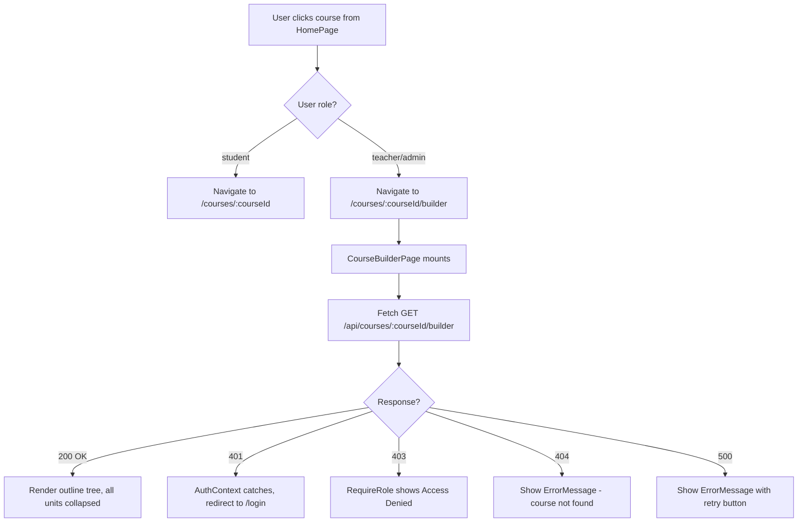
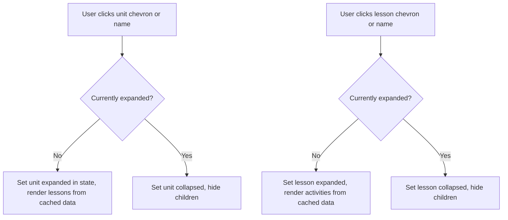
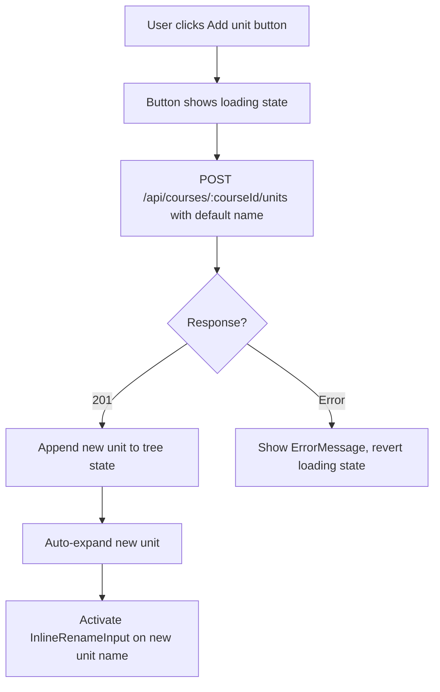
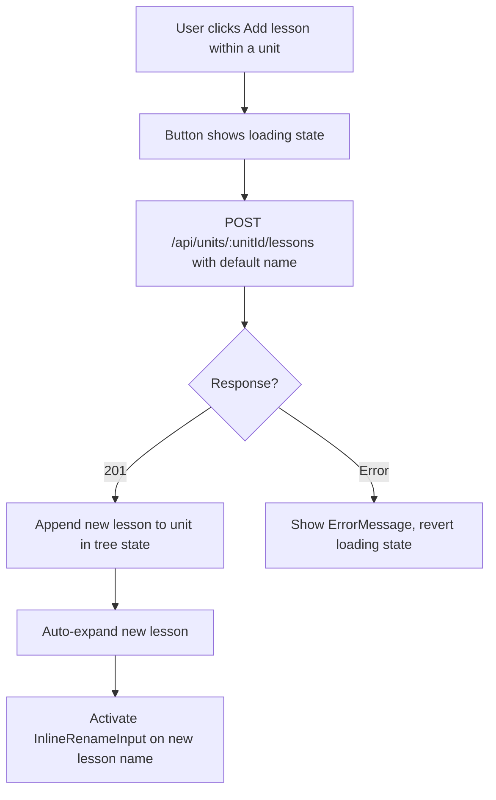
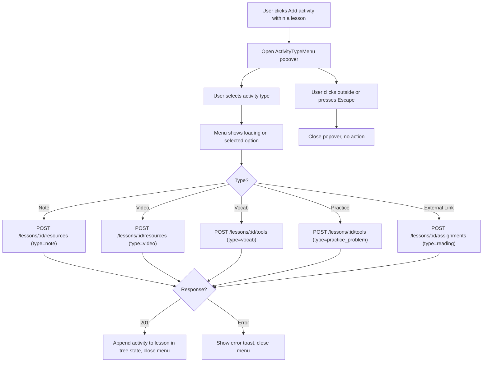
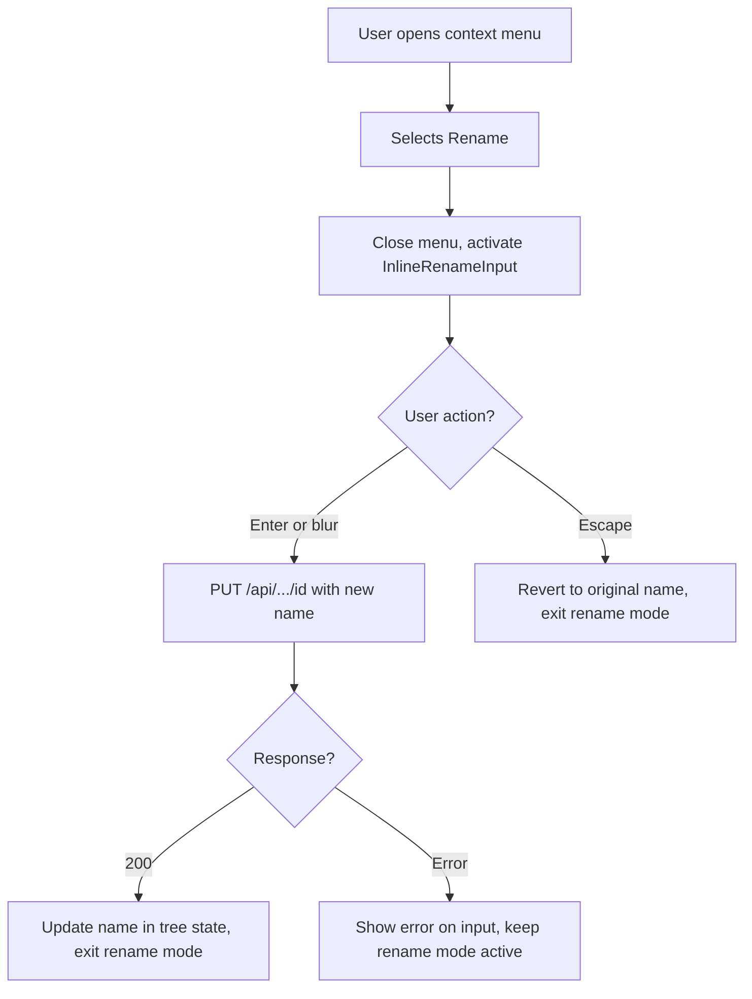
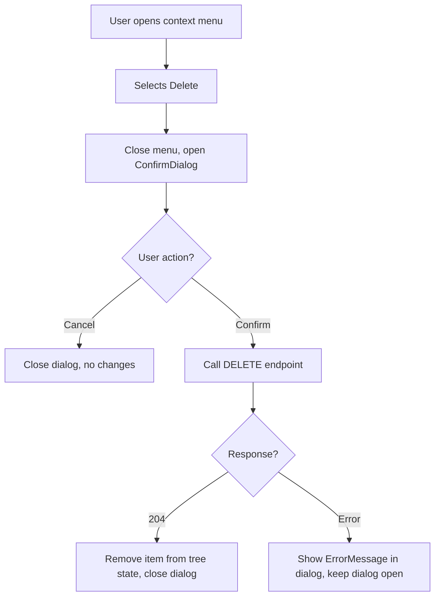
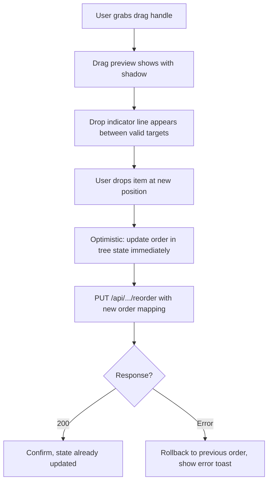
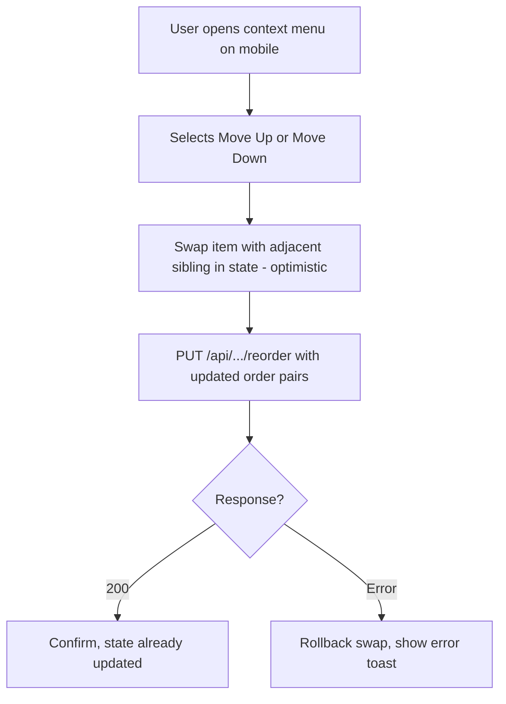

# Course Builder — UI Wireframe

## 1. Overview

The Course Builder is a single-page outline editor at `/courses/:courseId/builder` that lets teachers (and admins) view and manage an entire course hierarchy — units, lessons, and activities — without navigating between pages. The feature introduces role-based routing: teachers land on the builder; students continue to the existing `CourseDetailPage` at `/courses/:courseId`.

**User goal:** See, organize, and extend a course's full structure from one screen.

**Affected routes:**
- NEW: `/courses/:courseId/builder` — `CourseBuilderPage` (requires auth, teacher/admin role)
- MODIFIED: `/` — `HomePage` / `CourseCard` navigation target changes by role
- REFERENCED: `/courses/:courseId` — existing `CourseDetailPage` (linked from "Preview as student")

**Auth:** `RequireAuth` + `RequireRole` restricting to `teacher` and `admin`. Students who navigate directly to `/courses/:courseId/builder` see an "Access Denied" message (existing `RequireRole` behavior).

---

## 2. Desktop Layout

The builder uses a two-column layout on `lg:` (1024px+) viewports: a wide main column containing the top bar and outline tree, and a narrow right sidebar for course metadata and quick actions.

```
+------------------------------------------------------------------------+
| LAYOUT (existing app shell — sticky nav at top, <Outlet> below)        |
+------------------------------------------------------------------------+
|                                                                        |
|  +------------------------------------------------------+ +---------+ |
|  | BuilderTopBar                                         | |         | |
|  | [Home > Algebra Essentials]  [Builder]  [...] [Eye]   | |         | |
|  +------------------------------------------------------+ |         | |
|  |                                                       | | Builder | |
|  | Course Title  [edit-icon]                             | | Sidebar | |
|  | Description text (muted)                              | |         | |
|  |                                                       | | COURSE  | |
|  | OutlineTree                                           | | DETAILS | |
|  | +--------------------------------------------------+  | | ------  | |
|  | | [drag] [v] Unit 1: Expressions   [3 lessons] [...] | | Category| |
|  | |   [drag] [v] Lesson 1: Variables  [5 items]  [...] | | Units   | |
|  | |     Lesson plan - auto             [edit]         | | Lessons | |
|  | |     [drag] [Note]  Intro to vars   [edit]         | | Items   | |
|  | |     [drag] [Video] What are vars?  [edit]         | | Students| |
|  | |     [drag] [Vocab] Key terms  6    [edit]         | |         | |
|  | |     [drag] [Prac.] Practice 1  5  [edit]         | | QUICK   | |
|  | |     [+ Add activity]                              | | ACTIONS | |
|  | |     Lesson quiz - auto - 8 Qs      [edit]         | | ------  | |
|  | |   [drag] [>] Lesson 2: Equations   [3 items] [...] | | Calendar| |
|  | |   [+ Add lesson]                                  | | Syllabus| |
|  | |   Unit test - auto - 0 Qs          [edit]         | | Manage  | |
|  | +--------------------------------------------------+  | | Students| |
|  | [drag] [>] Unit 2: Graphing     [2 lessons]  [...]  | | Settings| |
|  | [+ Add unit]                                        | |         | |
|  | Course exam - auto - 0 Qs            [edit]         | |         | |
|  +------------------------------------------------------+ +---------+ |
|                                                                        |
+------------------------------------------------------------------------+
```

### Page Shell

The page renders inside the existing `Layout` component (nav + footer). The builder content sits within a `max-w-7xl mx-auto px-4 lg:px-8 py-6` container.

```
Container: max-w-7xl mx-auto px-4 lg:px-8 py-6
  TopBar:    w-full
  Body:      flex gap-8
    Main:    flex-1 min-w-0
    Sidebar: w-80 shrink-0 hidden lg:block
```

### BuilderTopBar

Component: `BuilderTopBar`

```
+------------------------------------------------------------------+
| [Home icon] > Algebra Essentials   [Builder badge]   [Eye] Preview as student   [...] |
+------------------------------------------------------------------+
```

| Element | Token / Class | Notes |
|---|---|---|
| Container | `flex items-center justify-between py-3 border-b border-border mb-6` | Full-width row |
| Breadcrumb | `text-sm text-muted-foreground` with `>` separator | "Home" is a link (`text-accent hover:underline`). Course name is `text-text-primary font-medium`. Wrap in `<nav aria-label="Breadcrumb">` with `<ol>` |
| "Builder" badge | `bg-green-surface text-green-surface-text text-xs font-semibold px-2 py-0.5 rounded-full ml-2` | Static label, not interactive |
| "Preview as student" button | `Button` component, `variant="secondary"`, `size="sm"` with `Eye` icon | Links to `/courses/:courseId`. Text hidden below `md:` — icon-only on mobile |
| Three-dot overflow | `MoreHorizontal` icon button, `text-muted-foreground hover:text-foreground w-8 h-8 flex items-center justify-center rounded-lg hover:bg-surface-raised` | Visible only below `lg:` — opens sidebar content as dropdown. On desktop above `lg:`, hidden |

### Course Title Section

Below the top bar, within the main column:

```
+----------------------------------------------------------------------+
| Algebra Essentials  [pencil-icon]                                    |
| A course covering algebraic fundamentals...                          |
+----------------------------------------------------------------------+
```

| Element | Token / Class | Notes |
|---|---|---|
| Course title | `text-2xl font-bold text-text-primary` | Editable inline |
| Edit icon (pencil) | `Pencil` from lucide, `text-muted-foreground hover:text-foreground w-4 h-4 cursor-pointer` | Triggers `InlineRenameInput` on the course title |
| Description | `text-sm text-text-secondary mt-1` | Read-only in this iteration |
| Container | `mb-6` | |

Clicking the pencil replaces the `<h1>` with an `InlineRenameInput`. On Enter or blur, a `PUT /courses/:courseId` call saves the new title.

### OutlineTree

Component: `OutlineTree`

The tree is rendered as a `<div role="tree" aria-label="Course outline">` containing nested `<div role="treeitem">` elements. Each level increases left margin:

| Level | Element | Indentation |
|---|---|---|
| 0 | Unit row | `ml-0` |
| 1 | Lesson row | `ml-8` (within expanded unit) |
| 2 | Activity row | `ml-16` (within expanded lesson) |
| 2 | Assessment row | `ml-16` (within expanded lesson) |
| 1 | Unit test row | `ml-8` (bottom of expanded unit) |
| 0 | Course exam row | `ml-0` (bottom of tree) |

Tree container: `flex flex-col gap-0`

### UnitRow

Component: `UnitRow`

```
[GripVertical] [ChevronRight/Down] Unit 1: Variables and expressions   [2 lessons]   [MoreHorizontal]
```

| Element | Token / Class | Notes |
|---|---|---|
| Container | `flex items-center gap-2 px-3 py-2.5 rounded-lg hover:bg-surface transition-colors group cursor-pointer` | |
| Drag handle | `GripVertical` icon, `text-muted-foreground opacity-0 group-hover:opacity-100 transition-opacity cursor-grab w-4 h-4` | Hidden on mobile: `hidden md:flex` |
| Chevron | `ChevronRight` (collapsed) or `ChevronDown` (expanded), `text-muted-foreground w-4 h-4` | `<button aria-expanded="true/false">`, chevron + unit name are click target |
| Unit name | `text-sm font-semibold text-text-primary flex-1 min-w-0 truncate` | Replaced by `InlineRenameInput` in rename mode |
| Lesson count badge | `text-xs text-muted-foreground bg-surface px-2 py-0.5 rounded-full` | e.g., "2 lessons" |
| Context menu trigger | `MoreHorizontal` icon, `text-muted-foreground hover:text-foreground w-8 h-8 flex items-center justify-center rounded-lg hover:bg-surface-raised` | Opens dropdown with Rename, Delete |

A `border-b border-border-subtle` divider appears between unit rows.

### LessonRow

Component: `LessonRow`

```
   [GripVertical] [ChevronRight/Down] Variables and constants   [5 activities]   [MoreHorizontal]
```

| Element | Token / Class | Notes |
|---|---|---|
| Container | `flex items-center gap-2 px-3 py-2 rounded-lg hover:bg-surface transition-colors group cursor-pointer ml-8` | Indented under parent unit |
| Drag handle | Same as UnitRow | Hidden on mobile |
| Chevron | Same as UnitRow | |
| Lesson name | `text-sm font-medium text-text-primary flex-1 min-w-0 truncate` | |
| Activity count badge | `text-xs text-muted-foreground bg-surface px-2 py-0.5 rounded-full` | e.g., "5 activities" |
| Context menu trigger | Same as UnitRow | Rename, Delete |

### ActivityRow

Component: `ActivityRow`

```
      [GripVertical] [Note]  Intro to variables                    [Pencil]
      [GripVertical] [Video] What are variables?                   [Pencil]
      [GripVertical] [Vocab] Key terms              6 terms        [Pencil]
      [GripVertical] [Practice] Practice set 1      5 problems     [Pencil]
```

| Element | Token / Class | Notes |
|---|---|---|
| Container | `flex items-center gap-2 px-3 py-1.5 rounded-lg hover:bg-surface transition-colors group ml-16` | |
| Drag handle | Same pattern. Not rendered for auto items (lesson plan) | Hidden on mobile |
| Type pill | `ActivityTypePill` — see color mapping below | |
| Activity name | `text-sm text-text-primary flex-1 min-w-0 truncate` | |
| Item count (optional) | `text-xs text-muted-foreground` | Shown for Vocab ("N terms") and Practice ("N problems") |
| Edit button | `Pencil` icon, `text-muted-foreground hover:text-foreground w-7 h-7 flex items-center justify-center rounded-lg hover:bg-surface-raised opacity-0 group-hover:opacity-100 transition-opacity` | For teacher activities: shows "Coming soon" `Tooltip`. For assessments: navigates to assessment editor |

### AssessmentRow

Component: `AssessmentRow`

Auto-created items that are visually dimmed and not deletable.

```
      Lesson plan - auto                                          [Pencil]
      Lesson quiz - auto - 8 questions                            [Pencil]
   Unit test - auto - 0 questions                                 [Pencil]
Course exam - auto - 0 questions                                  [Pencil]
```

| Element | Token / Class | Notes |
|---|---|---|
| Container | Same as ActivityRow but with `opacity-60` | Visually dimmed |
| Label | `text-sm text-muted-foreground italic flex-1` | e.g., "Lesson quiz" |
| "auto" badge | `text-xs bg-surface text-muted-foreground px-1.5 py-0.5 rounded` | Indicates system-managed |
| Question count | `text-xs text-muted-foreground` | e.g., "8 questions". Shown even if 0 |
| Edit button | Always visible (not opacity-gated), `Pencil` icon, `text-muted-foreground hover:text-accent` | Navigates to assessment edit flow |

No drag handle. No three-dot menu. No delete action.

- Lesson plan: first item when lesson is expanded, at `ml-16`
- Lesson quiz: last item when lesson is expanded, at `ml-16`
- Unit test: last item when unit is expanded (after add-lesson button), at `ml-8`
- Course exam: last item in entire tree, at `ml-0`

### ActivityTypePill

Component: `ActivityTypePill`

Base classes: `inline-flex items-center gap-1 text-xs font-medium px-2 py-0.5 rounded-full`

| Activity Type | Background | Text | Label |
|---|---|---|---|
| Note (resource `note`) | `bg-blue-surface` | `text-blue-surface-text` | "Note" |
| Video (resource `video`) | `bg-orange-surface` | `text-orange-surface-text` | "Video" |
| Vocab (tool `vocab`) | `bg-green-surface` | `text-green-surface-text` | "Vocab" |
| Practice Problem (tool `practice_problem`) | `bg-purple-surface` | `text-purple-surface-text` | "Practice" |
| External Link (assignment) | `bg-surface border border-border-subtle` | `text-muted-foreground` | "Link" |
| Lecture / Lesson Plan (resource `lecture`) | No pill — uses dimmed row styling | n/a | "Lesson plan" label inline |

**OQ-01 Resolution — Purple Token:** A new `--purple-surface` / `--purple-surface-text` token pair must be added to `client/src/index.css`, following the exact pattern of existing surface tokens. See Section 8 for definitions. Until added, use `bg-surface border border-border-subtle` / `text-muted-foreground` as a neutral fallback.

### AddItemButton

Component: `AddItemButton`

```
[+ Add unit]       — at ml-0, before course exam
[+ Add lesson]     — at ml-8, before unit test
[+ Add activity]   — at ml-16, before lesson quiz
```

Styling: `flex items-center gap-1.5 w-full px-3 py-2 text-sm text-muted-foreground border border-dashed border-border rounded-lg hover:border-green-primary hover:text-green-primary transition-colors cursor-pointer`

Icon: `Plus` from lucide-react, `w-4 h-4`

- "Add unit" and "Add lesson" create the item immediately with a default name, then enter inline rename mode on the new item.
- "Add activity" opens the `ActivityTypeMenu` popover first (see below).

### ActivityTypeMenu

Component: `ActivityTypeMenu`

**OQ-02 Resolution:** Clicking "+ Add activity" opens a type-picker popover. The teacher selects a type, then the system creates the activity with default content. The button does not immediately create an activity.

```
+----------------------------+
| [FileText]  Note           |
| [Play]      Video          |
| [LayoutGrid] Vocab         |
| [PenTool]   Practice       |
| [ExtLink]   External Link  |
+----------------------------+
```

| Element | Token / Class | Notes |
|---|---|---|
| Container | `absolute left-0 mt-1 w-56 bg-surface-raised border border-border rounded-xl shadow-warm-md z-30 py-1` | Positioned below the "Add activity" button |
| Menu item | `flex items-center gap-2.5 px-3 py-2 text-sm text-text-primary hover:bg-surface rounded-lg mx-1 cursor-pointer` | Icon uses same color as corresponding `ActivityTypePill` |
| ARIA | `role="menu" aria-label="Select activity type"` with `role="menuitem"` children | |

Closes on click-outside, Escape, or after selecting a type. On selection:
1. POST to appropriate endpoint with default title and next order value
2. Append new activity to tree state
3. Close popover

### BuilderSidebar

Component: `BuilderSidebar`

Visible above `lg:` breakpoint. Below `lg:`, content moves into the top-bar overflow dropdown.

```
+--------------------------+
| COURSE DETAILS           |
|                          |
| Category                 |
| Mathematics              |
|                          |
| Structure                |
| 2 units - 4 lessons      |
|                          |
| Assessments              |
| 2 unit tests - 1 exam    |
|                          |
| Students                 |
| 1 enrolled               |
+--------------------------+

+--------------------------+
| QUICK ACTIONS            |
|                          |
| [Calendar]  Calendar     |
| [List]      Syllabus     |
| [Users]     Manage       |
| [Settings]  Settings     |
+--------------------------+
```

| Element | Token / Class | Notes |
|---|---|---|
| Container | `w-80 shrink-0 hidden lg:block` | |
| Section card | `bg-surface rounded-xl border border-border-subtle p-5 shadow-warm-sm` | Matches existing `CourseProgressSidebar` pattern |
| Section heading | `text-xs font-semibold text-muted-foreground uppercase tracking-wider mb-4` | "COURSE DETAILS", "QUICK ACTIONS" |
| Detail label | `text-xs text-muted-foreground` | |
| Detail value | `text-sm text-text-primary font-medium mt-0.5 mb-3` | |
| Quick action row | `flex items-center gap-2 w-full text-sm text-text-primary hover:text-blue-accent transition-colors py-1.5 rounded-lg hover:bg-surface-raised px-1.5` | Same `actionRowClasses` pattern as `CourseProgressSidebar` |
| Sidebar layout | `flex flex-col gap-4 sticky top-24` | Sticky sidebar |

Quick action buttons are placeholders. Each shows a `Tooltip` with "Coming soon" on hover.

### Context Menu (DropdownMenu)

The three-dot menu on units, lessons, and activities opens a positioned dropdown.

**Desktop (above `md:`):**

| Item type | Menu options |
|---|---|
| Unit | Rename, Delete |
| Lesson | Rename, Delete |
| Activity | Delete |

**Mobile (below `md:`):**

| Item type | Menu options |
|---|---|
| Unit | Rename, Move up, Move down, Delete |
| Lesson | Rename, Move up, Move down, Delete |
| Activity | Move up, Move down, Delete |

| Element | Token / Class |
|---|---|
| Container | `absolute right-0 mt-1 w-44 bg-surface-raised border border-border rounded-xl shadow-warm-md z-30 py-1` |
| Menu item | `flex items-center gap-2 px-3 py-2 text-sm text-text-primary hover:bg-surface rounded-lg mx-1 cursor-pointer` |
| Delete item | `text-destructive hover:bg-destructive/10` |
| Divider before Delete | `border-t border-border-subtle my-1 mx-3` |
| Disabled move item | `opacity-50 cursor-not-allowed` (Move up on first item, Move down on last) |

### InlineRenameInput

Component: `InlineRenameInput`

Replaces the name text within a row when "Rename" is selected from the context menu.

| Element | Token / Class | Notes |
|---|---|---|
| Input | Reuses shared `Input` component, `size="sm"` | Auto-focuses, selects all text on mount |
| Container | Input fills the `flex-1` slot that the name text previously occupied | Row layout otherwise unchanged |

Behavior:
- Enter or blur: sends `PUT` to update name
- Escape: reverts to original name without API call
- Error: `border-destructive` on input, error text below via `aria-describedby`

---

## 3. Mobile Layout

Below `md:` (768px), the layout adapts for touch interaction.

```
+--------------------------------------+
| [<-] Algebra Essentials [Builder]    |
|                          [Eye] [...] |
+--------------------------------------+
|                                      |
| Course Title  [edit-icon]            |
| Description text                     |
|                                      |
| [v] Unit 1: Expressions  [3]  [...] |
|                                      |
|   [v] Variables & constants [5] [..] |
|                                      |
|     Lesson plan - auto       [edit]  |
|     [Note] Intro to variables [ed]   |
|     [Video] What are vars?   [ed]    |
|     [Vocab] Key terms  6t    [ed]    |
|     [Practice] Set 1  5p    [ed]     |
|     [+ Add activity]                 |
|     Lesson quiz - auto  8q  [ed]     |
|                                      |
|   [>] Simplifying expressions [3]    |
|     [...menu]                        |
|                                      |
|   [+ Add lesson]                     |
|   Unit test - auto  0q      [edit]   |
|                                      |
| [>] Unit 2: Equations...  [2] [...] |
|                                      |
| [+ Add unit]                         |
|                                      |
| Course exam - auto  0q      [edit]   |
|                                      |
+--------------------------------------+
```

### Key Mobile Differences

| Aspect | Desktop (>= md) | Mobile (< md) |
|---|---|---|
| Sidebar | Visible as right column (above `lg:`) | Hidden; content in top-bar overflow dropdown |
| Drag handles | Visible on hover | Hidden entirely (`hidden md:flex`) |
| Reorder | Drag-and-drop | "Move up" / "Move down" in context menu |
| Top bar | Breadcrumb with full path + text labels | Back arrow + course title + icon-only buttons |
| Indentation | `ml-8` / `ml-16` | `ml-4` / `ml-8` (reduced via responsive: `ml-4 md:ml-8`, `ml-8 md:ml-16`) |
| Touch targets | Standard | Minimum 44x44px on all interactive elements (`min-h-[44px] min-w-[44px]`) |

### Mobile TopBar

```
+--------------------------------------+
| [ArrowLeft]  Algebra Essent... [B]   |
|                          [Eye] [...] |
+--------------------------------------+
```

| Element | Token / Class | Notes |
|---|---|---|
| Back arrow | `ArrowLeft` icon, `w-11 h-11 flex items-center justify-center` | Navigates to `/` (home) |
| Title | `text-lg font-bold text-text-primary truncate flex-1` | |
| Builder badge | Same as desktop | |
| Eye icon | Icon-only, `aria-label="Preview as student"`, `w-11 h-11` | Links to `/courses/:courseId` |
| Three-dot overflow | Opens dropdown with sidebar content | |
| Container | `flex items-center gap-2 px-4 py-3 border-b border-border` | |

### Mobile Overflow Menu

When the three-dot overflow is tapped on mobile, it shows sidebar content in a dropdown:

```
+----------------------------+
| COURSE DETAILS             |
| Mathematics | 2u 4l | 1 st |
+----------------------------+
| QUICK ACTIONS              |
| Calendar                   |
| Syllabus                   |
| Manage students            |
| Course settings            |
+----------------------------+
```

---

## 4. Interactive States

### 4.1 UnitRow / LessonRow States

| State | Visual Treatment |
|---|---|
| **Default (collapsed)** | `bg-transparent`, chevron points right, drag handle hidden (`opacity-0`) |
| **Hover** | `bg-surface`, drag handle fades in (`opacity-100`), subtle transition |
| **Expanded** | Chevron rotates down (`rotate-90 transition-transform` or icon swap to `ChevronDown`), children rendered below |
| **Focus** | `focus-visible:ring-2 focus-visible:ring-primary focus-visible:ring-offset-2` on chevron and menu trigger |
| **Rename mode** | Name text replaced by `InlineRenameInput` (auto-focused, text selected), other row elements remain |
| **Dragging** | Row gets `opacity-70 shadow-warm-lg bg-surface-raised rounded-lg` as drag preview. Source position shows `opacity-30` placeholder |
| **Drop target** | A 2px horizontal line at insertion point: `border-t-2 border-green-primary` |
| **Loading (after create/rename)** | Inline `LoadingSpinner size="sm"` or subtle pulse animation |
| **Delete pending** | `ConfirmDialog` modal open; row visible behind overlay |

### 4.2 ActivityRow States

| State | Visual Treatment |
|---|---|
| **Default** | Type pill colored per mapping, edit button hidden (`opacity-0`) |
| **Hover** | `bg-surface`, edit button fades in (`opacity-100`), drag handle fades in |
| **Dragging** | Same as UnitRow/LessonRow drag state |
| **Auto item (lesson plan / quiz)** | `opacity-60`, no drag handle, "auto" badge visible, edit button always visible |

### 4.3 AddItemButton States

| State | Visual Treatment |
|---|---|
| **Default** | Dashed border (`border-dashed border-border`), muted text |
| **Hover** | `border-green-primary text-green-primary` |
| **Focus** | `focus-visible:ring-2 focus-visible:ring-primary focus-visible:ring-offset-2` |
| **Loading (after click)** | Text changes to "Adding..." with `LoadingSpinner` inline, button disabled |
| **Disabled** | `opacity-50 cursor-not-allowed` |

### 4.4 ActivityTypeMenu States

| State | Visual Treatment |
|---|---|
| **Closed** | Not rendered |
| **Open** | Popover visible below button, `shadow-warm-md` |
| **Option hover** | `bg-surface` background |
| **Option focus** | `ring-2 ring-primary ring-offset-2` |
| **Creating** | Selected option shows inline spinner, menu stays open until creation succeeds |

### 4.5 Context Menu States

| State | Visual Treatment |
|---|---|
| **Closed** | Three-dot button visible |
| **Open** | Dropdown rendered, trigger button gets `bg-surface-raised` |
| **Option hover** | `bg-surface`, delete option gets `bg-destructive/10` |
| **Disabled move** | `opacity-50 cursor-not-allowed` (Move up on first, Move down on last) |

### 4.6 InlineRenameInput States

| State | Visual Treatment |
|---|---|
| **Active** | `Input` replaces name text, auto-focused with all text selected |
| **Saving** | Input disabled, subtle opacity reduction |
| **Error** | `border-destructive`, error message below via `aria-describedby` |
| **Cancel (Escape)** | Reverts to name text, no API call |

### 4.7 ConfirmDialog (Delete)

Uses existing `ConfirmDialog` component. Confirmation copy varies:

| Deleting | Title | Message |
|---|---|---|
| Unit | "Delete unit" | "This will permanently delete \"{name}\" and all its lessons, activities, and assessments. This cannot be undone." |
| Lesson | "Delete lesson" | "This will permanently delete \"{name}\" and all its activities and assessments. This cannot be undone." |
| Activity | "Delete activity" | "This will permanently delete \"{name}\". This cannot be undone." |

### 4.8 Empty States

| Scenario | Display |
|---|---|
| Course with no units | `EmptyState` component centered in tree area: "No units yet. Add your first unit to start building your course." with `AddItemButton` below |
| Unit with no lessons | Inline message within expanded unit: `text-sm text-muted-foreground italic py-2 ml-8` "No lessons in this unit." with `AddItemButton` below |
| Lesson with no activities | Inline message within expanded lesson: `text-sm text-muted-foreground italic py-2 ml-16` "No activities in this lesson." with `AddItemButton` below |

### 4.9 Page-Level States

| State | Visual Treatment |
|---|---|
| **Loading (initial fetch)** | `LoadingSpinner` centered in the main content area. Sidebar shows skeleton placeholders (`bg-surface animate-pulse rounded h-4 w-full`) |
| **Error (fetch failed)** | `ErrorMessage` component with error string and a "Retry" button calling `reload()` |

---

## 5. User Flows

### 5.1 Page Load and Navigation



### 5.2 Expand / Collapse



No API calls — all data pre-fetched on mount.

### 5.3 Add Unit



### 5.4 Add Lesson



### 5.5 Add Activity (OQ-02 Resolution)



### 5.6 Rename



### 5.7 Delete



### 5.8 Drag and Drop Reorder (Desktop)



### 5.9 Mobile Reorder (Move Up / Move Down)



---

## 6. Component Inventory

### Existing Components (reuse as-is)

| Component | Location | Usage |
|---|---|---|
| `Button` | `src/components/Button.tsx` | Preview button, quick action placeholders, confirm/cancel |
| `Input` | `src/components/Input.tsx` | `InlineRenameInput` wraps this |
| `Modal` | `src/components/Modal.tsx` | Used internally by `ConfirmDialog` |
| `ConfirmDialog` | `src/components/ConfirmDialog.tsx` | Delete confirmations |
| `ErrorMessage` | `src/components/ErrorMessage.tsx` | Error display |
| `LoadingSpinner` | `src/components/LoadingSpinner.tsx` | Page load, inline loading |
| `EmptyState` | `src/components/EmptyState.tsx` | Empty course state |
| `Tooltip` | `src/components/Tooltip.tsx` | "Coming soon" on activity edit buttons, sidebar placeholders |
| `Layout` | `src/components/Layout.tsx` | App shell (nav + footer) |
| `RequireAuth` | `src/features/auth/RequireAuth.tsx` | Route guard |
| `RequireRole` | `src/features/auth/RequireRole.tsx` | Role restriction |

### Existing Components (require modification)

| Component | Location | Change |
|---|---|---|
| `CourseCard` | `src/features/courses/CourseCard.tsx` | Change `Link to` based on `user.role`: teachers/admins navigate to `/courses/:courseId/builder`, students to `/courses/:courseId`. Accept `userRole` prop or use `useAuth()` internally. |
| `App.tsx` | `src/App.tsx` | Register new route: `/courses/:courseId/builder` wrapped in `RequireAuth` + `RequireRole` |

### New Components (to create)

All live under `src/features/builder/`.

| Component | File | Purpose |
|---|---|---|
| `CourseBuilderPage` | `CourseBuilderPage.tsx` | Top-level page: fetches outline, manages expand/collapse state, orchestrates all sub-components |
| `BuilderTopBar` | `BuilderTopBar.tsx` | Breadcrumb, builder badge, preview button, mobile overflow |
| `OutlineTree` | `OutlineTree.tsx` | Renders the full collapsible tree from outline data |
| `UnitRow` | `UnitRow.tsx` | Unit-level row with drag, expand, rename, delete |
| `LessonRow` | `LessonRow.tsx` | Lesson-level row with drag, expand, rename, delete |
| `ActivityRow` | `ActivityRow.tsx` | Activity-level row with drag, type pill, edit |
| `AssessmentRow` | `AssessmentRow.tsx` | Dimmed auto-created assessment row |
| `ActivityTypePill` | `ActivityTypePill.tsx` | Colored badge for activity type |
| `BuilderSidebar` | `BuilderSidebar.tsx` | Course metadata + quick action placeholders |
| `InlineRenameInput` | `InlineRenameInput.tsx` | Inline text input for renaming |
| `AddItemButton` | `AddItemButton.tsx` | Dashed-border creation button |
| `ActivityTypeMenu` | `ActivityTypeMenu.tsx` | Popover listing activity types |
| `DropdownMenu` | `DropdownMenu.tsx` | Generic positioned dropdown for context menus |

### New Hooks

| Hook | Location | Purpose |
|---|---|---|
| `useBuilderOutline` | `src/features/builder/hooks/useBuilderOutline.ts` | Fetches outline tree, manages tree state (expand/collapse, CRUD, reorder with optimistic rollback) |
| `useContextMenu` | `src/features/builder/hooks/useContextMenu.ts` | Open/close state and positioning for dropdown menus |
| `useDragReorder` | `src/features/builder/hooks/useDragReorder.ts` | Wraps HTML Drag and Drop API with optimistic reorder and rollback |

### Existing Hooks (reused)

| Hook | Usage |
|---|---|
| `useFetch` | Initial outline tree fetch (wrapped by `useBuilderOutline`) |
| `useCanEdit` | Role check in `CourseCard` for routing |
| `useAuth` | User role for routing decisions |
| `useDisclosure` | Popover/dropdown open/close state |
| `useMediaQuery` | Detect mobile for hiding drag handles |

---

## 7. Accessibility Notes

### 7.1 Outline Tree ARIA Structure

- Tree container: `<div role="tree" aria-label="Course outline">`
- Each UnitRow: `<div role="treeitem" aria-expanded="true|false" aria-level="1">`
- Each LessonRow: `<div role="treeitem" aria-expanded="true|false" aria-level="2">`, nested within `<div role="group">` inside the parent unit
- Each ActivityRow / AssessmentRow: `<div role="treeitem" aria-level="3">` (leaf nodes, no `aria-expanded`), nested within `<div role="group">` inside the parent lesson
- Unit test: `role="treeitem" aria-level="2"` within the unit's group
- Course exam: `role="treeitem" aria-level="1"` at tree root

### 7.2 Keyboard Navigation

| Key | Behavior |
|---|---|
| `Tab` | Moves focus between interactive elements within rows (chevron, name, badge, menu button, edit button) |
| `Enter` / `Space` | On chevron: toggle expand/collapse. On menu button: open context menu. On add button: trigger action |
| `Escape` | Close any open dropdown/popover. Cancel inline rename |
| `ArrowUp` / `ArrowDown` | Within an open dropdown menu: move between menu items |
| `Home` / `End` | Within an open dropdown menu: jump to first/last item |

Full tree keyboard navigation (ArrowUp/Down between tree items) is not required in this iteration per NFR-03.

### 7.3 Focus Management

| Trigger | Focus Destination |
|---|---|
| After adding an item | `InlineRenameInput` on the new item |
| After deleting an item | Previous sibling row, or parent row if no siblings remain |
| After closing a dropdown | Trigger button that opened the dropdown |
| After closing ConfirmDialog | Context menu trigger that initiated the delete |
| InlineRenameInput commit | Row's name display area |
| ActivityTypeMenu opens | First menu item |
| ActivityTypeMenu closes | The "+ Add activity" button that triggered it |

### 7.4 ARIA Attributes by Component

| Component | ARIA Attributes |
|---|---|
| `OutlineTree` container | `role="tree"`, `aria-label="Course outline"` |
| `UnitRow` | `role="treeitem"`, `aria-expanded`, `aria-level="1"`, `aria-label="Unit: {name}"` |
| `LessonRow` | `role="treeitem"`, `aria-expanded`, `aria-level="2"`, `aria-label="Lesson: {name}"` |
| `ActivityRow` | `role="treeitem"`, `aria-level="3"`, `aria-label="{type}: {name}"` |
| `AssessmentRow` | `role="treeitem"`, `aria-level` (varies), `aria-label="{type} - {questionCount} questions"` |
| Group container | `role="group"` (wraps children of expanded treeitem) |
| Expand/collapse chevron | `<button aria-expanded aria-label="Expand {name}" aria-controls="{group-id}">` |
| Context menu trigger | `<button aria-haspopup="menu" aria-expanded aria-label="Actions for {name}">` |
| Context menu | `<div role="menu" aria-label="Actions">` |
| Context menu item | `<button role="menuitem">` |
| `ActivityTypeMenu` | `<div role="menu" aria-label="Select activity type">` |
| `ActivityTypeMenu` item | `<button role="menuitem">` |
| `AddItemButton` | `<button aria-label="Add {item type}">` (for unit/lesson). `<button aria-haspopup="menu" aria-label="Add activity">` (for activity) |
| Edit button | `<button aria-label="Edit {name}">` |
| Drag handle | `aria-hidden="true"` (not keyboard-accessible in this iteration) |
| `InlineRenameInput` | `<input aria-label="Rename {item type}">`, `aria-describedby` linked to error message if present |
| Preview button | Visible text "Preview as student" or `aria-label="Preview as student"` when icon-only |

### 7.5 Screen Reader Announcements

A single `aria-live="polite"` visually-hidden container at the `CourseBuilderPage` level receives announcement text via state updates:

- After add: "{Item type} created"
- After rename: "Renamed to {new name}"
- After delete: "{Item name} deleted"
- After reorder: "{Item name} moved to position {N}"

### 7.6 Color Contrast Verification

All type pill pairings use surface/surface-text token pairs designed to meet WCAG AA:

| Pair | Contrast Ratio | WCAG Level |
|---|---|---|
| Blue: `#1E40AF` on `#EFF6FF` | 7.0:1 | AAA |
| Green: `#065F46` on `#ECFDF5` | 7.2:1 | AAA |
| Orange: `#9A3412` on `#FFF7ED` | 7.1:1 | AAA |
| Purple (proposed): `#5B21B6` on `#F5F3FF` | 7.3:1 | AAA |

The "auto" badge (`text-muted-foreground` on `bg-surface`) and dimmed assessment rows (`opacity-60` on `text-muted-foreground`) follow existing project contrast standards. Assessment row dimming uses `opacity-60` which still passes AA because `text-muted-foreground` on `bg-surface` starts well above the 4.5:1 threshold.

---

## 8. Required Token Additions

### Purple surface token pair (OQ-01 resolution)

New tokens for Practice Problem activity type pills:

- `--purple-surface`: Light wash background for purple pills
  - Light: `#F5F3FF` (Tailwind violet-50)
  - Dark: `rgba(91, 33, 182, 0.15)` (follows existing rgba pattern)

- `--purple-surface-text`: Text color on purple surface backgrounds
  - Light: `#5B21B6` (Tailwind violet-800)
  - Dark: `#C4B5FD` (Tailwind violet-300)

Add in three places in `client/src/index.css`:

1. **`:root` block:**
   ```css
   --purple-surface:       #F5F3FF;
   --purple-surface-text:  #5B21B6;
   ```

2. **`.dark` block:**
   ```css
   --purple-surface:       rgba(91, 33, 182, 0.15);
   --purple-surface-text:  #C4B5FD;
   ```

3. **`@theme inline` block:**
   ```css
   --color-purple-surface:      var(--purple-surface);
   --color-purple-surface-text: var(--purple-surface-text);
   ```

This follows the exact same pattern as the existing `blue-surface`, `green-surface`, and `orange-surface` token pairs. The resulting Tailwind utilities are `bg-purple-surface` and `text-purple-surface-text`.

**Contrast verification:**
- Light: `#5B21B6` on `#F5F3FF` = 7.3:1 (passes WCAG AAA for normal text)
- Dark: `#C4B5FD` on dark background with 15% violet wash = follows same verified rgba pattern as other dark surface tokens

No other new tokens are required.
