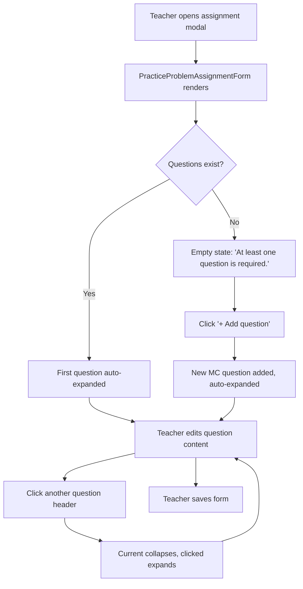
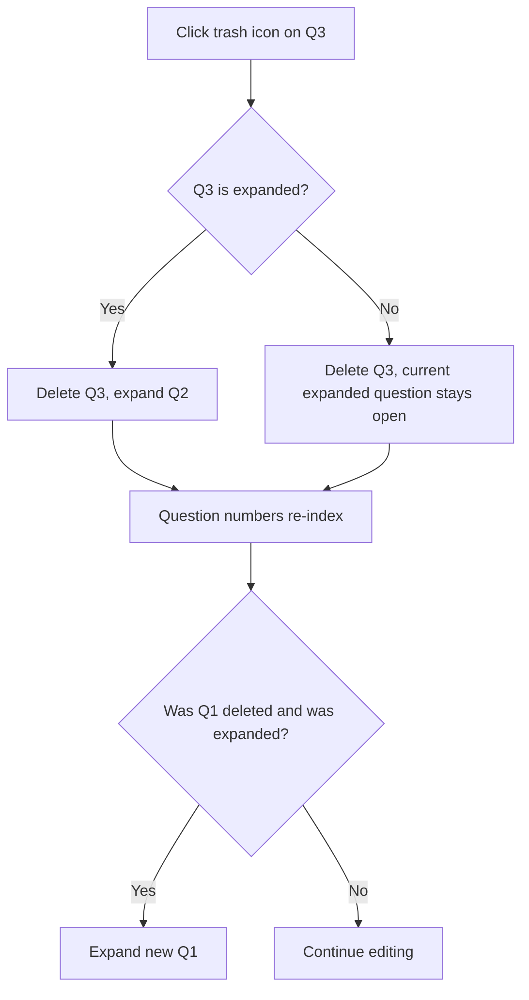
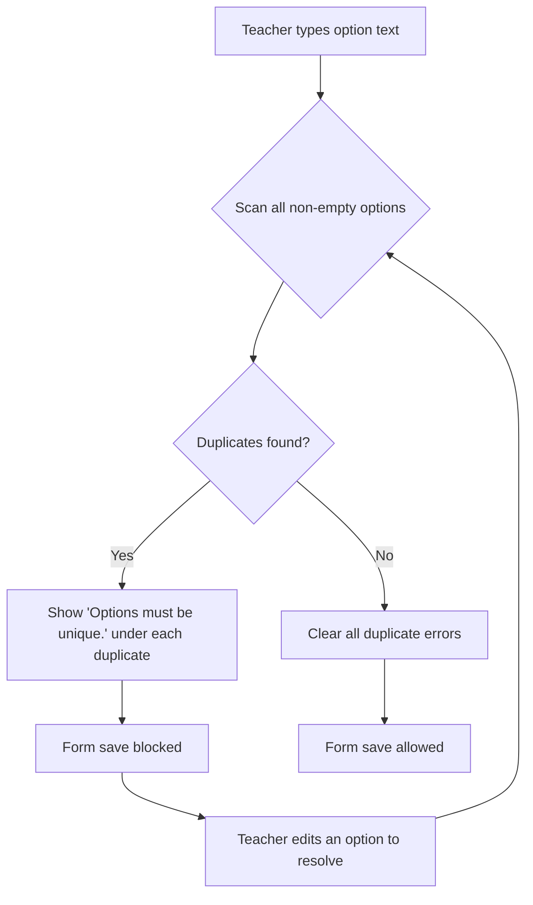
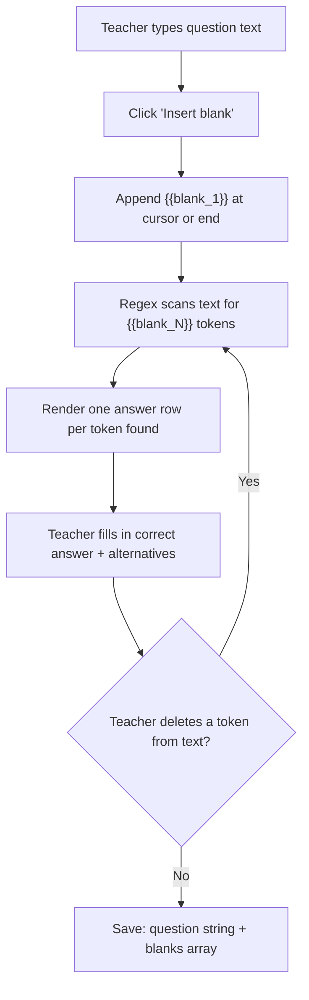

## 1. Overview

This wireframe covers the UX redesign of the practice problem assignment builder inside the `AssignmentFormModal`. The feature affects four components within `client/src/features/assignments/`:

- `PracticeProblemAssignmentForm.tsx` -- accordion collapse for question list
- `question-editors/MultipleChoiceEditor.tsx` -- 4 default options, duplicate validation
- `question-editors/FillInBlankEditor.tsx` -- token-based blank insertion
- `question-editors/MatchingEditor.tsx` -- two-column pair table

All changes are client-only. No new routes, no API changes, no schema migrations. The form is rendered inside the existing `AssignmentFormModal` on the `LessonDetailPage` route (`/courses/:courseId/units/:unitId/lessons/:lessonId`). Only users with `teacher` or `admin` role can access the builder (gated by `useCanEdit`).

---

## 2. Accordion Question List

### 2.1 Collapsed State

Each question collapses to a single header row inside the existing `border border-border bg-surface rounded-lg` card pattern. The header contains: question number, type badge, truncated question preview, and action controls.

```
+-----------------------------------------------------------------------+
| Q1  [Multiple Choice]  "What is the capital of Fr..."   [^][v][trash] |
+-----------------------------------------------------------------------+
| Q2  [Fill in the Blank] "The _____ is the largest..."   [^][v][trash] |
+-----------------------------------------------------------------------+
|                                                                       |
| Q3  [Matching]  "Match the following term..."           [^][v][trash] |
| +-------------------------------------------------------------------+ |
| |                                                                   | |
| |  (expanded editor content -- see sections 3/4/5/6)               | |
| |                                                                   | |
| +-------------------------------------------------------------------+ |
|                                                                       |
+-----------------------------------------------------------------------+
| Q4  [True / False]  "New question"                      [^][v][trash] |
+-----------------------------------------------------------------------+

  [+ Add question]
```

### 2.2 Header Row Detail

```
+---------------------------------------------------------------------------+
|  Q{n}   [type-badge]   "preview text truncated to ~50ch..."   [^] [v] [x] |
+---------------------------------------------------------------------------+
  |          |                  |                                  |   |   |
  |          |                  |                                  |   |   +-- Trash2 icon (lucide)
  |          |                  |                                  |   +-- ArrowDown icon
  |          |                  |                                  +-- ArrowUp icon
  |          |                  +-- Truncated content.question or "New question"
  |          +-- Badge: bg-primary-subtle text-green-surface-text
  |              rounded-md px-2 py-0.5 text-xs font-medium
  +-- text-xs text-muted-foreground font-medium
```

**Component notes:**

- The header row is a `<button>` element (the clickable region excluding the action icons) for keyboard accessibility. The action icons are separate `<button>` elements to avoid nested interactive elements.
- Type badge uses `bg-primary-subtle text-green-surface-text` with `rounded-md px-2 py-0.5 text-xs font-medium`. This matches the existing badge pattern used elsewhere in the app.
- Question preview: `text-sm text-text-secondary truncate` -- shows `content.question` truncated with CSS `text-overflow: ellipsis`, or the string "New question" in italic if the question text is empty.
- The entire collapsed row has `cursor-pointer` and `hover:bg-surface-raised` transition.
- Action buttons retain the existing styling from `QuestionCard`: `p-1 text-muted-foreground hover:text-foreground disabled:opacity-30 disabled:cursor-not-allowed`.
- Delete button: `hover:text-destructive` (existing pattern).

### 2.3 Expanded State

When expanded, the card opens below the header row within the same bordered container. The header remains visible at the top.

```
+-----------------------------------------------------------------------+
| Q3  [Matching]  "Match the following term..."           [^][v][trash] |
| --------------------------------------------------------------------- |
|                                                                       |
|  Question type                                                        |
|  +---------------------------------------------------------------+    |
|  | Matching                                                  [v] |    |
|  +---------------------------------------------------------------+    |
|                                                                       |
|  (type-specific editor content rendered here)                         |
|                                                                       |
+-----------------------------------------------------------------------+
```

- The divider between header and body is `border-t border-border-subtle` (hairline).
- Body padding: `p-4 pt-3 flex flex-col gap-3` (matches existing `QuestionCard` internals).
- The "Question type" `<select>` dropdown remains in the expanded body (not the header).

### 2.4 Accordion Behavior

| Event | Behavior |
|---|---|
| Click collapsed header | Expand this question, collapse the previously open one |
| Click expanded header | Collapse it (no question open) |
| Add question | New question appends, auto-expands, all others collapse |
| Delete open question | The question above opens (or Q1 if deleting Q1) |
| Delete collapsed question | The currently open question stays open |
| Move question up/down | Open index follows the moved question (stays expanded) |

### 2.5 Mobile Layout

On mobile (`< 640px`), the header layout wraps:

```
+-------------------------------------------+
| Q1  [Multiple Choice]         [^] [v] [x] |
| "What is the capital of Fr..."             |
+-------------------------------------------+
```

- The question number + badge and action icons stay on the first line.
- The preview text wraps to a second line, still truncated with ellipsis.
- Use `flex flex-wrap` on the header. The preview text gets `w-full sm:w-auto` and `order-last sm:order-none`.

---

## 3. Multiple Choice Editor

### 3.1 Layout

```
+---------------------------------------------------------------+
|  Question                                                      |
|  +-----------------------------------------------------------+ |
|  | What is the capital of France?                            | |
|  |                                                           | |
|  +-----------------------------------------------------------+ |
|                                                                |
|  Options                                                       |
|  Select the radio button next to the correct answer.           |
|                                                                |
|  (o) +---------------------------------------------+ [x]      |
|      | Paris                                       |           |
|      +---------------------------------------------+           |
|                                                                |
|  ( ) +---------------------------------------------+ [x]      |
|      | London                                      |           |
|      +---------------------------------------------+           |
|                                                                |
|  ( ) +---------------------------------------------+ [x]      |
|      | Berlin                                      |           |
|      +---------------------------------------------+           |
|      "Options must be unique."   <-- inline error              |
|                                                                |
|  ( ) +---------------------------------------------+ [x]      |
|      | Berlin                                      |           |
|      +---------------------------------------------+           |
|      "Options must be unique."   <-- inline error              |
|                                                                |
|  + Add option                                                  |
+---------------------------------------------------------------+
```

### 3.2 Component Notes

- **Default options:** `defaultContent('multiple_choice')` changes from 2 to 4 blank options: `{ question: '', options: ['', '', '', ''], correctIndex: 0 }`.
- **Radio buttons:** `accent-accent` (existing pattern). Name attribute: `mc-correct-{index}`.
- **Option inputs:** Use the existing inline `<input type="text">` styling: `rounded-md border border-border bg-surface-raised px-3 py-1.5 text-sm text-foreground placeholder:text-muted-foreground focus:outline-none focus:ring-1 focus:ring-primary`.
- **Remove button (x):** Same `text-muted-foreground hover:text-destructive text-xs px-1` pattern. Hidden when `options.length <= 2`.
- **"+ Add option":** Same `text-xs text-muted-foreground hover:text-foreground mt-2 underline` link pattern. Hidden when `options.length >= 6`.
- **Hint text:** `text-xs text-muted-foreground mt-1` -- "Select the radio button next to the correct answer." (existing).

### 3.3 Duplicate Validation

Duplicate detection logic: scan all non-empty options for exact string matches (case-sensitive). When two or more non-empty options share the same text, show an inline error beneath each offending option.

```
  ( ) +---------------------------------------------+ [x]
      | Berlin                                      |
      +---------------------------------------------+
      "Options must be unique."
```

- Error text: `text-xs text-destructive mt-0.5` -- positioned directly below the input, before the next option row.
- The error appears on every option that participates in the duplicate (not just the second occurrence).
- While any duplicate exists, the parent form's save action is blocked. The `MultipleChoiceEditor` exposes validity via a callback or the parent checks for duplicates when validating before save.

### 3.4 Interactive States

| Element | Default | Hover | Focus | Disabled | Error |
|---|---|---|---|---|---|
| Option input | `border-border` | -- | `ring-1 ring-primary` | `opacity-50` | -- |
| Radio button | unchecked, `accent-accent` | -- | browser default focus ring | -- | -- |
| Remove (x) | `text-muted-foreground` | `text-destructive` | -- | hidden (<=2 options) | -- |
| "+ Add option" | `text-muted-foreground` | `text-foreground` | underline + `text-foreground` | hidden (>=6 options) | -- |
| Duplicate error | -- | -- | -- | -- | `text-xs text-destructive` beneath input |

---

## 4. Fill-in-Blank Editor

### 4.1 Layout

```
+---------------------------------------------------------------+
|  Question                                                      |
|  +-----------------------------------------------------------+ |
|  | The capital of {{blank_1}} is {{blank_2}}.                | |
|  |                                                           | |
|  +-----------------------------------------------------------+ |
|  Use {{blank_N}} tokens to mark blanks.  [Insert blank]       |
|                                                                |
|  Blank answers                                                 |
|                                                                |
|  +-----------------------------------------------------------+ |
|  | Blank 1                                                   | |
|  | --------------------------------------------------------- | |
|  | Correct answer                                            | |
|  | +-------------------------------------------------------+ | |
|  | | France                                                | | |
|  | +-------------------------------------------------------+ | |
|  | Alternatives (comma-separated, optional)                  | |
|  | +-------------------------------------------------------+ | |
|  | | france, FRANCE                                        | | |
|  | +-------------------------------------------------------+ | |
|  +-----------------------------------------------------------+ |
|                                                                |
|  +-----------------------------------------------------------+ |
|  | Blank 2                                                   | |
|  | --------------------------------------------------------- | |
|  | Correct answer                                            | |
|  | +-------------------------------------------------------+ | |
|  | | Paris                                                 | | |
|  | +-------------------------------------------------------+ | |
|  | Alternatives (comma-separated, optional)                  | |
|  | +-------------------------------------------------------+ | |
|  | | paris, PARIS                                          | | |
|  | +-------------------------------------------------------+ | |
|  +-----------------------------------------------------------+ |
|                                                                |
+---------------------------------------------------------------+
```

### 4.2 Empty State (no tokens)

When the question text contains no `{{blank_N}}` tokens:

```
|  Blank answers                                                 |
|                                                                |
|  No blanks defined. Use the "Insert blank" button above to     |
|  add blank positions to your question text.                    |
```

- Empty state text: `text-sm text-muted-foreground italic p-3 border border-border-subtle rounded-lg`.
- This replaces the current always-present blank answer rows.

### 4.3 Component Notes

- **Textarea:** Uses the shared `<Textarea>` component with `label="Question"`. The raw `{{blank_N}}` tokens are visible as plain text in the textarea -- no rich-text rendering.
- **Hint text:** `text-xs text-muted-foreground mt-1` -- "Use {{blank_N}} tokens to mark blanks." displayed inline before the Insert blank button.
- **"Insert blank" button:** A small `<Button variant="ghost" size="sm">` positioned inline after the hint text (same line, right-aligned via `flex items-center justify-between`). Clicking it appends `{{blank_N}}` at the cursor position (if cursor is accessible via `selectionStart`) or at the end of the current text. The N is the next sequential number based on existing tokens.
- **Blank answer rows:** Each blank gets a bordered card (`rounded-lg border border-border p-3 flex flex-col gap-2`) matching the existing pattern. The "Blank N" label is `text-xs text-muted-foreground font-medium`.
- **Correct answer / Alternatives:** Use the shared `<Input>` component with labels.
- **Derived, not manually managed:** The blank rows are derived by scanning the textarea value with a regex like `/\{\{blank_(\d+)\}\}/g`. Rows appear/disappear automatically as tokens are added or removed from the text. There is no manual "+ Add blank" or "Remove" button for blank rows -- the text is the source of truth.
- **Existing data migration note:** Old questions using `___` notation will display the raw underscores in the textarea. Teachers edit them manually. No auto-conversion.

### 4.4 Insert Blank Button Behavior

| Textarea state | Button action |
|---|---|
| Textarea is focused with cursor at position N | Insert `{{blank_X}}` at cursor position, advance cursor past the token |
| Textarea is not focused | Append ` {{blank_X}}` at end of text |
| Text already has `{{blank_1}}` and `{{blank_2}}` | Next insert produces `{{blank_3}}` |
| User manually deletes `{{blank_2}}` from text | Blank 2 answer row disappears; next insert still produces `{{blank_3}}` (counter based on max existing N + 1, not count) |

### 4.5 Interactive States

| Element | Default | Hover | Focus | Disabled | Error |
|---|---|---|---|---|---|
| Textarea | `border-border` | -- | `border-primary` | `opacity-50` | `border-destructive` |
| "Insert blank" button | ghost style, `text-muted-foreground` | `text-foreground bg-surface` | `ring-2 ring-primary` | -- | -- |
| Correct answer input | `border-border` | -- | `border-primary` | -- | `border-destructive` if empty on touched |
| Alternatives input | `border-border` | -- | `border-primary` | -- | -- |

---

## 5. Matching Editor

### 5.1 Layout

```
+---------------------------------------------------------------+
|  Question (optional context)                                   |
|  +-----------------------------------------------------------+ |
|  | Match the following terms to their definitions.           | |
|  |                                                           | |
|  +-----------------------------------------------------------+ |
|                                                                |
|  Pairs                                                         |
|                                                                |
|  Term                          Definition                      |
|  +---------------------------+ +---------------------------+   |
|  | Photosynthesis            | | Process by which plants...| [x]|
|  +---------------------------+ +---------------------------+   |
|  +---------------------------+ +---------------------------+   |
|  | Mitosis                   | | Cell division process... | [x]|
|  +---------------------------+ +---------------------------+   |
|  +---------------------------+ +---------------------------+   |
|  | Osmosis                   | | Movement of water thro...| [x]|
|  +---------------------------+ +---------------------------+   |
|                                                                |
|  + Add pair                                                    |
+---------------------------------------------------------------+
```

### 5.2 Detailed Row

```
  Term                             Definition
  +-----------------------------+  +-----------------------------+  +---+
  | [text input]                |  | [text input]                |  | x |
  +-----------------------------+  +-----------------------------+  +---+
```

- Each row is a `flex items-center gap-2` container.
- Both inputs use the existing inline input styling: `flex-1 rounded-md border border-border bg-surface-raised px-3 py-1.5 text-sm text-foreground placeholder:text-muted-foreground focus:outline-none focus:ring-1 focus:ring-primary`.
- Placeholder text: "Term" for left, "Definition" for right.
- Column headers ("Term" / "Definition") are `text-xs text-muted-foreground font-medium uppercase tracking-wide mb-1`. Rendered once above the first row, not repeated.
- Delete icon: `Trash2` from lucide-react, same styling as existing: `text-muted-foreground hover:text-destructive text-xs px-1`. Disabled (`opacity-30 cursor-not-allowed`) when only 2 pairs remain.

### 5.3 Data Shape Migration

The editor reads both old and new shapes on mount:

```
if content.pairs exists:
  use content.pairs as Array<{ left: string; right: string }>
else if content.leftItems exists:
  derive pairs by zipping leftItems[i] with rightItems[correctPairs[i][1]]
```

On any edit, the data is re-saved exclusively in the new `{ pairs: [...] }` shape. The old `leftItems`, `rightItems`, `correctPairs` fields are dropped from the content object.

### 5.4 Component Notes

- **Question textarea:** Retained from existing editor. Uses shared `<Textarea>` with `label="Question (optional context)"`.
- **"+ Add pair" link:** Same `text-xs text-muted-foreground hover:text-foreground mt-2 underline` pattern. Hidden when `pairs.length >= 8`.
- **Min/Max:** 2 pairs minimum (delete disabled at 2), 8 pairs maximum (add hidden at 8).
- **No dropdown:** The old index-based `<select>` is completely removed. Each row directly defines a term-definition pair by position.

### 5.5 Mobile Layout

On mobile (`< 640px`), the two inputs stack vertically within each pair row:

```
  +-----------------------------------------------+
  | Term                                          |
  | [text input]                                  |
  | Definition                                    |
  | [text input]                                  |
  +-----------------------------------------------+ [x]
```

- Use `flex flex-col sm:flex-row` on the input container.
- On mobile, each pair gets a subtle bottom border (`border-b border-border-subtle pb-2 mb-2`) to visually separate stacked rows.
- Delete icon moves to the top-right of the stacked pair via `self-start sm:self-center`.

### 5.6 Interactive States

| Element | Default | Hover | Focus | Disabled | Error |
|---|---|---|---|---|---|
| Term input | `border-border` | -- | `ring-1 ring-primary` | -- | -- |
| Definition input | `border-border` | -- | `ring-1 ring-primary` | -- | -- |
| Delete (Trash2) | `text-muted-foreground` | `text-destructive` | -- | `opacity-30 cursor-not-allowed` (<=2 pairs) | -- |
| "+ Add pair" | `text-muted-foreground` | `text-foreground` | underline + `text-foreground` | hidden (>=8 pairs) | -- |

---

## 6. User Flows

### 6.1 Question Lifecycle (Happy Path)



### 6.2 Delete Flow



### 6.3 Multiple Choice Duplicate Error



### 6.4 Fill-in-Blank Token Flow



---

## 7. Component Inventory

| Component | Status | Notes |
|---|---|---|
| `PracticeProblemAssignmentForm` | **Modify** | Add `expandedIndex` state, wrap `QuestionCard` in accordion behavior |
| `QuestionCard` | **Modify** | Split into header row (always visible) + collapsible body. Add `isExpanded` / `onToggle` props |
| `MultipleChoiceEditor` | **Modify** | Change default to 4 options; add duplicate scanning and inline error display |
| `FillInBlankEditor` | **Rewrite** | Replace manual blank management with token-based derivation; add "Insert blank" button |
| `MatchingEditor` | **Rewrite** | Replace three-input+dropdown layout with two-column pair table; normalize data shape |
| `TrueFalseEditor` | **No change** | Unaffected by this spec |
| `Button` | Exists | Used for "Insert blank" (ghost variant) |
| `Input` | Exists | Used in blank answer rows and matching pair inputs |
| `Textarea` | Exists | Used for question text fields |
| `ErrorMessage` | Exists | Used for "At least one question" validation (existing) |

No new shared components are required. All changes are modifications to existing feature components.

---

## 8. Accessibility Notes

### Accordion

- Each collapsed header row uses `<button>` with `aria-expanded="true|false"` and `aria-controls="question-{index}-body"`.
- The expandable body has `id="question-{index}-body"` and `role="region"` with `aria-labelledby="question-{index}-header"`.
- Arrow up/down and delete buttons are separate `<button>` elements (not nested inside the accordion trigger) to maintain valid DOM nesting. They use `aria-label` attributes: "Move question N up", "Move question N down", "Remove question N".
- Keyboard: `Enter` or `Space` on the header toggles expand/collapse. `Tab` moves between the header button and the action buttons.

### Multiple Choice

- Radio group: each radio has `aria-label="Option N is correct"` (existing pattern).
- Duplicate error text is associated with its input via `aria-describedby="mc-{questionIndex}-option-{optionIndex}-error"`. The error `<p>` has a matching `id`.
- Remove button: `aria-label="Remove option N"` (existing).

### Fill-in-Blank

- "Insert blank" button has visible label text "Insert blank" -- no additional `aria-label` needed.
- The hint text "Use {{blank_N}} tokens to mark blanks." is associated with the textarea via `aria-describedby`.
- Each blank answer section uses a heading-like label "Blank N" with `id="blank-{N}-heading"`. The section container has `aria-labelledby="blank-{N}-heading"`.
- Correct answer and alternatives inputs have visible `<label>` elements via the shared `<Input>` component.

### Matching

- Column headers "Term" and "Definition" are rendered as `<span>` elements with IDs. Each input row's term input has `aria-label="Term for pair N"` and definition input has `aria-label="Definition for pair N"`.
- Delete button: `aria-label="Remove pair N"`. When disabled (<=2 pairs), `aria-disabled="true"` is set alongside the native `disabled` attribute.
- On mobile when inputs stack, the labels ("Term", "Definition") appear as inline `<label>` elements above each input to maintain context.

### Focus Management

- When a new question is added and auto-expanded, focus moves to the question type `<select>` inside the newly expanded card.
- When a question is deleted and a neighbor expands, focus moves to the newly expanded question's header button.
- "Insert blank" returns focus to the textarea after inserting the token.

### Screen Reader Announcements

- The question count region ("Questions *") should have `aria-live="polite"` so additions/deletions are announced.
- Duplicate validation errors use `role="alert"` to announce immediately when they appear.

---

## 9. Required Token Additions

No new tokens required. All styling uses existing design tokens:

- `bg-surface`, `bg-surface-raised`, `border-border`, `border-border-subtle`
- `text-foreground`, `text-muted-foreground`, `text-destructive`
- `bg-primary-subtle`, `text-green-surface-text` (type badge)
- `ring-primary`, `accent-accent` (focus, radio)
- `shadow-warm-sm` (if card elevation is needed -- current cards use border only)
